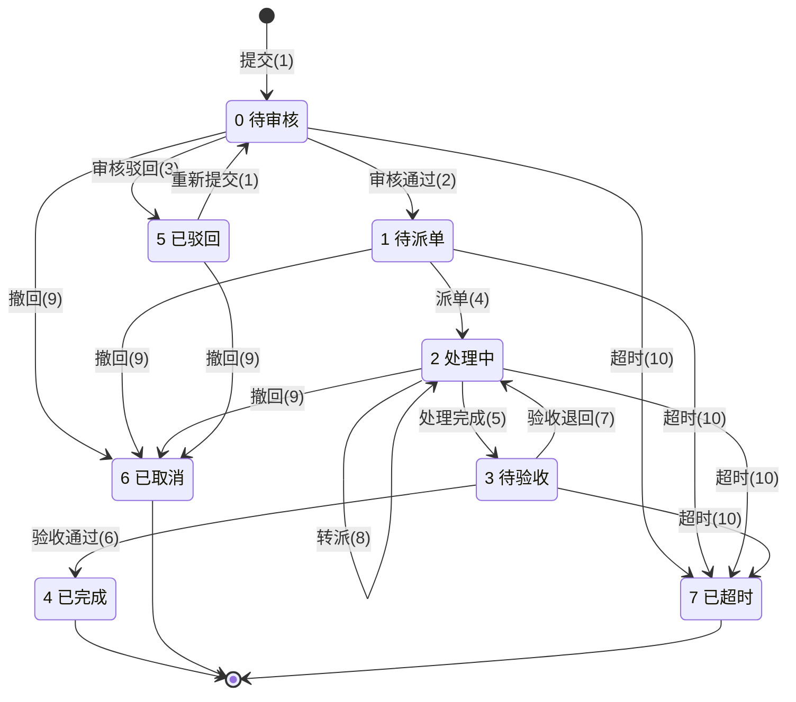
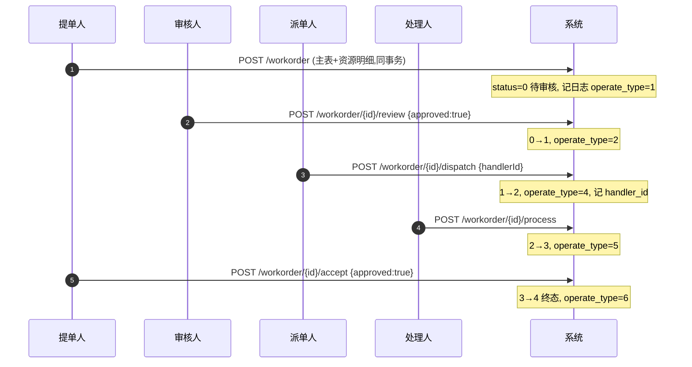

"# Work_Order_System" 

## 状态流转图

```mermaid
stateDiagram-v2
    state "0 待审核" as S0
    state "1 待派单" as S1
    state "2 处理中" as S2
    state "3 待验收" as S3
    state "4 已完成" as S4
    state "5 已驳回" as S5
    state "6 已取消" as S6
    state "7 已超时" as S7

    [*] --> S0 : 提交(1)
    S0 --> S1 : 审核通过(2)
    S0 --> S5 : 审核驳回(3)
    S0 --> S6 : 撤回(9)
    S0 --> S7 : 超时(10)

    S1 --> S2 : 派单(4)
    S1 --> S6 : 撤回(9)
    S1 --> S7 : 超时(10)

    S2 --> S2 : 转派(8)
    S2 --> S3 : 处理完成(5)
    S2 --> S6 : 撤回(9)
    S2 --> S7 : 超时(10)

    S3 --> S4 : 验收通过(6)
    S3 --> S2 : 验收退回(7)
    S3 --> S7 : 超时(10)

    S5 --> S0 : 重新提交(1)
    S5 --> S6 : 撤回(9)

    S4 --> [*]
    S6 --> [*]
    S7 --> [*]
```

## 工单全生命周期（主线）

```mermaid
sequenceDiagram
    autonumber
    participant S as 提单人
    participant R as 审核人
    participant D as 派单人
    participant H as 处理人
    participant SYS as 系统

    S->>SYS: POST /workorder (主表+资源明细,同事务)
    Note over SYS: status=0 待审核, 记日志 operate_type=1
    R->>SYS: POST /workorder/{id}/review {approved:true}
    Note over SYS: 0→1, operate_type=2
    D->>SYS: POST /workorder/{id}/dispatch {handlerId}
    Note over SYS: 1→2, operate_type=4, 记 handler_id
    H->>SYS: POST /workorder/{id}/process
    Note over SYS: 2→3, operate_type=5
    S->>SYS: POST /workorder/{id}/accept {approved:true}
    Note over SYS: 3→4 终态, operate_type=6
```
