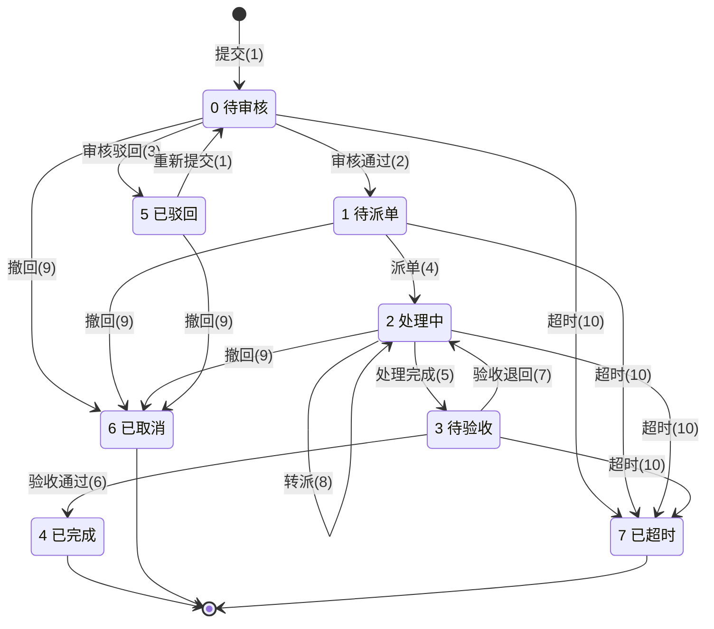
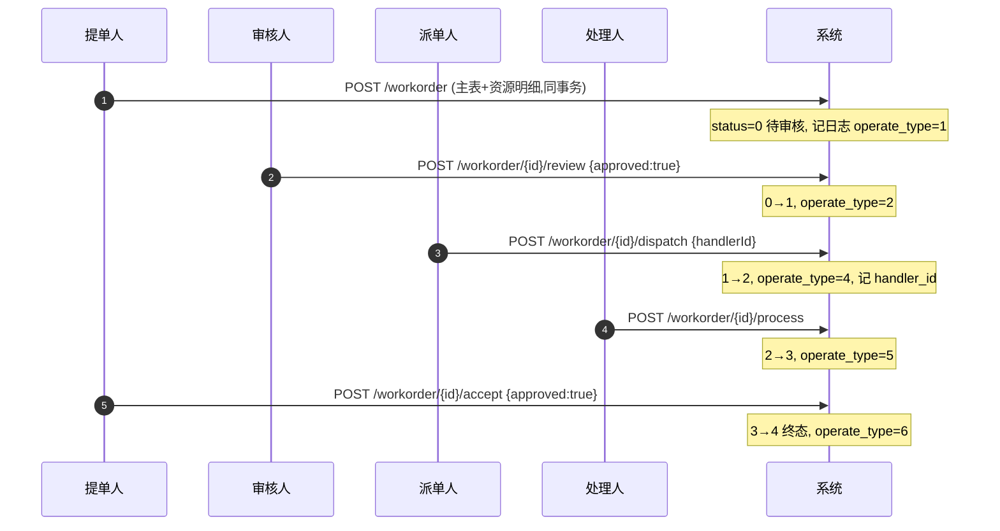
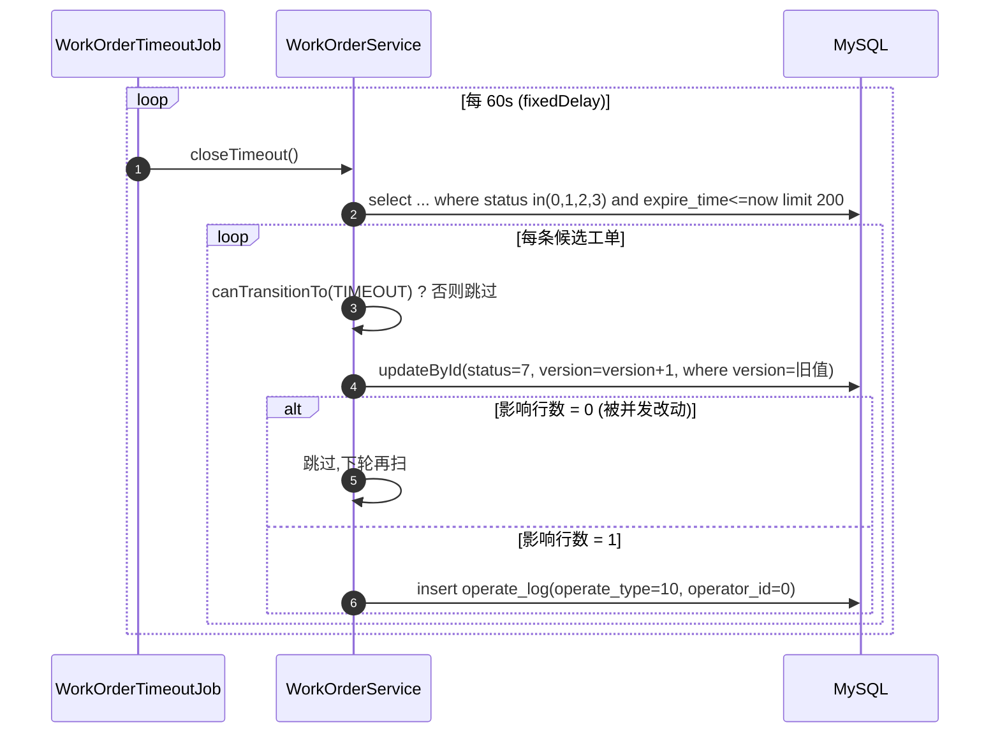

# 工单核心业务 —— 模块二：工单状态机与流转设计

> 本文档讲解「智能工单系统」**板块二：工单核心业务** 的设计理念与核心实现。
> 写作目的：作者本人复习 + 面试讲解，因此重点在**「为什么这么设计」**，而不只是「是什么」。
> 文中所有类名、方法名、接口路径、状态码、权限码均与当前代码一致，可对照源码阅读。
> 前置阅读：`权限解析.md`（板块一：用户 / 角色 / 部门 / 权限 + 认证鉴权）。

---

## 一、文档定位

### 1.1 范围

本文覆盖板块二已经落地的能力：

| 能力 | 说明 |
|---|---|
| **工单生命周期** | 提交 → 审核 → 派单 → 处理 → 验收，完整 5 环节 |
| **状态机** | `0-7` 状态与「合法迁移」的集中定义与校验 |
| **数据范围** | 按角色收敛「能看哪些工单」与「能动哪些工单」 |
| **并发控制** | 乐观锁 `version` 防止并发覆盖 |
| **超时自动关闭** | `@Scheduled` 扫描到期工单，批量置为已超时 |
| **操作留痕** | 每次流转在 `work_order_operate_log` 落一行 |
| **资源明细** | 主表 + `work_order_resource` 子表同事务写入 |

### 1.2 边界（不在本文范围）

- **附件上传**：`work_order_attachment` 表已建好，接口**暂缓**（首版不提供）。
- **MQ 异步通知**：`mq_message_reliability`（本地消息表）已建好，尚未接线。
- **前端页面**：本文只讲后端。
- **板块一内容**：认证鉴权、RBAC 维护接口见 `权限解析.md`，本文只引用其结论。

### 1.3 一句话总览

> 用「**集中式状态机 + 动作型接口 + 乐观锁 + 数据范围**」，把工单的五环节流转做成一条
> **不可绕过、可追溯、并发安全、按部门隔离**的主线。

---

## 二、设计目标与原则

### 2.1 设计目标

1. **状态不可绕过**：任何状态变更都必须经过状态机校验，非法迁移（如「待审核」直接派单）一律拒绝。
2. **并发安全**：同一工单被两人同时操作时，只能有一方成功，另一方得到「请刷新重试」而非静默覆盖。
3. **数据隔离**：提单人只看自己的、审核/派单人只看本部门的、处理人只看指派给自己的。
4. **全程留痕**：每一次流转都记录「谁 / 做了什么 / 从哪个状态到哪个状态」，可审计、可追溯。

### 2.2 五条设计原则

| 原则 | 含义 | 反面（我们没有这么做） |
|---|---|---|
| **状态机集中定义** | 迁移关系写在一张 `Map<当前状态, 可去状态集>` 里 | 不在各处散落 `if (status == 0) ... else if (status == 1) ...` |
| **动作型接口** | 用 `/review`、`/dispatch` 等动词子路径表达流转 | 不暴露 `PUT /workorder/{id}` 让前端直接改 `status` 字段 |
| **乐观锁兜底** | 主表 `@Version`，冲突即返回 409 | 不用悲观锁 `SELECT ... FOR UPDATE` 把行锁死 |
| **数据范围在 Service** | 按角色在 Service 层拼查询条件 | 不做「注解式数据权限」（条件因业务而异，抽象反而僵硬） |
| **主表驱动子表** | 资源明细不单独维护状态，跟随主表流转 | 不给子表各自的状态机，避免状态爆炸 |

---

## 三、状态机与数据模型

### 3.1 状态定义

`WorkOrderStatus`（`src/main/java/com/rj/model/enums/WorkOrderStatus.java`）：

| 码值 | 枚举 | 含义 | 说明 |
|---|---|---|---|
| 0 | `PENDING_REVIEW` | 待审核 | 已提交，等本部门审核人处理 |
| 1 | `PENDING_DISPATCH` | 待派单 | 审核通过，等派单人分配处理人 |
| 2 | `PROCESSING` | 处理中 | 已派单给处理人；**转派 / 返工仍停留在 2** |
| 3 | `PENDING_ACCEPT` | 待验收 | 处理人处理完成，等提单人验收 |
| 4 | `COMPLETED` | 已完成 | **终态** |
| 5 | `REJECTED` | 已驳回 | 审核不通过，修改后可重回 0 |
| 6 | `CANCELED` | 已取消 | **终态**，提单人撤回 |
| 7 | `TIMEOUT` | 已超时 | **终态**，系统自动关闭 |

### 3.2 状态流转图



### 3.3 合法迁移表（代码即真相）

枚举里的 `TRANSITIONS` 就是上面这张图的机器版：

```java
private static final Map<WorkOrderStatus, Set<WorkOrderStatus>> TRANSITIONS = Map.of(
        PENDING_REVIEW,   Set.of(PENDING_DISPATCH, REJECTED, CANCELED, TIMEOUT),
        PENDING_DISPATCH, Set.of(PROCESSING, CANCELED, TIMEOUT),
        PROCESSING,       Set.of(PROCESSING, PENDING_ACCEPT, CANCELED, TIMEOUT), // 2→2 自环=转派
        PENDING_ACCEPT,   Set.of(COMPLETED, PROCESSING, TIMEOUT),
        REJECTED,         Set.of(PENDING_REVIEW, CANCELED),
        COMPLETED,        Set.of(),   // 终态
        CANCELED,         Set.of(),   // 终态
        TIMEOUT,          Set.of()    // 终态
);
```

### 3.4 动作 → 状态 → 权限 → 日志 一览

| 动作 | 从 → 到 | 权限码 | `operate_type` | 谁可操作（数据权限） |
|---|---|---|---|---|
| 创建/提交 | — → 0 | `workorder:create` | 1 提交 | 登录用户；部门取当前用户部门 |
| 审核通过 | 0 → 1 | `workorder:review` | 2 | 本部门审核人 |
| 审核驳回 | 0 → 5 | `workorder:review` | 3 | 本部门审核人 |
| 重新提交 | 5 → 0 | `workorder:modify` | 1 | 提单人本人 |
| 派单 | 1 → 2 | `workorder:dispatch` | 4 | 本部门派单人 |
| 转派 | 2 → 2 | `workorder:transfer` | 8 | 本部门派单人 / 当前处理人 |
| 处理完成 | 2 → 3 | `workorder:process` | 5 | 处理人本人 |
| 验收通过 | 3 → 4 | `workorder:accept` | 6 | 提单人本人 |
| 验收退回 | 3 → 2 | `workorder:accept` | 7 | 提单人本人 |
| 撤回/取消 | 0/1/2/5 → 6 | `workorder:withdraw` | 9 | 提单人本人 |
| 超时关闭 | 0/1/2/3 → 7 | 系统任务 | 10 | `@Scheduled`（operatorId = 0） |

### 3.5 四张工单表

> 建表脚本：`src/main/resources/db/schema.sql`

| 表 | 作用 | 关键设计 |
|---|---|---|
| `work_order` | 工单主表 | `uk_order_no` 编号唯一；`status`(0-7)；`version` 乐观锁；`deleted` 逻辑删除；`idx_status_expire(status, expire_time)` 服务超时扫描 |
| `work_order_resource` | 资源明细子表 | `idx_order_id`；**无 status 字段**，跟随主表流转 |
| `work_order_operate_log` | 操作日志 | **只增不改**；`from_status`/`to_status`/`operate_type`/`to_user_id`；`idx_order_operate(order_id, create_time)` |
| `work_order_attachment` | 附件表 | 已建、暂缓；`file_path` 存对象存储 key，不落本地绝对路径 |

### 3.6 三个「为什么不」

**① 为什么状态存整数码值，而不是状态名字符串？**
整数码值紧凑、可建索引、便于比较与排序（如 `status < 4` 表示未完结）。可读性由两处补回：数据库列注释 + Java 枚举 `WorkOrderStatus`。**存的用码值，讲给人听的用枚举描述**，各取所长。

**② 为什么「已取消(6)」和「已超时(7)」要分成两个终态？**
两者业务含义完全不同：一个是**人主动放弃**，一个是**系统判定逾期**。分开后：统计「超时率」只需 `status = 7`；超时可以作为绩效/告警指标，而用户主动取消不算。如果合并成一个「关闭」，这个信息就永久丢失了。**终态也要如实记录「怎么结束的」。**

**③ 为什么资源明细是子表，而不是塞进主表一个 JSON 字段？**
JSON 字段写入方便，但查询/统计困难（「本月申请了多少台服务器」要解析 JSON）。子表 + `idx_order_id` 让明细可关联查询、可聚合。**首版明细不单独维护状态**，因为资源是「工单的附属物」——工单处理完，资源自然就绪，没必要给子表再来一套状态机（避免状态组合爆炸）。属于「结构上够用、复杂度上克制」。

---

## 四、分层与职责划分

### 4.1 三层职责

```
Controller  动作型路由 + 功能权限注解（@RequiresPermission）
    ↓
Service     状态机校验 + 数据范围 + 事务 + 操作留痕
    ↓
Mapper      MyBatis-Plus 单表 CRUD
```

| 层 | 负责 | 不负责 |
|---|---|---|
| `WorkOrderController` | 路由、参数校验（`@Valid`）、挂权限码 | 任何业务判断 |
| `WorkOrderService` | 状态机、数据范围、事务、日志、并发判定 | HTTP 语义 |
| `WorkOrderMapper` 等 | 单表 CRUD（`BaseMapper`） | 跨表业务规则 |

### 4.2 两种「权限」的分工（承接板块一）

板块一定下一条边界，板块二严格执行：

| 关注点 | 「你是谁 / 你能做什么功能」 | 「你能看/动哪些数据」 |
|---|---|---|
| 名称 | **功能权限** | **数据范围（Data Scope）** |
| 判定位置 | 拦截器 `LoginInterceptor`（读 `@RequiresPermission`） | Service 层（读 `UserContext`） |
| 表达 | 权限码，如 `workorder:review` | 按角色拼查询条件，如 `department_id = 我部门` |
| 失败 | 403（进不来方法） | 403/404（进了方法再拒绝） |

> 为什么数据范围不做成拦截器注解？条件因业务而异（工单按部门、附件按工单归属……），强行抽象成注解反而僵硬。**放到 Service 按需拼条件，更简单也更好懂**——这与板块一的结论一致。

---

## 五、核心机制详解

### 5.1 状态机集中校验（灵魂之一）

**问题**：如果每个动作自己写 `if (status == 期望值)`，迁移规则就散落在七八个方法里。一旦要调整流程（比如「待验收也能撤回」），得满仓库找 `if`，极易漏改。

**解法**：把「谁能到谁」全部收进枚举的一张 `Map`，所有流转都走同一个 `transition()`。

```java
// WorkOrderStatus —— 合法迁移表
public boolean canTransitionTo(WorkOrderStatus target) {
    return target != null && TRANSITIONS.getOrDefault(this, Set.of()).contains(target);
}
```

```java
// WorkOrderService#transition —— 所有动作的唯一出口
private void transition(WorkOrder order, WorkOrderStatus target, OperateType operateType,
                        Long toUserId, String remark) {
    WorkOrderStatus current = WorkOrderStatus.fromCode(order.getStatus());
    if (!current.canTransitionTo(target)) {
        throw new BusinessException(ResultCode.CONFLICT,
                "当前状态[" + current.getDesc() + "]不允许该操作");
    }
    order.setStatus(target.getCode());
    if (toUserId != null)      order.setHandlerId(toUserId);
    if (remark != null)        order.setRemark(remark);
    order.setUpdateTime(LocalDateTime.now());

    if (workOrderMapper.updateById(order) == 0) {   // 影响行数 0 = 版本冲突
        throw new BusinessException(ResultCode.CONFLICT, "工单已被他人修改,请刷新后重试");
    }
    insertLog(order.getId(), UserContext.getUserId(), operateType,
              current.getCode(), target.getCode(), toUserId, remark);
}
```

**收益**：
- 迁移规则**一处维护**，改流程只改枚举；
- 每个动作只需声明「目标状态 + 操作类型」，不再重复校验逻辑；
- 非法迁移统一 `409`，前端与测试都只认一种失败形态。

**关于 `2 → 2` 自环**：转派时状态仍停留在「处理中」，只是换了 `handler_id`。把自环显式写进迁移表，比「转派不校验状态」更严谨——它明确要求「只有处理中的工单能转派」。

### 5.2 乐观锁防并发（灵魂之二）

**问题**：审核人对同一工单连点两次「通过」，或审核与撤回并发，后到的写会**覆盖**先到的结果。

**解法**：主表 `work_order` 带 `@Version version`，MyBatis-Plus 更新时自动追加 `WHERE version = 旧值` 并 `version + 1`。并发下只有一方能命中，另一方影响行数为 0，业务层据此抛 `409`。

> ⚠️ **踩过的坑**：`@Version` 只有在注册了 `OptimisticLockerInnerInterceptor` 后才生效。此前 `MybatisPlusConfig` 只注册了分页插件，`@Version` 一直是**空转**。现已补上（分页插件仍放最后）。

```java
// MybatisPlusConfig —— 乐观锁 + 分页
interceptor.addInnerInterceptor(new OptimisticLockerInnerInterceptor());
interceptor.addInnerInterceptor(new PaginationInnerInterceptor(DbType.MYSQL));
```

**为什么用乐观锁而不是悲观锁？**
工单是**低冲突、高读**场景（同一单很少被并发写）。乐观锁无锁等待、不占用数据库连接，冲突时让用户刷新重试即可；悲观锁 `SELECT ... FOR UPDATE` 会把行锁住，长事务下容易拖垮连接池。**低冲突场景，乐观锁更划算。**

**一个容易忽略的细节**：`updateById` 会把实体中读出来的**全部非空字段**写回，包括 `update_time`。而 `update_time` 列有 `ON UPDATE CURRENT_TIMESTAMP`——显式写旧值会**覆盖**这个自动更新。因此 `transition` 里主动 `order.setUpdateTime(LocalDateTime.now())`，保证时间戳准确。

### 5.3 数据范围：四类角色，取并集

列表查询 `page()` 会按当前登录人的角色自动收敛可见范围（`applyListScope`）：

| 角色 | 可见条件 | 依据 |
|---|---|---|
| `ADMIN` | 全部 | 全局账号，不受部门限制 |
| `SUBMITTER` | `user_id = 我` | 只看自己提的 |
| `REVIEWER` / `DISPATCHER` | `department_id = 我部门` | 本部门作业 |
| `HANDLER` | `handler_id = 我` | 只看指派给自己的 |

**一人多角色怎么办？取并集（`OR`）**：

```java
wrapper.and(w -> {
    boolean used = false;
    if (bySubmitter)  { w.eq(WorkOrder::getUserId, userId);        used = true; }
    if (byDepartment) { if (used) w.or(); w.eq(WorkOrder::getDepartmentId, departmentId); used = true; }
    if (byHandler)    { if (used) w.or(); w.eq(WorkOrder::getHandlerId, userId); }
});
```

生成的 SQL 形如：`status = ? AND (user_id = ? OR department_id = ? OR handler_id = ?)`。

**边界兜底**：若用户**没有任何**数据范围角色（例如刚注册、只有 `workorder:query` 权限却没配角色），追加一条恒假条件 `id = -1`，返回空列表——**宁可查不到，也不能越权看到别人的数据**。

**详情查询**另设 `requireViewScope(order)`：单条工单同样按「提单人 / 本部门 / 处理人 / 管理员」判断是否可见，不可见抛 403。

### 5.4 「谁可操作」的动作级校验

功能权限（注解）+ 数据范围（列表）还不够，**每个动作还要判断「这个人有没有资格操作这一单」**：

| 校验方法 | 语义 | 说明 |
|---|---|---|
| `requireDepartmentScope` | 本部门工单 | 审核、派单；**管理员旁路** |
| `requireTransferScope` | 本部门派单人 或 当前处理人 | 转派；管理员旁路 |
| `requireSubmitterSelf` | 提单人本人 | 验收、撤回；**管理员不旁路** |
| `requireHandlerSelf` | 当前处理人本人 | 处理完成；管理员不旁路 |

**为什么「部门级」给管理员旁路，「本人级」不给？**
管理员是**跨部门的管理者**，让他能代为审核/派单合理；但「验收」「处理」是**具体人对具体结果负责**的动作，代操作会破坏责任链。**权限旁路要区分「管理」与「担责」。**

### 5.5 操作留痕

每次流转都由 `insertLog` 写入 `work_order_operate_log`：`order_id / operator_id / operate_type / from_status / to_status / to_user_id / remark`。

- **只增不改**：日志是审计数据，不提供更新删除。
- **首次提交 `from_status` 为 `NULL`**：因为「提交前」没有状态，如实留空好过编一个假的 `-1`。
- **转派时 `to_user_id` 记目标处理人**，便于追溯「这单被转给过谁」。
- **超时关闭的 `operator_id = 0`**：由定时任务触发，没有真实登录用户，用 `0` 表示「系统」。

### 5.6 派单 vs 转派：一个注解表达不了的权限（重点）

板块一里 `@RequiresPermission` 的语义是「**需要同时满足全部**权限码」，判断是 `hasAll`。而派单与转派需要的是「**二选一**」：

| 动作 | 需要权限 | 谁有 |
|---|---|---|
| 派单（1 → 2） | `workorder:dispatch` | 派单人 |
| 转派（2 → 2） | `workorder:transfer` | 处理人 |

`DISPATCHER` 只有 `dispatch`，`HANDLER` 只有 `transfer`——**没有任何角色同时持有两者**。若把 `/dispatch` 注解上 `workorder:dispatch`，处理人调转派会在拦截器就被 403，根本进不了 Service。

**解法**：同一个 `POST /workorder/{id}/dispatch` 入口**不挂注解**，改为在 Service 内按工单**当前状态**精确判权：

```java
if (current == WorkOrderStatus.PENDING_DISPATCH) {
    requirePermission(PERM_DISPATCH);      // 派单 → 要 dispatch 权限
    requireDepartmentScope(order);         //        且限本部门
    transition(order, PROCESSING, DISPATCH, dto.getHandlerId(), dto.getRemark());
} else if (current == WorkOrderStatus.PROCESSING) {
    requirePermission(PERM_TRANSFER);      // 转派 → 要 transfer 权限
    requireTransferScope(order);           //        且限本部门派单人/当前处理人
    transition(order, PROCESSING, TRANSFER, dto.getHandlerId(), dto.getRemark());
} else {
    throw new BusinessException(ResultCode.CONFLICT, "当前状态不允许派单/转派");
}
```

**要点**：接口没有注解，但**安全性没有降低**——`requirePermission` 在 Service 里做同样的判断，只是把「判权时机」从拦截器挪到了业务逻辑里，因为后者才知道这单此刻处于哪个状态。**注解适合「静态的、与方法无关」的权限；一旦权限取决于数据本身，就得下沉到业务层。**

### 5.7 超时自动关闭

`WorkOrderTimeoutJob` 用 Spring `@Scheduled` 周期性调用 `closeTimeout()`：

```java
@Scheduled(fixedDelayString = "${workorder.timeout.scan-delay-ms:60000}")
public void scanTimeoutOrders() {
    try {
        workOrderService.closeTimeout();
    } catch (Exception e) {
        // 单次失败不中断后续调度,记录后等下一轮重试
        log.error("工单超时扫描任务执行失败", e);
    }
}
```

扫描逻辑（`WorkOrderService#closeTimeout`）：

```java
.in(WorkOrder::getStatus, 0, 1, 2, 3)          // 只扫未完结的状态
.isNotNull(WorkOrder::getExpireTime)
.le(WorkOrder::getExpireTime, LocalDateTime.now())
.last("LIMIT " + TIMEOUT_BATCH_SIZE)           // 单轮批量上限 200
```

**四个设计点**：

1. **`fixedDelay` 而非 `fixedRate`**：上一轮**执行结束**后固定延迟再触发，避免扫描慢时任务堆积重叠。
2. **批量限流 `LIMIT 200`**：一次拉太多会拖垮数据库；没关完的下一轮继续关。
3. **幂等靠「前置校验 + 乐观锁」**：先 `canTransitionTo(TIMEOUT)` 判断（已是终态的跳过），再 `updateById` 用乐观锁——影响行数为 0 说明已被并发改动，跳过即可。**即使任务重复触发、或与其他操作并发，也不会重复关闭或覆盖。**
4. **用 `idx_status_expire(status, expire_time)` 联合索引**：状态在前、时间在后，正好匹配「按状态过滤 + 按时间比较」的扫描模式。

> **为什么用 `@Scheduled` 而不是 XXL-JOB？** 当前是单体单实例，`@Scheduled` 零依赖零成本。等**多实例部署**时，`@Scheduled` 会在每个实例各扫一遍（靠幂等兜底不会重复关单，但白跑）。届时的迁移成本极低——`closeTimeout()` 是纯业务，与调度器解耦，只需把入口那一层换成 XXL-JOB 执行器即可（见 §9）。

---

## 六、关键业务流程

### 6.1 工单全生命周期（主线）



### 6.2 创建工单（一个事务写三处）

```java
@Transactional(rollbackFor = Exception.class)
public Long create(WorkOrderCreateDTO dto) {
    // 1) 提单人/部门取自登录上下文,不信任前端
    // 2) insert work_order(status=0, order_no 生成, expire_time 默认 +72h)
    // 3) 遍历 resources → insert work_order_resource
    // 4) insert work_order_operate_log(operate_type=1, from_status=null)
    return order.getId();
}
```

**要点**：
- **`order_no` 生成**：`WO` + `yyyyMMddHHmmssSSS`（毫秒时间戳）+ 3 位随机数，配合 `uk_order_no` 保证唯一。
- **主表 + 子表同事务**：子表写入失败则主表回滚，不会留下「有主单没明细」的脏数据。
- **无部门的账号不能提单**：提单需要归属部门（数据隔离的锚点），全局账号（如 `ADMIN`，`department_id` 为 `NULL`）提交时直接 `400`。
- **超时时间**：不传默认 72 小时后；传了但不晚于当前时间则 `400`。

### 6.3 审核 / 验收：通过 or 驳回，一个接口两种结果

审核与验收共用「一个接口 + `approved` 布尔」模式，由 Service 把布尔值翻译成目标状态与操作类型：

```java
// 审核
transition(order,
        approved ? PENDING_DISPATCH : REJECTED,
        approved ? REVIEW_PASS : REVIEW_REJECT, null, dto.getRemark());

// 验收
transition(order,
        approved ? COMPLETED : PROCESSING,
        approved ? ACCEPT_PASS : ACCEPT_REJECT, null, dto.getRemark());
```

**为什么「通过」和「驳回」不拆成两个接口？** 它们的前置条件（当前状态）、权限、操作人完全相同，只有目标状态不同。合成一个接口，权限注解只写一次，前端也只需一个「审核弹窗 + 通过/驳回按钮」。**共享前置条件的动作，差异用参数表达。**

### 6.4 验收退回 = 返工（3 → 2）

验收不通过时，工单从「待验收」退回「处理中」，`handler_id` 保持不变——**同一个处理人继续返工**。这样处理人打开 App 就能看到「有工单被退回」，无需重新派单。状态机里 `PENDING_ACCEPT → PROCESSING` 正是为此预留。

### 6.5 撤回（终态之一）

提单人可撤销**尚未完成**的工单。状态机把可撤回的范围限定为 `0/1/2/5`——注意 **`3 待验收` 不在其中**：处理人已经干完活了，此时撤回对处理人不公平，应走「验收」环节。**流程规则用数据表达（迁移表），而不是靠人记住。**

### 6.6 超时关闭（幂等）



---

## 七、接口清单（板块二交付）

> 在线文档：`http://localhost:10001/doc.html`（Knife4j）。

| 方法 | 路径 | 所需权限 | 说明 |
|---|---|---|---|
| POST | `/workorder` | `workorder:create` | 创建（提交）工单，含资源明细 |
| GET | `/workorder/page` | `workorder:query` | 分页列表（按角色收敛数据范围） |
| GET | `/workorder/stats` | `workorder:query` | 统计（总数与各状态数量，数据范围同列表） |
| GET | `/workorder/{id}` | `workorder:query` | 详情（含资源明细 + 操作日志） |
| POST | `/workorder/{id}/review` | `workorder:review` | 审核（`approved` 区分通过/驳回） |
| POST | `/workorder/{id}/dispatch` | **无注解**（Service 内判权） | 派单 / 转派（按当前状态区分，见 §5.6） |
| POST | `/workorder/{id}/process` | `workorder:process` | 处理完成 |
| POST | `/workorder/{id}/accept` | `workorder:accept` | 验收（`approved` 区分通过/退回） |
| POST | `/workorder/{id}/withdraw` | `workorder:withdraw` | 撤回 / 取消 |
| POST | `/workorder/{id}/resubmit` | `workorder:modify` | 重新提交（驳回后修改重投，见表单复用说明 §8 Q8） |

**列表查询参数**：`current`、`size`、`status`、`orderType`、`keyword`（标题/编号模糊）。

**统计查询参数**：`orderType`、`keyword`（口径与列表保持一致，供工作台指标卡与列表页状态筛选条共用）。

> **待审核(0) 的工单不提供原地编辑**：内容修改只能经审核驳回(5) 后走 `POST /workorder/{id}/resubmit`，或超时(7) 关闭后重新提单。这样「编辑」不会绕开状态机，流转记录也就只由状态迁移产生。（对应前端《接口补充 · 阶段二 · 1》的补充-2，经确认不做）

**权限码与角色的对应**（`db/data.sql` 种子数据）：

| 角色 | 拥有的 `workorder:*` 权限 |
|---|---|
| `SUBMITTER` | create / modify / withdraw / accept / query |
| `REVIEWER` | review / query |
| `DISPATCHER` | dispatch / query |
| `HANDLER` | process / transfer / query |
| `ADMIN` | 全部 |

> 注意 `HANDLER` **没有** `dispatch`、`DISPATCHER` **没有** `transfer`——这正是 §5.6 必须把判权下沉到 Service 的原因。

---

## 八、设计取舍与常见问题（面试点）

### Q1：为什么用「动作型接口」而不是「PUT 改 status 字段」？
`PUT /workorder/{id}` 带一个 `status` 字段看着简单，但它把**状态合法性判断**推给了调用方——前端可以传任意状态，后端必须再校验一遍，等于绕了一圈。动作型接口 `/review`、`/dispatch` 直接表达**业务意图**，每个动作各自挂权限码、各自校验前置状态，**状态只能通过业务动作改变，无法被直接赋值**。这是「让非法状态不可表达」的思路。

### Q2：状态机为什么用 `Map<当前, Set<目标>>`，而不是在枚举里写 `next()` 方法？
`next()` 只能表达线性的「唯一后继」，而工单是多分支的（待审核可去待派单/已驳回/已取消/已超时）。`Map<当前, Set<目标>>` 能表达**一对多**，且新增分支只改数据不改逻辑。查询是 O(1)，迁移表本身也**可读性极佳**——一眼就是那张流程图。

### Q3：并发下两人同时审核同一单会怎样？
后到的一方 `updateById` 影响行数为 0（因为 `version` 已被先到者 `+1`），抛出 `409 工单已被他人修改,请刷新后重试`。**不会出现「后写的覆盖先写的」**。这也是为什么 `@Version` 必须配合 `OptimisticLockerInnerInterceptor`——插件没注册时，`@Version` 是**静默失效**的，这是本项目踩过的坑。

### Q4：为什么不给「资源明细」也做状态？
因为会**状态组合爆炸**：一个工单有 3 条资源，各自处于不同状态，主表状态和子表状态还要保持同步，复杂度指数上升。首版明确「资源是工单的附属物，随主单流转」，用一张子表 + 无状态字段解决 90% 的需求。**能用主表状态表达清楚的，就不要给子表再来一套。**

### Q5：超时任务重复执行会不会重复关单？
不会。双重保险：**① 状态前置校验**——已是终态（含已超时）的工单 `canTransitionTo(TIMEOUT)` 返回 false，直接跳过；**② 乐观锁**——即使两个线程同时读到「处理中」，也只有一个 `updateById` 能成功，另一个影响行数为 0 被跳过。**幂等不靠「任务不重复触发」，而靠「重复触发也无害」。**

### Q6：数据范围为什么在 Service 而不是拦截器？
见 §4.2。拦截器注解擅长表达「静态功能权限」；数据范围的条件因业务而异且常需组合（多角色取并集），做成注解要么表达力不够、要么过度设计。**放在 Service 里拼 `LambdaQueryWrapper`，直观且好调试。**

### Q7：`operate_log` 的 `from_status` 为什么要允许 `NULL`？
因为「创建/首次提交」这个动作**没有前一个状态**。允许 `NULL` 是**如实表达**，比硬编码一个 `-1` 或 `0` 更诚实——`0` 本身是个合法状态（待审核），用它当哨兵会引发歧义。**用 `NULL` 表达「无」，别用魔法值。**

### Q8：重新提交为什么不新增一套 DTO，而是复用创建表单？
`POST /workorder/{id}/resubmit` 的入参直接复用 `WorkOrderCreateDTO`——因为它的业务语义就是「**把这张工单再提交一次**」，字段（标题 / 描述 / 类型 / 优先级 / 明细）与创建完全一致，另起一个 `ResubmitDTO` 只会制造一份重复定义。

配套两个细节：
- **明细覆盖式替换**：传了 `resources` 就以本次为准（先删后插），不传则保留原样。这与板块一「角色 / 权限分配」的覆盖式语义一致，**全项目一种心智模型**。
- **内容修改与状态流转合二为一**：`transition` 提供了一个带 `mutator` 的重载，把「改标题 / 描述」和「5 → 0」合并成**同一次带版本校验的更新**，而不是「改内容一次 + 改状态一次」两次写——少一次乐观锁往返，也不会出现「内容改了但状态没改」的中间态。

权限码用 `workorder:modify`（`SUBMITTER` 已持有），动作人限**提单人本人**——别人不能替他把单子重投。

### Q9：`remark` 一个字段同时当「备注 / 驳回原因 / 关闭说明」，会不会互相覆盖？
会，这是**有意的妥协**。`work_order.remark` 是单列，最新一次写入的说明会覆盖上一次。之所以敢这么做：
- 完整历史**已由 `operate_log` 兜底**——每次流转都单独记了一行，带 `remark` 与前后状态，主表单列的覆盖不会丢失信息；
- 主表只保留「当前最相关的一句话」，详情页展示简单。

如果未来需要让「驳回原因」永久挂在工单上、不被后续动作覆盖，应拆成独立字段（如 `reject_reason`），而不是继续复用 `remark`。**判断依据是「这个信息要不要长期独立存在」。**

---

## 九、扩展方向

1. **MQ 异步通知**：工单每次流转后向相关人（审核人 / 处理人 / 提单人）推送站内信或消息。`mq_message_reliability` 本地消息表已建好，可走「本地消息表 + 定时补偿」实现**至少一次投递**。
   - ⚠️ 关键点：**不要在事务内直接发消息**，应改为「事务提交后发送」（`@TransactionalEventListener(AFTER_COMMIT)` 或 `TransactionSynchronizationManager`），否则可能「消息发出去了但事务回滚了」。
   - 量大时，可把 `closeTimeout()` 的「逐条发」改为「批量关闭后批量发」。
2. **调度器升级（XXL-JOB）**：多实例部署后，把 `WorkOrderTimeoutJob` 的 `@Scheduled` 换成 `@XxlJob`，由调度中心统一派发、避免多实例重复扫描，并获得可视化 / 手动触发 / 执行日志。**迁移成本极低**——`closeTimeout()` 与调度器解耦，只换入口那一层，同时给启动类摘掉 `@EnableScheduling`。若不想引中间件，也可用 Redis 分布式锁包住 `closeTimeout()` 做轻量版。
3. **附件上传**：`work_order_attachment` 表已备好，接对象存储（MinIO / OSS）即可，`file_path` 存对象 key。
4. **工单流转看板 / 统计**：基于 `status` 与 `operate_log` 做「各状态工单数」「平均处理时长」「超时率」等指标。
5. **SLA 与提醒**：在超时**之前**（如到期前 1 小时）先发预警，而不是到期直接关闭。

---

## 附：核心文件索引

| 关注点 | 文件 |
|---|---|
| 状态枚举 + 迁移表 | `src/main/java/com/rj/model/enums/WorkOrderStatus.java` |
| 操作事件枚举 | `src/main/java/com/rj/model/enums/OperateType.java` |
| 工单业务（状态机/数据范围/超时） | `src/main/java/com/rj/service/impl/WorkOrderService.java` |
| 工单业务接口 | `src/main/java/com/rj/service/IWorkOrderService.java` |
| 工单接口层 | `src/main/java/com/rj/controller/WorkOrderController.java` |
| 超时定时任务 | `src/main/java/com/rj/job/WorkOrderTimeoutJob.java` |
| 乐观锁 + 分页插件 | `src/main/java/com/rj/config/MybatisPlusConfig.java` |
| 调度开关（`@EnableScheduling`） | `src/main/java/com/rj/WorkOrderSystemApplication.java` |
| 请求/响应模型 | `src/main/java/com/rj/model/dto/`、`src/main/java/com/rj/model/vo/` |
| 工单实体 | `src/main/java/com/rj/model/pojo/WorkOrder.java`、`WorkOrderResource.java`、`WorkOrderOperateLog.java` |
| 建表 / 初始化数据 | `src/main/resources/db/schema.sql`、`db/data.sql` |
| 板块一（前置） | `设计理念/权限解析.md` |
