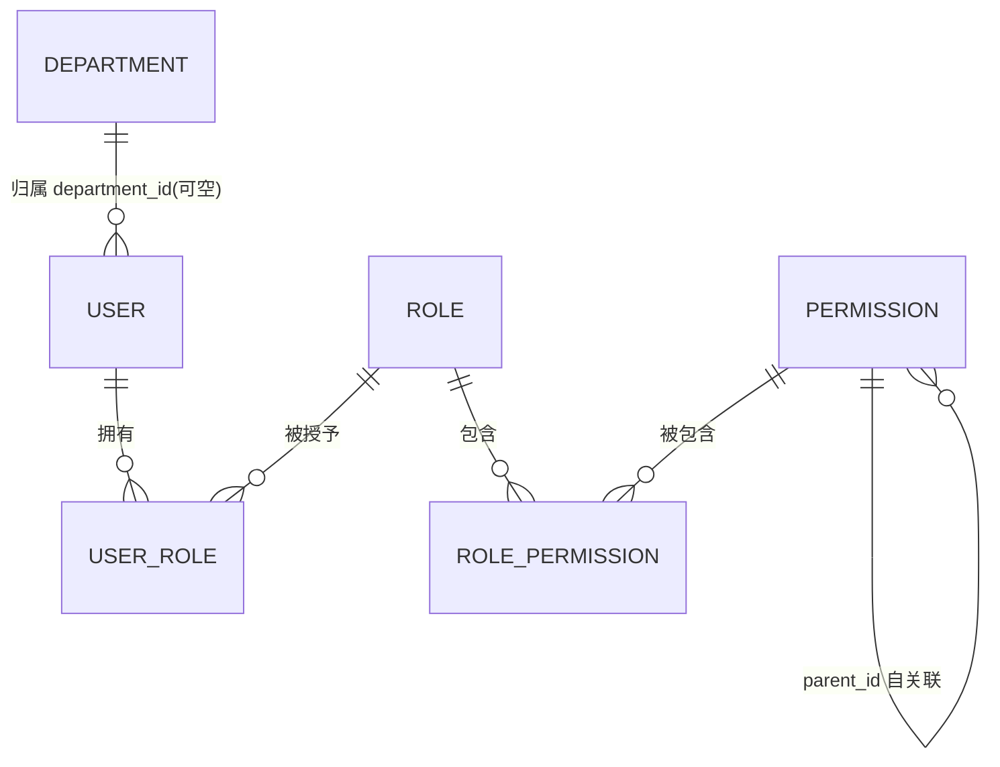
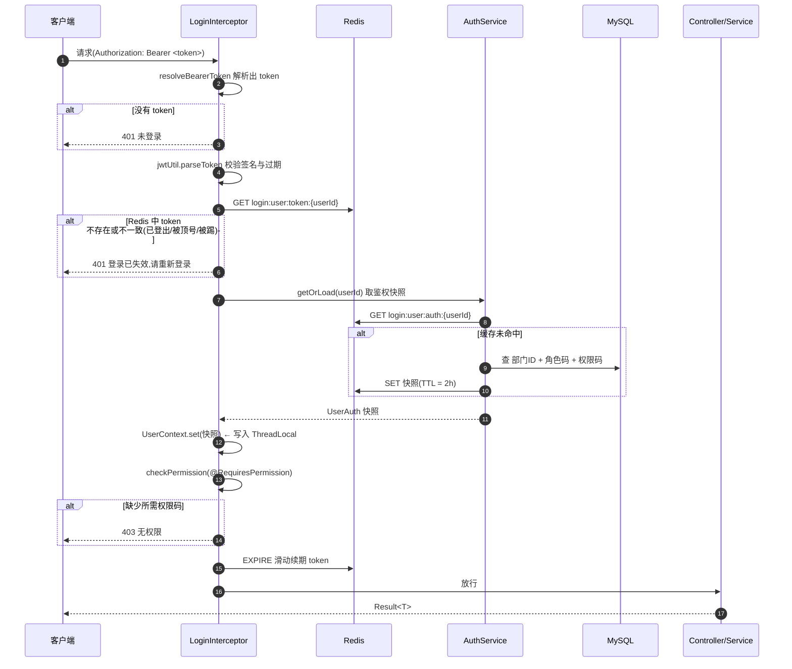
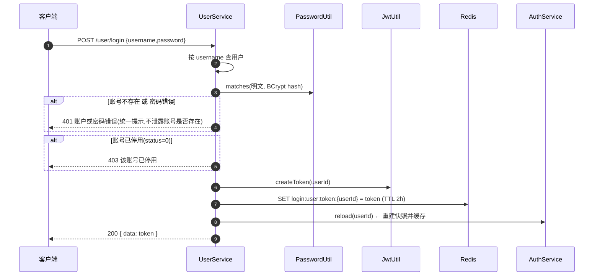

# 权限解析 —— 工单系统 RBAC 认证鉴权设计

> 本文档讲解「智能工单系统」**板块一：用户 / 角色 / 部门 / 权限 + 认证鉴权** 的设计理念与核心实现。
> 写作目的：作者本人复习 + 面试讲解，因此重点在**「为什么这么设计」**，而不只是「是什么」。
> 文中所有类名、方法名、接口路径、Redis key、权限码均与当前代码一致，可对照源码阅读。

---

## 一、文档定位

### 1.1 范围

本文覆盖板块一已经落地的三块能力：

| 能力 | 说明 |
|---|---|
| **认证（Authentication）** | 你是谁：登录签发 token、后续请求识别身份 |
| **授权（Authorization）** | 你能做什么：接口级权限校验 |
| **RBAC 数据模型** | 用户 / 角色 / 权限 / 部门 的建模与维护接口 |

### 1.2 边界（不在本文范围）

板块二（工单主流程：提单 → 审核 → 派单 → 处理 → 验收）尚未实现。本文只在**「数据范围」和「扩展方向」**两处提及它与板块一的衔接点，不展开。

### 1.3 一句话总览

> 用**自研拦截器 + Redis 鉴权快照**，在**不引入 Spring Security** 的前提下，实现了一套
> 「JWT 负责签名、Redis 负责登录态、权限码负责授权判断」的轻量 RBAC。

---

## 二、设计目标与原则

### 2.1 设计目标

1. **接口级鉴权**：每个接口声明「需要什么权限」，无权限直接 403，业务代码零侵入。
2. **数据范围隔离**：以「部门」为数据隔离单位，为板块二的工单可见范围打基础。
3. **变更即时生效**：管理员改了某人的角色 / 部门 / 权限后，**下一次请求**就生效，不等缓放过期。
4. **无状态可扩展**：服务端不存 Session，token 无状态、可水平扩展。

### 2.2 四条设计原则

| 原则 | 含义 | 反面（我们没有这么做） |
|---|---|---|
| **轻量自研，不引全家桶** | 只用 `HandlerInterceptor` + 自定义注解做鉴权 | 不引 Spring Security，避免为一个小系统引入整套过滤链与配置心智 |
| **按「权限码」判断，不按权限 ID** | 注解里写 `workorder:review` 这种字符串 | 不写 `@RequiresPermission(6)`，避免业务与自增主键耦合 |
| **快照缓存 + 主动失效** | 一次请求只读 Redis，变更时主动删缓存 | 不做「每次请求三表 join」也不做「定时刷新」 |
| **统一响应，业务码与 HTTP 码分离** | HTTP 恒为 200，状态在响应体 `code` | 不搞 HTTP 401/403 满天飞，前端只认一套 `Result` |

---

## 三、RBAC 模型与数据模型

### 3.1 模型关系

经典 **RBAC（Role-Based Access Control）**：用户不直接绑权限，而是绑角色，角色再绑权限。

```
User ──(user_role)── Role ──(role_permission)── Permission
  │
  └──(department_id)── Department   ← 数据范围（Data Scope）
```

- **认证**只关心 `User`。
- **功能权限**走 `User → Role → Permission`。
- **数据权限（范围）**走 `User → Department`，是板块二工单隔离的依据。

### 3.2 实体关系图



### 3.3 六张表逐张说明

> 建表脚本：`src/main/resources/db/schema.sql`；初始化数据：`src/main/resources/db/data.sql`

| 表 | 作用 | 关键字段 / 约束 |
|---|---|---|
| `department` | 部门字典，**数据隔离基础** | `dept_code` 唯一；无逻辑删除 |
| `user` | 账号主体 | `username` 唯一；`status`(0禁用/1启用)；`deleted` 逻辑删除；`department_id` 可空(可空=全局账号，如 ADMIN) |
| `role` | 角色字典 | `role_code` 唯一；**固定 5 个角色，不提供增删改** |
| `user_role` | 用户-角色关联(多对多) | `uk(user_id, role_id)` 防重复授权 |
| `permission` | 权限字典 | `perm_code` 唯一；`parent_id` 自关联支持权限树 |
| `role_permission` | 角色-权限关联(多对多) | `uk(role_id, permission_id)` 防重复授权 |

### 3.4 三个「为什么不」

**① 为什么部门要单独建模，而不是用户表里存个字符串？**
因为部门的本质不是「属性」而是「**范围**」。板块二里，审核人 / 派单人只能看到**本部门**的工单，工单提交时会快照 `department_id`。把部门抽成表 + 外键语义，才能做「按部门过滤」和「部门变更即改变数据范围」。

**② 为什么角色不提供 CRUD？**
看 `RoleController` 的注释：`// 新增角色 由于角色基本上固定的 不需要修改`。角色与业务流程（提单/审核/派单/处理/管理）**强绑定**——新增一个角色，代码里没有任何流程认它，是伪需求。因此角色只做「查列表」+「改权限」，不做增删改。**能砍的需求就是好设计。**

**③ 为什么权限用扁平表 + `parent_id`，而不是直接两级表？**
种子数据里 10 个权限 `parent_id` 全为 `null`（当前是扁平的一级权限），但表结构留了自关联。这样后续要给权限分组（如「工单权限」下挂 5 个子权限）时，**不用改表、不用改接口**——`GET /permission/tree` 已经能渲染多级。属于「结构上预留、数据上按需」。

---

## 四、认证与鉴权总览

### 4.1 请求全链路

任何受保护请求都会经过 `LoginInterceptor`（`src/main/java/com/rj/config/LoginInterceptor.java`）：



**这条链路里最关键的一句**：
`JWT 只保证「签名 + 未过期」，真正决定「还能不能用」的是 Redis 里那份 token。`

### 4.2 放行清单

不是所有请求都要登录，`WebMvcConfig` 里配置了白名单：

```java
.addPathPatterns("/**")
.excludePathPatterns(
        "/user/login", "/user/register",          // 免登录业务接口
        "/doc.html", "/webjars/**",               // 接口文档(Knife4j)
        "/v3/api-docs/**", "/swagger-ui/**",
        "/favicon.ico"
);
```

设计要点：**默认全拦，白名单放行**（而非反过来）。这样新增接口默认是受保护的，不会因为「忘了加注解」而裸奔。

---

## 五、核心机制详解

### 5.1 认证双保险：JWT + Redis

**只用 JWT 会有什么问题？**
JWT 是**自包含、无状态**的：服务端不存它，也就**没法主动作废**它。签发出去的 token 只要没到期就一直有效。这带来三个做不到的诉求：

- 用户点了「登出」→ 旧 token 仍能用；
- 管理员把某人「禁用」→ 他还能继续操作；
- 用户改了密码 / 在别处登录 → 旧会话无法失效。

**我们的解法：双保险。**
JWT 负责**签名与过期**（防篡改、减轻查询），Redis 负责**登录态**（可主动失效）。

```java
// 登录时:一个用户只保留一个有效 token,重复登录覆盖旧的(顶号)
stringRedisTemplate.opsForValue().set(
        LOGIN_USER_TOKEN_KEY + user.getId(), token,
        LOGIN_TOKEN_EXPIRE_HOURS, TimeUnit.HOURS);
```
```java
// 拦截时:JWT 通过后,还要和 Redis 里的当前 token 比对
if (userId == null || currentToken == null || !currentToken.equals(token)) {
    throw new BusinessException(ResultCode.UNAUTHORIZED, "登录已失效,请重新登录");
}
```

**由此获得的三个能力：**

| 能力 | 实现 |
|---|---|
| **登出** | 删 Redis token，旧 token 立即失效 |
| **踢下线 / 顶号** | 删或覆盖 Redis token |
| **滑动续期** | 每次请求 `EXPIRE` 续命，活跃用户不掉线 |

> 代价：每次请求多一次 Redis `GET`。对本系统规模完全可接受，换来的「可失效」是刚需。
> 见 `src/main/java/com/rj/util/JwtUtil.java`、`src/main/java/com/rj/common/RedisConstants.java`。

### 5.2 接口鉴权：`@RequiresPermission` + 拦截器

权限声明用自定义注解，**方法级优先于类级**：

```java
@Target({ElementType.METHOD, ElementType.TYPE})
@Retention(RetentionPolicy.RUNTIME)
public @interface RequiresPermission {
    String[] value();   // 需要全部满足的权限码,如 workorder:review
}
```

拦截器里的判断逻辑（`LoginInterceptor#checkPermission`）：

```java
// 方法上的注解优先,没有再找类上的
RequiresPermission required = AnnotatedElementUtils.findMergedAnnotation(
        handlerMethod.getMethod(), RequiresPermission.class);
if (required == null) {
    required = AnnotatedElementUtils.findMergedAnnotation(
            handlerMethod.getBeanType(), RequiresPermission.class);
}
if (required != null && !userAuth.hasAll(required.value())) {
    throw new BusinessException(ResultCode.FORBIDDEN, "无权限");
}
```

**为什么方法优先于类？** 允许「整个 Controller 都要 `user:manage`（标在类上），但个别接口放宽/收紧（标在方法上）」。

**为什么用「权限码」而不是「权限 ID」判断？**
- `@RequiresPermission("workorder:review")` 一眼看懂，自解释；
- 权限 ID 是数据库自增主键，会随导数据、环境重建而变化，写死在代码里极其脆弱；
- 权限码是**业务契约**，稳定、可读、可跨环境。

### 5.3 鉴权快照与缓存（灵魂所在）

**问题**：判断一个用户有没有某权限，需要 `user_role JOIN role_permission` 三表联查。每个受保护请求都查一遍，显然不行。

**解法**：登录时把「这个用户是谁、什么角色、什么权限、哪个部门」一次性组装成一个**快照 `UserAuth`**，缓存进 Redis。

```java
// com.rj.common.UserAuth —— 鉴权快照
private Long userId;
private Long departmentId;      // 数据范围
private Set<String> roleCodes;  // 角色码
private Set<String> permCodes;  // 权限码
```

**加载与缓存**（`com.rj.service.impl.AuthService`）:

| 方法 | 语义 |
|---|---|
| `getOrLoad(userId)` | 缓存优先，未命中回源 DB 重建并写回；命中则滑动续期 |
| `reload(userId)` | 强制回源重建（登录时调用，防止用到上次会话的残留） |
| `cache(userAuth)` | 写缓存，TTL 与 token 一致（2h） |
| `evict(userId)` | 删缓存，**变更后主动失效** |

回源 SQL 都做了联表一次取回，避免 N+1：

```java
// RoleMapper: 用户拥有的全部角色码
SELECT r.role_code FROM `role` r JOIN user_role ur ON ur.role_id = r.id WHERE ur.user_id = #{userId}

// PermissionMapper: 用户通过角色间接拥有的权限码(去重)
SELECT DISTINCT p.perm_code FROM permission p
  JOIN role_permission rp ON rp.permission_id = p.id
  JOIN user_role ur ON ur.role_id = rp.role_id
  WHERE ur.user_id = #{userId}
```

**一致性策略：主动驱逐（Cache Aside）。**
缓存不设「自然过期才更新」，而是在**会改变快照的所有写操作**里显式 `evict`。当前代码里所有触发点：

| 触发点 | 原因 |
|---|---|
| `UserService.assignRoles` | 角色变了 → 权限变了 |
| `UserService.assignDepartment` | 部门变了 → 数据范围变了 |
| `UserService.updateUser` | 仅当 `departmentId` 确实变化时驱逐（姓名/电话不影响快照） |
| `UserService.updateStatus`（禁用） | 登录态需立即失效 |
| `UserService.resetPassword` | 旧会话不再可信 |
| `UserService.deleteUser` | 用户没了 |
| `UserService.logout` | 主动登出 |
| `RoleService.assignPermissions` | 权限集变了 → **所有持有该角色的用户**逐个驱逐 |

> 注意最后一条：改的是「角色」，但受影响的是「一批用户」，所以要遍历 `user_role` 把持有者全部驱逐。
> 这就是「缓存失效要顺着依赖链推导影响面」的典型例子。

### 5.4 数据范围（部门隔离）

`departmentId` 被放进 `UserAuth` 快照，业务层通过 `UserContext.getDepartmentId()` 随手取用。

- **当前状态**：板块一里它只是「存好了」——`admin` 的 `department_id` 为 `NULL`（全局账号），其余种子用户都归研发部。
- **板块二用途（预留）**：审核人 / 派单人在 `Service` 层按 `department_id` 过滤工单查询，实现「只能看到本部门工单」。

设计说明原文写在 `LoginInterceptor` 类注释里：
> 部门级数据范围不在拦截器判断，交给 Service 层按 `UserContext.getDepartmentId()` 过滤。

**为什么不做成注解式数据权限？** 数据范围的条件因业务而异（工单按部门、附件按工单归属……），强行抽象成拦截器注解反而僵硬。**放到 Service 层按需拼查询条件，更简单也更好懂。**

### 5.5 用户上下文：ThreadLocal

`UserContext`（`src/main/java/com/rj/common/UserContext.java`）用 `ThreadLocal` 承载当前请求的快照，让业务代码不用层层传参：

```java
UserContext.getUserId();          // 当前用户ID
UserContext.getDepartmentId();    // 当前部门(数据范围)
UserContext.hasPermission("..."); // 是否拥有某权限
```

**必须有清理**：Web 容器线程是复用的，不清就会「串号」。因此在拦截器 `afterCompletion` 里：

```java
public void afterCompletion(...) {
    // 请求结束必须清除 ThreadLocal,避免线程池复用时把上一个请求的 userId 带到下一个请求
    UserContext.clear();
}
```

> 面试点：这是 ThreadLocal 的经典陷阱——**用完不 remove，线程池复用导致 A 用户的数据泄漏给 B 用户**。

---

## 六、关键业务流程

### 6.1 登录



两个安全细节：
- **登录失败统一提示**「账户或密码错误」，不区分「账号不存在」和「密码错误」，避免账号枚举。
- **登录成功先 `reload` 再返回**，保证缓存里是最新角色/权限，而不是上一次会话的残留。

### 6.2 注册

注册**只创建账号，不分配任何角色**（`status=1` 启用）。新账号必须由管理员通过 `PUT /user/{userId}/roles` 赋权后才能访问受限接口。这是「默认最小权限」的体现——注册出来就是个「没权限的空账号」。

### 6.3 覆盖式分配（角色 / 权限）

`assignRoles` 与 `assignPermissions` 都采用**覆盖式**语义：**以本次提交的列表为准**，不是增量追加。

```java
// 事务内:先清空旧关联,再写入新关联 —— 任一步失败整体回滚
userRoleMapper.delete(eq(UserRole::getUserId, userId));
for (Long roleId : distinctRoleIds) {
    userRoleMapper.insert(UserRole.builder().userId(userId).roleId(roleId).build());
}
authService.evict(userId);   // 变更后驱逐缓存
```

两个工程细节：
1. **先校验 ID 有效性**：用 `selectCount(in ids)` 反查，个数对不上就说明混进了不存在的 ID → 400。先去重再比对，避免「重复 ID 导致个数不符」的误判。
2. **整段包在事务里**：否则可能出现「旧关联清空了、新关联没写入」，用户直接丢角色。

### 6.4 管理员变更用户：为什么要「踢下线」

启停用 / 重置密码 / 删除，都会调用复用的私有方法 `logoutRemote`：

```java
private void logoutRemote(Long userId) {
    // token 才是真正的登录态凭据:JWT 未过期不代表仍可用
    stringRedisTemplate.delete(LOGIN_USER_TOKEN_KEY + userId);
    // 清掉鉴权快照,避免下次请求读到旧的角色/权限
    authService.evict(userId);
}
```

**核心原因**：拦截器只校验 token 和快照，**并不看 `status`**。如果禁用时不删 token，被禁用的账号凭旧 token 照样能干活，直到 2 小时后过期——这显然不对。所以「禁用」「重置密码」「删除」这三个语义上代表「旧会话必须立刻作废」的操作，都要删 token。

> 另一个方向是把 `status` 校验塞进 `loadFromDb`，但那样每次回源才拦得住；删 token 更直接、更即时。

**防自锁**：`updateStatus`（禁用）和 `deleteUser` 都禁止操作**当前登录账号**，否则管理员一键把自己废掉，管理入口就锁死了。

### 6.5 登出

`POST /user/logout` 是把上面这套「踢下线」用在自己身上：`UserContext.getUserId()` 取当前用户 → 删 token + 驱逐快照。登出**不需要** `user:manage` 权限（谁都能登出自己），但**需要登录**（在拦截器保护范围内）。

---

## 七、接口清单（板块一交付）

> 在线文档：`http://localhost:10001/doc.html`（Knife4j）。`所需权限` 一列凡为空即为「登录即可」。

### 用户 / 认证

| 方法 | 路径 | 所需权限 | 说明 |
|---|---|---|---|
| POST | `/user/login` | 公开 | 登录，返回 token |
| POST | `/user/register` | 公开 | 注册（不带角色） |
| POST | `/user/logout` | 登录 | 登出 |
| GET | `/user/me` | 登录 | 当前用户信息 + 角色/权限码 |
| GET | `/user/page` | `user:manage` | 用户分页（模糊匹配账号/姓名） |
| PUT | `/user/{userId}/roles` | `user:manage` | 覆盖式分配角色 |
| PUT | `/user/{userId}/department` | `user:manage` | 调整所属部门 |
| PUT | `/user/{userId}/status` | `user:manage` | 启停用（禁用即踢下线） |
| PUT | `/user/{userId}/password` | `user:manage` | 重置密码 |
| PUT | `/user/{userId}` | `user:manage` | 改基本信息（姓名/电话/部门） |
| DELETE | `/user/{userId}` | `user:manage` | 删除用户（逻辑删除） |

### 角色

| 方法 | 路径 | 所需权限 | 说明 |
|---|---|---|---|
| GET | `/role/list` | `user:manage` | 角色下拉 |
| PUT | `/role/{roleId}/permissions` | `user:manage` | 覆盖式分配权限（空数组=清空） |

### 部门

| 方法 | 路径 | 所需权限 | 说明 |
|---|---|---|---|
| GET | `/department/list` | `user:manage` | 部门下拉 |
| POST | `/department` | `user:manage` | 新增（编码唯一） |
| PUT | `/department/{id}` | `user:manage` | 修改（编码唯一，排除自身） |
| DELETE | `/department/{id}` | `user:manage` | 删除（被用户/工单引用则拒绝） |

### 权限

| 方法 | 路径 | 所需权限 | 说明 |
|---|---|---|---|
| GET | `/permission/tree` | `user:manage` | 权限树（按 `parent_id` 装配） |

### 前端如何做按钮级鉴权

登录后前端调 `GET /user/me`，拿到 `roles`（角色码）与 `perms`（权限码）列表，据此控制菜单 / 按钮显隐：

```json
{
  "code": 200,
  "data": {
    "userId": 2, "username": "submitter01", "realName": "提单人小王",
    "departmentId": 1, "departmentName": "研发部", "status": 1,
    "roles": ["SUBMITTER"],
    "perms": ["workorder:create", "workorder:modify", "workorder:withdraw", "workorder:accept", "workorder:query"]
  }
}
```

**注意**：前端的显隐只是**体验优化**，真正的安全边界永远在服务端拦截器。前端能隐藏按钮，但绕过前端直接调接口仍会被 403。

---

## 八、设计取舍与常见问题（面试点）

### Q1：为什么不用 Spring Security？
Spring Security 功能完备，但代价是一整套过滤链、`SecurityContext`、配置 DSL 的学习与调试成本。本项目鉴权逻辑清晰（token + 权限码），自研拦截器**约 100 行**就实现了等价能力，且完全可控、易讲清。**取舍：用「自己写、看得懂」换「框架开箱即用」**。若项目规模变大、需要 OAuth2 / 方法级 SpEL / CSRF 等，再引入也不迟。

### Q2：为什么权限判断用 code 不用 id？
见 §5.2。ID 是易变的物理主键，code 是稳定的业务契约。写 `"workorder:review"` 比写 `6` 可读、可跨环境。

### Q3：token 的「即时失效」怎么保证？
JWT 本身做不到，靠 Redis 双保险（§5.1）。登出/踢人/禁用/改密/删除都会删 Redis token，下一次请求立即 401。

### Q4：逻辑删除与 `username` 唯一索引有冲突吗？
**有，是个已知权衡。** `user` 表 `username` 有唯一索引，逻辑删除只把 `deleted` 置 1、行还在。因此**删除后无法用同名账号重新注册**（会撞唯一索引）。当前选择「保留历史、账号名不重用」，对工单系统是合理的（提单人名字要能追溯）。若要支持重建，需改为「逻辑删除 + 唯一索引带上 deleted」或物理删除。

### Q5：缓存和数据库怎么保持一致？
Cache Aside：读时缓存优先、未命中回源；**写时主动 `evict`**。不做「写库同时写缓存」（易不一致），也不靠「等缓存自然过期」（太慢，最长 2h 才生效）。所有 evict 触发点见 §5.3。

### Q6：密码安全做了哪些？
`PasswordUtil` 基于 Spring Security 的 `BCryptPasswordEncoder`：
- **随机盐**：同一密码每次 hash 结果不同，防彩虹表；
- **恒定时间比较**：防时序侧信道；
- **72 字节上限**：BCrypt 只取前 72 字节，超长会被静默截断造成「意外等价」，因此主动拒绝；
- **强度可配**：`password.bcrypt.strength`（当前 10）。

### Q7：响应为什么 HTTP 恒为 200？
统一 `Result<T>`（`code / message / data / timestamp`），业务状态放 `code`（见 `ResultCode`），由 `GlobalExceptionHandler` 把 `BusinessException` 转成标准响应体。好处：前端只需一套拦截逻辑；坏处：与 REST 纯正主义不符。团队内统一即可。

### Q8：一个小瑕疵（自我批评）
`IUserService` 里 `login` / `register` 返回 `Result<T>`，而其余方法返回领域对象/`void` 由 Controller 包装。两种风格并存不够统一。后续可统一为「Service 返回领域对象、Controller 负责包装」。

---

## 九、扩展方向

1. **数据权限落地（板块二）**：`UserContext.getDepartmentId()` 已在快照里备好，工单 Service 按部门拼查询条件即可。
2. **权限树分组**：`permission.parent_id` 已支持多级，补数据即可让 `GET /permission/tree` 渲染成组。
3. **工单权限码的使用**：种子里已定义 `workorder:*` 共 9 个权限码，板块二的工单接口直接挂 `@RequiresPermission("workorder:review")` 等。
4. **操作审计**：`work_order_operate_log` 表已建好，板块二记录工单状态流转。
5. **token 续期体验**：当前 2h 滑动续期；如需「记住我 / 刷新令牌」，可引入 access + refresh 双 token。

---

## 附：核心文件索引

| 关注点 | 文件 |
|---|---|
| 登录拦截 / 鉴权 | `src/main/java/com/rj/config/LoginInterceptor.java` |
| 放行白名单 | `src/main/java/com/rj/config/WebMvcConfig.java` |
| 鉴权快照缓存 | `src/main/java/com/rj/service/impl/AuthService.java` |
| 鉴权快照模型 | `src/main/java/com/rj/common/UserAuth.java` |
| 用户上下文 | `src/main/java/com/rj/common/UserContext.java` |
| 权限注解 | `src/main/java/com/rj/common/annotation/RequiresPermission.java` |
| Redis key / TTL | `src/main/java/com/rj/common/RedisConstants.java` |
| JWT 工具 | `src/main/java/com/rj/util/JwtUtil.java` |
| 密码工具 | `src/main/java/com/rj/util/PasswordUtil.java` |
| 用户业务 | `src/main/java/com/rj/service/impl/UserService.java` |
| 角色业务 | `src/main/java/com/rj/service/impl/RoleService.java` |
| 权限业务 | `src/main/java/com/rj/service/impl/PermissionService.java` |
| 建表 / 初始化数据 | `src/main/resources/db/schema.sql`、`db/data.sql` |
| 配置文件 | `src/main/resources/application.yaml` |
