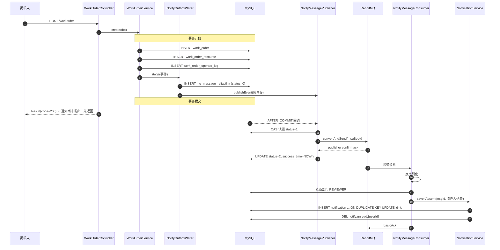
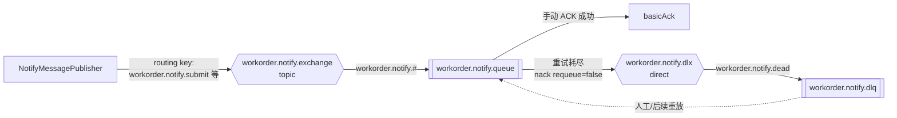
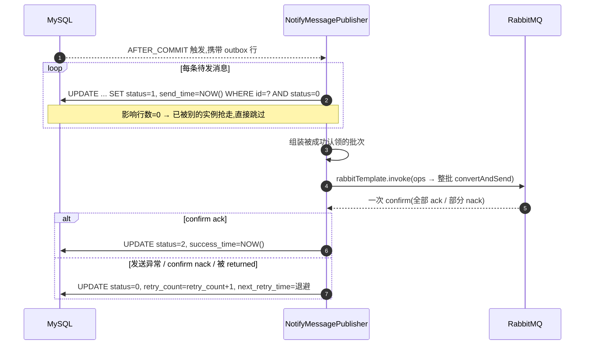
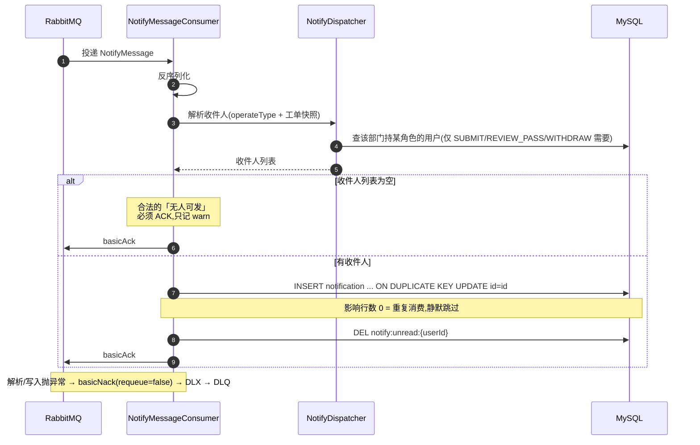
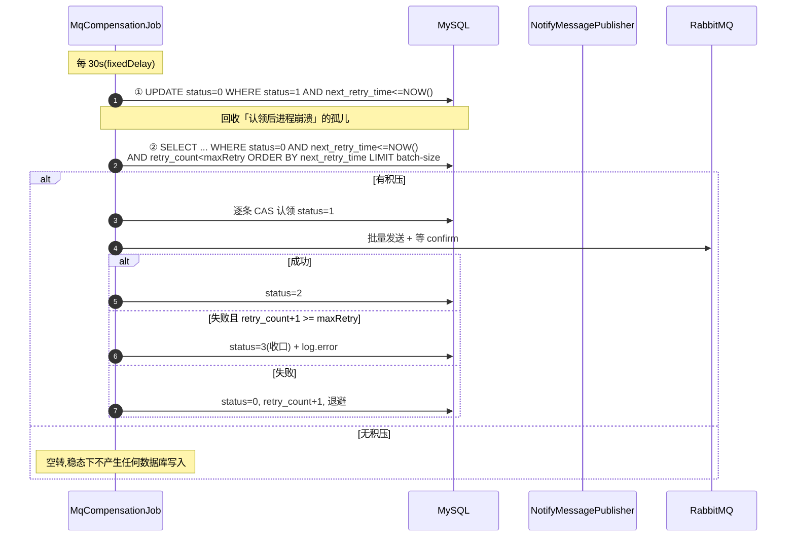

# 模块三（异步通知 / RabbitMQ）技术设计方案

> 本文档给出「智能工单系统」**模块三：异步通知（RabbitMQ）** 的完整技术设计方案。
> 写作目的：作为实现前的设计依据 + 作者本人复习/面试讲解材料，因此既写「怎么做」，也写**「为什么这么设计」与「我们没选什么」**。
> 文中所有类名、方法名、表名、字段、状态码、权限码均与当前代码一致（`src/main/java/com/rj/` 与 `src/main/resources/db/`），可对照源码阅读。
> **本文只做设计，不含实现代码。** 落地顺序与验证方式见第十五～十七节。
>
> 前置阅读：`设计理念/权限解析.md`（板块一：认证鉴权 + RBAC）、`设计理念/工单核心业务.md`（板块二：工单状态机）、`阶段计划书/模块二.md`（板块二实现计划）。

---

## 一、文档定位

### 1.1 范围

本模块解决一件事：**工单创建或状态变更后，异步通知相关人（审核人 / 派单人 / 处理人 / 提单人）站内信。**

具体交付：

1. 把工单的 10 种流转事件接入消息通路（生产侧）；
2. 站内信消息的可靠投递（本地消息表 + 提交后发送 + 定时补偿）；
3. 消费端解析收件人并落库站内信（幂等）；
4. 站内信的读侧接口（分页收件箱 / 未读数 / 标记已读 / 全部已读）；
5. 失败消息的重试与死信队列。

### 1.2 边界（不在本文范围）

| 不做 | 原因 |
|---|---|
| 邮件 / 短信 / IM 推送 | 本次只实现站内信。表结构预留 `channel` 字段与消费端路由分支，**加渠道不需要动生产者与本地消息表** |
| SLA 到期前预警（到期前 1 小时提醒） | 是独立触发源（不是状态变更），需要额外的扫描与「已预警」去重标记；列为扩展方向 |
| MQ 中间件的安装、集群、运维 | 本机当前**未安装 RabbitMQ**，本设计把「无 broker」当作一等公民场景（见第 1.3 节与第六节）|
| 通用缓存策略、缓存击穿/穿透防护、分布式锁 | 属模块四。本文只用「未读数」这一处模块私有的写失效缓存，并说明它为何不等模块四 |
| 工单状态机本身的任何改动 | 模块三对模块二是**纯下游**，不改状态机、不改接口、不改表 |

### 1.3 一句话总览

> **把「工单变更」与「投递意图」放进同一个数据库事务，把真正的网络发送挪到事务提交之后，再用一个定时任务兜住「提交后发送失败」的那段窗口。**

这条链路里的每一环都对应一种失败：把投递意图和业务变更同事务落库，解决的失败是「消息发出去了但事务回滚了」；发送挪到提交后，解决的是「事务还没提交就把消息放出去，消费端读到旧数据」；补偿任务兜的是「提交成功、发送失败（broker 挂了 / 进程崩了）」。**三段式，缺一段就有一种丢消息的姿势。**

配套的一条硬性纪律写在第五节：**事件键只能是 `OperateType`，绝不能用「前后状态是否相同」来判断要不要发通知**——因为转派（`TRANSFER`）在状态机里是 `2 → 2` 的合法自环。

---

## 二、职责边界与模块关联

### 2.1 与四个模块的关系

| 模块 | 关联方向 | 具体依赖 | 关键约束 |
|---|---|---|---|
| **模块一：认证鉴权 RBAC** | 模块三**依赖**模块一 | ① 读侧接口复用 `LoginInterceptor` 的身份校验与 `UserContext`；② 收件人解析要查 `user` / `user_role` / `role` 三张表（板块一建的）；③ 角色码字符串 `ADMIN/SUBMITTER/REVIEWER/DISPATCHER/HANDLER` 是收件人字典的取值域 | ⚠️ **MQ 消息不携带 token。** 消费者是系统内部行为，不经过 `LoginInterceptor`，因此**不能用 `@RequiresPermission`**——这不是漏了鉴权，而是消费端根本没有「当前用户」这个概念 |
| **模块二：工单核心业务** | 模块三是模块二的**下游** | 挂在 3 个发布触点上读事件（见第九节）；复用 `OperateType` / `WorkOrderStatus` 枚举；收件人来自 `WorkOrder.userId` / `handlerId` / `departmentId` | **不改状态机、不改工单表、不给工单接口加语义。** 生产侧对工单事务只增加 1 次 INSERT（第十一节量化） |
| **模块四：缓存与分布式锁** | 模块三**部分自备，部分留给它** | 模块三自带「未读数」缓存（`notify:unread:{userId}`，写失效 + TTL 300s）；通用缓存策略、缓存击穿/穿透防护留给模块四 | ⚠️ **补偿 Job 用 CAS 认领保证多实例正确性，不依赖分布式锁。** 模块四的锁对本 Job 只是「省掉无效扫描」的优化，**不是补漏**（第十一节详述）|
| **模块五：全局能力** | 模块三**复用** | `Result` / `PageResult` / `BusinessException` / `GlobalExceptionHandler` / `@Valid` / `@Scheduled` | 遵守「HTTP 恒 200，业务态在 body `code`」的既有约定，**不新增 `ResultCode` 枚举值** |

### 2.2 与 `application.yaml` 现有配置的关系

这一节刻意把每一条既有配置都过一遍，包括**关系很弱甚至无关的那些**——说清楚「无关」比假装有关更有价值。

| 现有配置 | 位置 | 与模块三的关系 |
|---|---|---|
| `jwt.secret` / `jwt.timeout: 7200` | `application.yaml:27-29` | **无直接关系。** JWT 是 HTTP 入口的身份凭证，只管「谁在调接口」。MQ 消息是系统内部投递，消费者不校验 token。**推论：消费端无法、也不应该做用户级鉴权**；权限边界在「谁读得到通知」这一侧（第八节），由读侧接口把 `user_id` 强制取自 `UserContext` 来保证 |
| Redis `database: 4` | `application.yaml:16-23` | 未读数缓存沿用同一 db 4。`notify:unread:*` 与 `login:user:*` 同库不同前缀，互不干扰。Key 前缀统一在 `common/RedisConstants.java` 登记 |
| `password.bcrypt.strength: 10` | `application.yaml:31-34` | **弱相关，且不构成本模块的设计约束。** 诚实说明：模块三不处理任何密码。消息体内不放凭据；即便将来站内信带「重置密码」链接，正确做法是放**一次性 token**（短 TTL、用后即失效），而**不是**把 BCrypt 哈希放进消息。BCrypt cost 只影响登录时的一次哈希开销，与消息链路无关 |
| （需新增）`spring.rabbitmq.*` | — | 见第六节 |
| （需新增）`mq.notify.*` | — | 见第六节。`mq.notify.enabled` **默认 `false`**（本机无 broker 的诚实默认），相关 Bean 用 `@ConditionalOnProperty` 门控 |

> ⚠️ **为什么 `mq.notify.enabled` 默认 `false` 是个设计决策，而不是偷懒？**
> 本机未安装 RabbitMQ。若强行让 `RabbitAdmin` / `@RabbitListener` 无条件启动，应用启动过程会持续打印连接失败日志。用配置开关把「模块存在」与「broker 存在」解耦之后：关闭时应用启动干净、工单照常流转、**outbox 行照写**（`status=0`）；装上 broker 打开开关，补偿 Job 会把积压一次性排空。**「能不能发」与「该不该记」是两件事，后者永远要做。**

---

## 三、设计目标与原则

### 3.1 设计目标

1. **至少一次投递（at-least-once）**：消息不丢是硬指标；重复投递由消费端幂等吸收（因此叫「至少一次」而非「恰好一次」）。
2. **不阻塞主流程**：通知是工单流转的**副作用**，任何通知链路的失败都不得让工单接口报错或回滚。
3. **broker 可选**：RabbitMQ 不可用时降级为「只落本地消息表」，恢复后自动补齐。
4. **可追溯**：每条通知都能回答「由哪条消息产生」「对应哪张工单」「发给谁」「读没读」。

### 3.2 五条设计原则

| 原则 | 含义 | 反面（我们没有这么做） |
|---|---|---|
| 同事务落投递意图 | 投递意图与业务变更在**同一个数据库事务**里提交 | 不在事务内直接 `convertAndSend`——那会出现「消息已发出但事务回滚」，消费端读到一个不存在的工单 |
| 发送在提交之后 | 真正的网络发送由 `@TransactionalEventListener(AFTER_COMMIT)` 触发 | 不用「事务同步回调」手写（等价但更底层、更易漏）；不用「调用方手动记得调」（有人忘调就静默丢事件）|
| 事件键用 `OperateType` | 通知类型 1:1 映射 `OperateType` 的 10 个值 | **绝不用 `fromStatus != toStatus` 判断**——`TRANSFER(8)` 是 `2 → 2` 自环，这么写会让**所有转派通知静默丢失** |
| 生产侧只记「发生了什么」，消费侧才决定「发给谁」 | outbox 每事件只写 1 行，`msg_body` 描述事件 | 不在生产端解析收件人（把查询压进工单事务、把 N 个收件人变成 N 行 outbox、`uk_msg_id` 幂等键失效）|
| 幂等靠数据库唯一键 | `notification` 表的 `uk_msg_user (msg_id, user_id)` | 不用 Redis `SETNX`（Redis 抖动就丢幂等，还引入双写不一致）；不单独建「已处理消息表」（`notification` 本身就是那张表）|

---

## 四、整体架构与分层

### 4.1 分层与数据流

```
【生产侧：在工单事务内】
  WorkOrderController
        ↓
  WorkOrderService（状态机校验 + 乐观锁 + 写 operate_log）
        ↓  3 个触点调用
  NotifyOutboxWriter.stage(...)  ── INSERT ──→  mq_message_reliability (status=0)
        └── ApplicationEventPublisher.publishEvent(...)   ← 纯内存，无 I/O
                          │
                  ═══ 事务提交 ═══
                          ↓
【投递侧：提交之后】
  NotifyMessagePublisher  @TransactionalEventListener(AFTER_COMMIT)
        ├── CAS 认领：UPDATE ... WHERE id=? AND status=0   → status=1
        ├── 批量 rabbitTemplate.invoke(ops -> ...)         ← 整批同一 Channel，只等一次 confirm
        └── confirm ack → status=2 ／ 失败 → 退回 status=0（retry_count+1，指数退避）
                          ↓
                    RabbitMQ（workorder.notify.exchange → workorder.notify.queue）
                          ↓
【消费侧：异步】
  NotifyMessageConsumer  @RabbitListener（手动 ACK）
        ├── 反序列化 NotifyMessage
        ├── NotifyDispatcher 解析收件人 + 渲染文案（唯一解析库查询在此发生）
        ├── NotificationService.saveIfAbsent(...)  ── INSERT ... ON DUPLICATE KEY ──→ notification
        └── basicAck ／ 异常 basicNack(requeue=false) → DLX → DLQ
                          ↓
【读侧】
  NotificationController → NotificationService → MySQL（收件箱）/ Redis（未读数）

【兜底】
  MqCompensationJob  @Scheduled
        ├── UPDATE status=1 → 0（回收「认领后进程崩溃」的孤儿）
        └── 扫 status=0 AND next_retry_time<=NOW() LIMIT n → 按第 4 步重投
```

### 4.2 新增类与单一职责

| 类 | 包路径 | 单一职责 | 是否受 `mq.notify.enabled` 门控 |
|---|---|---|---|
| `RabbitMqConfig` | `com.rj.config` | 声明交换机/队列/DLX/DLQ 与绑定；装配 `RabbitTemplate`、`JacksonJsonMessageConverter`、`RabbitAdmin` | ✅ |
| `MqNotifyProperties` | `com.rj.config` | 绑定 `mq.notify.*` 配置 | ❌（仅配置绑定）|
| `NotifyMessage` | `com.rj.mq` | 事件载荷，**其 JSON 序列化结果就是 `msg_body` 的内容** | ❌ |
| `WorkOrderNotifyEvent` | `com.rj.mq` | Spring 应用事件，携带「已落库的 outbox 行」 | ❌ |
| `NotifyOutboxWriter` | `com.rj.mq` | **事务内**：序列化 → INSERT outbox → `publishEvent`。不发送、不 try-catch、不门控 | ❌ |
| `NotifyMessagePublisher` | `com.rj.mq` | **提交后**：CAS 认领 → 批量发送 → confirm 回写。**所有异常吞掉记 ERROR** | ✅ |
| `NotifyMessageConsumer` | `com.rj.mq` | 手动 ACK；调用 `NotifyDispatcher` 与 `NotificationService`；异常分野处理 | ✅ |
| `MqCompensationJob` | `com.rj.job` | 回收孤儿 + 扫描重投 + 退避 + 重试耗尽收口 | ✅ |
| `NotifyDispatcher` | `com.rj.service.impl` | **收件人字典 + 文案字典**（纯函数，除查收件人外无副作用） | ❌ |
| `Notification` | `com.rj.model.pojo` | 站内信实体 | ❌ |
| `NotifyChannel` | `com.rj.model.enums` | 渠道枚举（1站内信 2邮件 3短信）| ❌ |
| `NotificationMapper` | `com.rj.mapper` | `BaseMapper<Notification>` + 1 个 `ON DUPLICATE KEY` 的 `@Insert` | ❌ |
| `INotificationService` / `NotificationService` | `com.rj.service` / `impl` | 站内信读侧 + 幂等写 + 未读数缓存 | ❌ |
| `NotificationVO` | `com.rj.model.vo` | 收件箱展示模型 | ❌ |
| `NotificationController` | `com.rj.controller` | 4 个读侧接口 | ❌ |

> **分层说明**：`com.rj.mq` 是本项目新增的包。之所以不塞进 `service/impl`，是因为这 5 个类构成一条**独立的技术管线**（可靠投递），它们不表达业务规则——业务规则（收件人是谁、文案是什么）全部收在 `NotifyDispatcher` 里。这样「传输可靠性」与「业务语义」的边界是清晰的。

### 4.3 端到端时序



注意第 13 行的顺序：**接口在通知发出之前就返回了**。这正是「异步」的含义——用户不会因为下游慢了而等待。

---

## 五、消息与通知模型

### 5.1 事件载荷 `NotifyMessage`（= `msg_body` 的 JSON 结构）

| 字段 | 类型 | 说明 |
|---|---|---|
| `msgId` | String | 消息唯一ID（UUID），与 `mq_message_reliability.msg_id` 一致 |
| `bizType` | String | 固定 `workorder_notify` |
| `orderId` | Long | 工单ID |
| `orderNo` | String | 工单编号（快照，消费端免 join）|
| `orderTitle` | String | 工单标题（快照）|
| `departmentId` | Long | 工单归属部门（提单时快照）|
| `creatorUserId` | Long | 提单人ID |
| `handlerId` | Long | 处理人ID（派单前为 null）|
| `operatorId` | Long | 本次操作人ID（`closeTimeout` 时为 `0`，即 `SYSTEM_OPERATOR_ID`）|
| `operateType` | Integer | **事件键**，取值 1-10，见 5.2 |
| `fromStatus` | Integer | 变更前状态（仅作展示/日志用，**不作判断依据**）|
| `toStatus` | Integer | 变更后状态（同上）|
| `remark` | String | 操作备注（驳回原因等，可空）|
| `occurredAt` | LocalDateTime | 事件发生时间 |

> **为什么载荷里同时有 `fromStatus`/`toStatus` 却明令「不作判断依据」？**
> 它们是给人看的（日志、排查），不是给程序分支用的。留 `remark` 是因为驳回原因就在里面，直接渲染进通知文案比消费端回查 `operate_log` 便宜得多。**凡是「可能被误用」的字段，都要在设计里点名它的正确用途**——否则半年后一定会有人写 `if (fromStatus != toStatus)`。

### 5.2 通知类型字典（= `OperateType`，唯一权威来源）

| `notify_type` | 枚举 | 中文 | 触发点 | 收件人 | 排除 |
|---|---|---|---|---|---|
| 1 | `SUBMIT` | 提交 | `create()` / `resubmit()` | 该部门 `REVIEWER` | 操作人本人 |
| 2 | `REVIEW_PASS` | 审核通过 | `transition()` | 该部门 `DISPATCHER` | 操作人 |
| 3 | `REVIEW_REJECT` | 审核驳回 | `transition()` | `creatorUserId`（提单人）| 操作人 |
| 4 | `DISPATCH` | 派单 | `transition()` | `handlerId`（**新**处理人）| 操作人 |
| 5 | `PROCESS_FINISH` | 处理完成 | `transition()` | `creatorUserId` | 操作人 |
| 6 | `ACCEPT_PASS` | 验收通过 | `transition()` | `handlerId` | 操作人 |
| 7 | `ACCEPT_REJECT` | 验收退回 | `transition()` | `handlerId` | 操作人 |
| 8 | `TRANSFER` | 转派 | `transition()` | `handlerId`（**新**处理人）| 操作人；**不通知原处理人** |
| 9 | `WITHDRAW` | 撤回/取消 | `transition()` | `handlerId` 非空则给他，否则该部门 `DISPATCHER` | 操作人 |
| 10 | `TIMEOUT_CLOSE` | 超时关闭 | `closeTimeout()` | `creatorUserId` + `handlerId` | 操作人（`0` 非真实用户，排除无效果）|

**额外规则**：

- **永远排除操作人自己**：没有人需要被告知「你刚做的事」。
- **`TIMEOUT_CLOSE` 是系统行为**（`operatorId = 0`），据实排除操作人这一步是空操作，但要写下来，避免有人日后把它当成遗漏而「修复」。
- **`TRANSFER` 不通知原处理人**：转派意味着工单离他而去，通知他只会造成困惑。这是刻意的产品判断，不是遗漏。

### 5.3 通知文案

文案采用**「类型 → 模板」字典 + 简单占位符替换**（`{orderNo}`、`{orderTitle}`、`{remark}`），在消费端渲染后落库。**落库的是已渲染的成品文本**，不是模板——理由见第七节 7.2。

| `notify_type` | 标题 | 正文模板 |
|---|---|---|
| 1 | 新工单待审核 | 工单 {orderNo}「{orderTitle}」已提交，请及时审核 |
| 2 | 工单待派单 | 工单 {orderNo} 审核已通过，请安排处理人 |
| 3 | 工单被驳回 | 工单 {orderNo} 被驳回，原因：{remark} |
| 4 | 新工单已派给你 | 工单 {orderNo}「{orderTitle}」已派给你，请及时处理 |
| 5 | 工单待验收 | 工单 {orderNo} 已处理完成，请验收 |
| 6 | 验收通过 | 工单 {orderNo} 已验收通过 |
| 7 | 验收退回 | 工单 {orderNo} 被验收退回，请返工处理 |
| 8 | 工单转派给你 | 工单 {orderNo}「{orderTitle}」已转派给你 |
| 9 | 工单已取消 | 工单 {orderNo} 已被取消 |
| 10 | 工单已超时关闭 | 工单 {orderNo} 因超时被系统自动关闭 |

**`TRANSFER` 的文案与 `DISPATCH` 区分开**是有意的：两者收件人相同（新处理人），但「这是新单」与「这单从别人手里转来了」对处理人的心理预期不同。

---

## 六、RabbitMQ 拓扑与配置

### 6.1 拓扑

| 组件 | 名称 | 类型 | 说明 |
|---|---|---|---|
| 业务交换机 | `workorder.notify.exchange` | topic, durable | 生产侧只认识它 |
| 业务队列 | `workorder.notify.queue` | durable | 带 DLX 参数 |
| 绑定 | `workorder.notify.#` | routing pattern | 一条绑定覆盖全部通知类型 |
| 路由键 | `workorder.notify.<operateType>` | — | 如 `workorder.notify.submit`（小写枚举名）|
| 死信交换机 | `workorder.notify.dlx` | direct, durable | 业务队列的 `x-dead-letter-exchange` |
| 死信队列 | `workorder.notify.dlq` | durable | 绑定路由键 `workorder.notify.dead` |
| 死信路由键 | `workorder.notify.dead` | — | 业务队列的 `x-dead-letter-routing-key` |



### 6.2 为什么是 topic 单队列

| 决策 | 选择 | 理由 | 反面 |
|---|---|---|---|
| 交换机类型 | **topic** | 将来按渠道拆队列（`workorder.notify.sms.#`）只需**加一条绑定**，生产者与本地消息表完全不动 | 选 direct 的话每加一个渠道都要改生产者的路由键拼接逻辑 |
| 队列数量 | **1 个**（MVP）| 保序（同一工单的事件按顺序消费）+ 运维简单 + 本地消息表的 `exchange`/`routing_key` 两列语义干净 | 一上来就按渠道路由（`sink` 模式）会把拓扑复杂度提前引入，而当前只有站内信一个渠道 |
| 渠道分发位置 | **消费端 `switch(channel)`** | 这正是「加渠道不动生产者」的落地方式：`channel` 是消息内容的一部分，路由不参与渠道决策 | 让路由键承担渠道维度，则渠道数 × 事件数 = 绑定数爆炸 |

> **一句话**：路由键表达「**发生了什么**」，消息体表达「**发给谁、走哪个渠道**」。

### 6.3 `application.yaml` 新增配置

```yaml
spring:
  rabbitmq:
    host: localhost
    port: 5672
    username: guest
    password: guest
    virtual-host: /
    connection-timeout: 5s
    # 生产者确认: correlated = 发 confirmation 并在 CorrelationData 上可取结果
    publisher-confirm-type: correlated
    # 不可路由的消息回退给发送方(配合 template.mandatory)
    publisher-returns: true
    template:
      mandatory: true
    listener:
      simple:
        # 手动 ACK: 由消费端代码决定 ack/nack,不靠容器猜测
        acknowledge-mode: manual
        prefetch: 10
        concurrency: 2
        max-concurrency: 4
        # 重试耗尽后不无限 requeue,交给 DLX
        default-requeue-rejected: false
        retry:
          enabled: true
          max-attempts: 3
          initial-interval: 1s
          multiplier: 2.0
          max-interval: 10s

mq:
  notify:
    # 本机未安装 RabbitMQ 时保持 false;装上 broker 后置 true
    enabled: false
    exchange: workorder.notify.exchange
    queue: workorder.notify.queue
    routing-key-prefix: workorder.notify.
    dead-letter-exchange: workorder.notify.dlx
    dead-letter-queue: workorder.notify.dlq
    dead-letter-routing-key: workorder.notify.dead
    confirm-timeout-seconds: 3
    compensation:
      enabled: true
      scan-delay-ms: 30000
      batch-size: 200
      max-retry: 5
      backoff-seconds: 30
```

**配置要点说明**：

| 配置 | 为什么是这个值 |
|---|---|
| `publisher-confirm-type: correlated` | 需要拿到每条消息的 ack/nack 才能把 outbox 推到 `status=2`。`simple` 只代表「进入 confirm 模式」但不带每一跳的结果 |
| `template.mandatory: true` + `publisher-returns: true` | 交换机存在但**路由不到队列**时，消息会被 broker 丢弃。开启 returns 后 `CorrelationData.getReturned()` 能拿到回退消息（它保证在 confirm 之前填充）。**「路由失败」也是一种失败，不能让 outbox 错认为成功** |
| `acknowledge-mode: manual` | 幂等写的成功/失败必须由业务代码裁决，不能由「方法没抛异常」代替 |
| `prefetch: 10` | 通知处理是「几次查询 + 一次插入」的轻量操作，10 条足以摊平网络往返，又不会在单实例上囤积过多未确认消息 |
| `max-attempts: 3` + `multiplier: 2.0` | 瞬时故障（连接抖动、死锁）给 3 次机会；再失败说明不是瞬时问题，进 DLQ 比继续占资源更有价值 |
| `default-requeue-rejected: false` | **防止「毒消息」无限循环**。默认 `true` 会让处理必然失败的消息被反复 requeue，占满 prefetch 窗口且永不进 DLQ |
| `confirm-timeout-seconds: 3` | 同步等 confirm 发生在「提交后的请求线程」上（见 6.4），必须有上界。3s 与 `connection-timeout: 5s` 同量级 |
| `compensation.scan-delay-ms: 30000` | 补偿路径是**降级路径**，不是常态路径。稳态下它扫不到任何东西；30s 一次的开销可以忽略 |
| `MQ_NOTIFY_ENABLED` 默认 `false` | 见 2.2 的说明 |

> ⚠️ **`spring.rabbitmq.listener.simple.retry.*` 有一个静默失效陷阱。**
> Boot 的 Rabbit 自动配置里，重试拦截器的装配条件是 `@ConditionalOnClass(RetryOperations.class)`——也就是说**如果 classpath 上没有 `spring-retry`，上述 `retry.*` 配置会被直接忽略，且不会有明显的启动报错**。结果是「我明明配了 3 次重试，为什么第一次异常就进 DLQ 了」。因此 `pom.xml` 需要**显式**加 `org.springframework.retry:spring-retry`（版本由 Boot BOM 管理，不写版本号）。

### 6.4 confirm 的等待方式：同步，不用异步回调

| 方案 | 结论 |
|---|---|
| **同步等 confirm**（`CorrelationData.getFuture().get(3, SECONDS)`） | ✅ **采用**。阻塞发生在**事务提交之后**的线程上，不回吐到工单事务。3s 上界明确，代码是直线的一条 |
| 异步 `setConfirmCallback` | ❌ 回调运行在 **AMQP 客户端线程**，回写 `status` 需要另起事务/会话，复杂度翻倍；收益只是省掉这 3s 阻塞，而这 3s 阻塞不占用数据库事务，代价可接受 |

`CorrelationData.getFuture()` 自 Spring AMQP 3.0 起返回 `CompletableFuture<Confirm>`（更早版本是 `ListenableFuture`）。`Confirm.isAck()` 决定 `status=2` 还是退回 `0`；`CorrelationData.getReturned()` 非空表示路由失败，同样按失败处理。

### 6.5 无 broker 时的行为

| 环节 | `mq.notify.enabled=false` 时 | `enabled=true` 但 broker 未启动时 |
|---|---|---|
| 应用启动 | 正常，无连接尝试 | 正常启动（`@RabbitListener` 容器持续重连并打日志，不阻断启动）|
| 工单流转 | 正常，outbox 行照写（`status=0`）| **正常**，`NotifyMessagePublisher` 抛出的连接异常被吞掉记 ERROR |
| outbox 状态 | 停在 `0` | 停在 `0`（发送失败退回）|
| 补偿 Job | 不运行（同受门控）| 运行，但同样发不出去，`retry_count` 累积到上限后收口为 `status=3` |

> 最后一行值得注意：**broker 长时间不可用会把消息推到 `status=3`（失败终态）**，恢复后补偿 Job 就不再重试了。这是刻意的——无限重试一个永久失败的目标没有意义。因此 `max-retry` 与 `backoff-seconds` 的乘积决定了「broker 可以挂多久而不丢通知」：`5 × 30s` 的退避序列约为 1.5 分钟到 2 分钟。**要更长的容忍窗口，调大这两个值，而不是取消上限。**

---

## 七、数据库表结构设计

### 7.1 `mq_message_reliability`（本地消息表 / outbox）——已有，不重新设计

该表在板块一阶段已建好（`schema.sql:234-258`），POJO 与 Mapper 也已存在但从未被引用。模块三的工作是**接线**，遵循它既定的字段语义。

| 字段 | 类型 | 可空 | 默认 | 说明 |
|---|---|---|---|---|
| `id` | BIGINT | 否 | AUTO_INCREMENT | 主键 |
| `msg_id` | VARCHAR(64) | 否 | — | 消息唯一ID（业务侧生成 UUID）|
| `biz_type` | VARCHAR(50) | 否 | — | 业务类型，本模块固定 `workorder_notify` |
| `biz_id` | VARCHAR(64) | 是 | NULL | 业务单据ID（工单ID的字符串形式）|
| `exchange` | VARCHAR(128) | 否 | — | 交换机名称 |
| `routing_key` | VARCHAR(128) | 否 | — | 路由键 |
| `msg_body` | MEDIUMTEXT | 否 | — | 消息体（JSON）|
| `status` | TINYINT | 否 | 0 | **0待发送 1已投递待确认 2已确认 3失败** |
| `retry_count` | INT | 否 | 0 | 已重试次数 |
| `next_retry_time` | DATETIME | 否 | CURRENT_TIMESTAMP | 下次重试时间 |
| `create_time` | DATETIME | 否 | CURRENT_TIMESTAMP | 创建时间 |
| `send_time` | DATETIME | 是 | NULL | 最近发送时间 |
| `success_time` | DATETIME | 是 | NULL | 确认成功时间 |

| 索引 | 类型 | 列 | 用途 |
|---|---|---|---|
| `PRIMARY` | 主键 | `id` | — |
| `uk_msg_id` | UNIQUE | `msg_id` | 幂等：同一事件不会被重复落库 |
| `idx_status_retry` | 普通 | `(status, next_retry_time)` | **补偿 Job 的扫描索引**，见 11.2 |

⚠️ **两个必须注意的实现细节**：

1. **该表没有 `@Version`**，`status` 的并发修改只能靠 CAS（`UPDATE ... WHERE id=? AND status=期望值`）。这不是「可选优化」而是**正确性要求**（11.3）。
2. **`next_retry_time` 是 `NOT NULL`**。虽然 MyBatis-Plus 3.5.x 默认 `insertStrategy = NOT_NULL`（null 字段被跳过，落到 DB 默认值），但**不要在 `stage()` 里留 null 去依赖这个巧合**——显式写 `LocalDateTime.now()`。换 MP 版本或给字段加 `@TableField` 都可能让这个巧合失效。

### 7.2 `notification`（站内信）——新增

| 字段 | 类型 | 可空 | 默认 | 说明 |
|---|---|---|---|---|
| `id` | BIGINT | 否 | AUTO_INCREMENT | 主键 |
| `msg_id` | VARCHAR(64) | 否 | — | 来源消息ID，= `mq_message_reliability.msg_id`。**幂等键的一半** |
| `user_id` | BIGINT | 否 | — | **收件人ID**。**幂等键的另一半** |
| `biz_type` | VARCHAR(50) | 否 | `workorder_notify` | 业务类型，与 outbox 一致 |
| `biz_id` | VARCHAR(64) | 是 | NULL | 业务单据ID（工单ID）|
| `order_no` | VARCHAR(32) | 是 | NULL | 工单编号**快照**，收件箱免 join |
| `notify_type` | TINYINT | 否 | — | 通知类型，取值同 `OperateType`(1-10) |
| `channel` | TINYINT | 否 | 1 | 渠道：**1站内信 2邮件 3短信（预留）** |
| `title` | VARCHAR(200) | 否 | — | 通知标题（**已渲染**）|
| `content` | VARCHAR(500) | 是 | NULL | 通知正文（**已渲染**）|
| `read_flag` | TINYINT | 否 | 0 | 0未读 1已读。⚠️ 列名**不能**叫 `read`（MySQL 保留字）|
| `read_time` | DATETIME | 是 | NULL | 首次标记已读时间 |
| `create_time` | DATETIME | 否 | CURRENT_TIMESTAMP | 产生时间 |

| 索引 | 类型 | 列 | 用途 |
|---|---|---|---|
| `PRIMARY` | 主键 | `id` | — |
| `uk_msg_user` | UNIQUE | `(msg_id, user_id)` | **消费幂等的唯一依靠**：同一消息对同一收件人只落一行 |
| `idx_user_read_time` | 普通 | `(user_id, read_flag, create_time)` | 同时服务两种查询（见下）|
| `idx_biz` | 普通 | `(biz_type, biz_id)` | 反查「某工单产生了哪些通知」，排查用 |

**关联关系**（本项目**不建物理外键**，靠「索引 + 业务保证」，与 `schema.sql` 头部声明一致）：

| 从 | 到 | 语义 |
|---|---|---|
| `notification.user_id` | `user.id` | 收件人 |
| `notification.biz_id` | `work_order.id`（字符串形式）| 关联工单 |
| `notification.msg_id` | `mq_message_reliability.msg_id` | 回溯到投递记录 |

**索引设计说明**：

- **`uk_msg_user` 是幂等的地基**。它把「同一条消息重复投递给同一个人」变成数据库层的唯一性冲突，而不是需要应用层记住的东西。**幂等做在存储层，就不会因为应用重启、并发、重试而失效。**
- **`idx_user_read_time` 一索引两用**，这是刻意的列序：
  - 收件箱列表：`WHERE user_id=? [AND read_flag=?] ORDER BY create_time DESC LIMIT 10` → `(user_id, read_flag)` 等值定位 + `create_time` 倒序走索引，**无 filesort**；
  - 未读数：`COUNT(*) WHERE user_id=? AND read_flag=0` → 同一索引的**最左前缀**，纯索引覆盖计数，不回表。
  - 若把列序写成 `(read_flag, user_id, create_time)`，未读数会退化成对「全部已读用户」的范围扫描——**列序不是随意排的**。
- **`idx_biz` 只服务排查**，不参与业务读写路径。这类「运维索引」写进文档的价值在于：它明确了「允许为什么样的查询加索引」——**为可预见的排查场景加索引是合理的，为假想场景加则是浪费**。

**为什么落库的是已渲染文本，而不是模板 + 参数？**

| 方案 | 利 | 弊 |
|---|---|---|
| **落库已渲染文本** ✅ | 读侧零成本；文案改版不影响历史通知（历史保持它被发出时的样子）| 多占几十字节 |
| 落库模板 + 参数 | 省空间 | **每次读都要渲染**，且文案字典一旦改动，历史通知的措辞会被追溯性改写——审计场景下这是错误行为 |

对一个每天几千行的表来说，省下的字节没有意义；而「历史通知不应被今天的改动篡改」是有意义的。

### 7.3 表结构落地方式

| 文件 | 内容 | 适用场景 |
|---|---|---|
| `src/main/resources/db/schema.sql` | 追加 `notification` 的完整建表段 | 保持「一个文件看全库结构」的可读性 |
| `src/main/resources/db/notification.sql`（新增）| `USE work_order_system;` + `DROP TABLE IF EXISTS notification;` + `CREATE TABLE notification (...)` | **已有数据的环境升级用这个** |

> ⚠️ **`schema.sql` 是破坏性重建脚本。** 它顶部逐表 `DROP TABLE IF EXISTS`，在已有工单数据的库上执行会**清空工单**。因此 `notification.sql` 的文件头要写明：「**已有数据的环境请执行本脚本，不要执行 schema.sql**」。
> 这是对仓库既有约定（无迁移框架、靠脚本手工执行）的诚实补丁，而不是重新发明 Flyway——引入迁移框架是模块五/工程化阶段该做的事，不是模块三的顺带产物。

---

## 八、核心接口设计

### 8.1 接口清单

| 方法 | 路径 | 说明 |
|---|---|---|
| GET | `/notification/page` | 分页收件箱 |
| GET | `/notification/unread-count` | 未读数 |
| POST | `/notification/{id}/read` | 标记单条已读 |
| POST | `/notification/read-all` | 全部标记已读 |

所有接口统一返回 `Result<T>`，**HTTP 状态码恒为 200，业务状态在 body 的 `code`**（既有约定，见 `GlobalExceptionHandler`）。

### 8.2 `GET /notification/page`

| 参数 | 位置 | 类型 | 必填 | 说明 |
|---|---|---|---|---|
| `current` | query | long | 否 | 页码，默认 1 |
| `size` | query | long | 否 | 每页条数，默认 10 |
| `readFlag` | query | Integer | 否 | 不传=全部；`0`=仅未读；`1`=仅已读 |

**返回**：`Result<PageResult<NotificationVO>>`

| `NotificationVO` 字段 | 类型 | 说明 |
|---|---|---|
| `id` | Long | 通知ID |
| `notifyType` | Integer | 类型码 1-10 |
| `notifyTypeDesc` | String | 类型中文（如「审核驳回」）|
| `channel` | Integer | 渠道 |
| `title` | String | 标题 |
| `content` | String | 正文 |
| `bizType` | String | 业务类型 |
| `bizId` | String | 业务ID（前端用于跳转工单详情）|
| `orderNo` | String | 工单编号 |
| `readFlag` | Integer | 0未读 1已读 |
| `readTime` | LocalDateTime | 已读时间，可空 |
| `createTime` | LocalDateTime | 产生时间 |

**失败**：`401` 未登录/登录失效（拦截器）；`400` 参数非法（`current <= 0` 等）。

### 8.3 `GET /notification/unread-count`

无参数。**返回**：`Result<Long>`（未读条数）。

走 Redis 缓存 `notify:unread:{userId}`，TTL 300s，未命中回源 `COUNT(*) WHERE user_id=? AND read_flag=0`（索引覆盖，亚毫秒）并回填。

### 8.4 `POST /notification/{id}/read`

| 参数 | 位置 | 类型 | 必填 | 说明 |
|---|---|---|---|---|
| `id` | path | Long | 是 | 通知ID |

**返回**：`Result<Void>`。

**失败**：

| 情况 | code | 为什么是这个码 |
|---|---|---|
| `id` 不属于当前用户，或不存在 | **404**「通知不存在」| **刻意不用 403**。403 等于告诉调用方「这条通知存在，只是不归你」——这是一个**存在性泄漏**。404 让「不存在」与「不是你的」在响应上不可区分 |
| 重复标记同一条 | 200 | **幂等**。`read_time` 保留**首次**的值不被覆盖（`UPDATE ... SET read_flag=1, read_time=IFNULL(read_time, NOW()) WHERE id=? AND user_id=? AND read_flag=0`）|

判定方式：`UPDATE` 的**影响行数**。行数 0 有两种可能——不存在/不是你的，或已经读过。因此实现上先按 `id + user_id` 查一次是否存在（不存在 → 404），再做「仅在未读时更新」的幂等 UPDATE。**两次查询换来的是语义清晰**，对这个量级的接口是划算的。

### 8.5 `POST /notification/read-all`

无参数。**返回**：`Result<Integer>`（本次标记的条数）。成功后 `DEL notify:unread:{userId}`。

### 8.6 数据范围：比模块二更严

模块二的列表接口按角色分四种数据范围（SUBMITTER 看自己、REVIEWER/DISPATCHER 看本部门、HANDLER 看派给自己的、ADMIN 看全部）。**模块三没有这一层**：

> **通知的数据范围只有一条：`user_id = UserContext.getUserId()`，服务端强制注入，不接受任何客户端传入的用户维度参数。**

理由：通知是**点对点私信**，不是部门/角色的共享资源。任何「按部门看通知」的设计都需要回答「谁有权看别人的私信」，而这个问题没有合理的业务答案。**把范围收窄到「只有本人」，就不需要权限模型。**因此也没有 `departmentId`、`roleCode` 之类的过滤参数——**不是没实现，是刻意不提供**。

### 8.7 权限策略：登录即可，不挂 `@RequiresPermission`

| 方案 | 结论 |
|---|---|
| 新增 `notification:query` 权限码 + `@RequiresPermission` | ❌ 不采用 |
| **仅要求登录**（拦截器默认行为）| ✅ **采用** |

不挂权限注解的三条理由：

1. **越权在结构上不可能**。`user_id` 强制取自 `UserContext`（服务端 ThreadLocal），客户端能影响的只有一个 `id`，而 `id` 的查询条件是 `id AND user_id`。**没有权限模型能比「查询条件里写死了归属」更安全。**
2. **权限码的维护成本是纯仪式**。加一个 `notification:query` 需要：改 `data.sql` 种一条 `permission` 行 → 给 `role_permission` 补 5 个角色的授权 → 让所有在线会话的 `login:user:auth:{userId}` 快照失效（否则老会话继续 403）。三步全做完，安全性一点没变。
3. **有既有先例**。`GET /user/directory`、`GET /department/directory` 就是 login-only（刻意不挂注解），本模块与它们同类。

安全边界仍由 `LoginInterceptor` 保证：`WebMvcConfig.addInterceptors` 只放行 `/user/login`、`/user/register`、`/doc.html`、`/webjars/**`、`/v3/api-docs/**`、`/swagger-ui/**`、`/favicon.ico`，`/notification/**` 落在 `/**` 里，**默认需要登录**。

### 8.8 状态码汇总

**无需新增 `ResultCode` 枚举值**（当前 7 个：200/400/401/403/404/409/500 已够用）。

| code | 触发场景 |
|---|---|
| 200 | 全部成功路径 |
| 400 | 分页参数非法（`@Validated` + 参数约束）|
| 401 | 未登录 / token 失效（`LoginInterceptor`）|
| 404 | 标记已读的通知不存在或不属于当前用户 |
| 500 | 未预期异常（`GlobalExceptionHandler` 兜底）|

---

## 九、关键业务流程与数据流

### 9.1 生产侧：3 个发布触点（一个都不能漏）

`WorkOrderService` 里所有状态变更都写 `work_order_operate_log`，但代码路径有**三条**，其中两条**绕过**了共用的 `transition(...)`：

| # | 触点 | 位置 | 覆盖的动作 | 为什么必须单独接 |
|---|---|---|---|---|
| 1 | `create()` | `WorkOrderService.java:99-140`（`insert` 在 119，日志在 136-137）| 创建/提交 | **绕过 `transition()`**：创建时工单还不存在，没有「迁移」可言 |
| 2 | `transition(...)` | `WorkOrderService.java:406-435`（`insertLog` 在 431）| `resubmit` / `review` / `dispatch` / `transfer` / `process` / `accept` / `withdraw`（7 个入口、9 个 `OperateType`）| 唯一的汇聚点，接这一处就覆盖 7 个动作 |
| 3 | `closeTimeout()` | `WorkOrderService.java:345-378`（直改 status 在 363，日志在 370-371）| 超时关闭 | **绕过 `transition()`**：它是批量扫描，逐条走 `transition` 会重复查库且有并发语义差异 |

> **为什么把这三处画成一张表？** 因为「漏接一个触点」的症状是**静默的**——没有编译错误、没有测试失败，只是某一类事件永远不产生通知。这类缺陷只有在设计阶段把它显式枚举出来才防得住。**能在设计里列全的，就不要留给实现时的记忆。**

**接入方式**（三处统一）：注入 `NotifyOutboxWriter`，在「主表已更新 + 日志已写」之后调用 `stage(...)`。

| 触点 | `stage()` 调用位置 | 传参要点 |
|---|---|---|
| `create()` | `insertLog` 之后 | `operatorId = 当前用户`；`handlerId = null`（尚未派单）|
| `transition(...)` | `insertLog` 之后（L431 后）| `operateType` 直接透传；`toUserId` 即派单/转派的新处理人，需**先 `setHandlerId` 再 `stage`**，否则通知里的收件人是旧值 |
| `closeTimeout()` | **循环之外**，关闭完成后单次 `stage(已关闭列表)` | `operatorId = SYSTEM_OPERATOR_ID (0)`；一条事件一个工单，但**整批只发一次 MQ 批量调用**（见 9.2）|

> ⚠️ **`transition()` 里有个顺序陷阱**：L414 `order.setStatus(target)`、L416 `order.setHandlerId(toUserId)`、L427 `updateById`、L431 `insertLog`。所以 `stage()` 必须放在 **L431 之后**，此时 `order` 上的 `status`/`handlerId` 才都是新值。**派单和转派的收件人就是 `handlerId`，读早了就把通知发给了上一个处理人。**

### 9.2 提交后发送：`NotifyMessagePublisher`



**四个关键点**：

1. **`@TransactionalEventListener(phase = AFTER_COMMIT)`**，`fallbackExecution = true`（万一将来有人在无事务上下文调用 `stage()`，也保证发送会发生，而不是静默丢掉）。
2. **CAS 认领先于发送**：`UPDATE ... WHERE id=? AND status=0`。这是多实例正确性的地基（11.3）。
3. **批量发送用 `rabbitTemplate.invoke(...)`**：把整批固定在**同一个 Channel** 上，且**只等一次 confirm**，而不是 N 次 `convertAndSend` 各自借还 Channel。`closeTimeout()` 一轮关闭 200 单时，这个差别是 1 次网络往返 vs 200 次。
4. **所有异常吞掉记 ERROR**。此刻事务**已经提交**，抛出异常只会污染调用方——对 HTTP 请求线程来说就是「工单建好了，但接口返回 500」。**在提交之后，任何失败都只是投递失败，不是业务失败。**

### 9.3 `closeTimeout()` 的批量语义

`closeTimeout()` 在**一个事务里**关闭最多 `TIMEOUT_BATCH_SIZE` 条工单。事件的处理方式：

| 做法 | 结论 |
|---|---|
| 循环内每条 `stage()`（一个事务内 N 行 outbox + N 个事件） | ✅ 采用。事务内是 N 次 INSERT，但**发送是 N 条消息合并成一次批量投递**（提交后统一处理）|
| 循环内每条直接发送 | ❌ 违背「提交后发送」原则 |
| 整个批量只写 1 行 outbox 装 N 个工单 | ❌ `uk_msg_id` 与工单不再一一对应，幂等与排查都会退化 |

`设计理念/工单核心业务.md` §九第 1 条原文指出：「量大时，可把 `closeTimeout()` 的『逐条发』改为『批量关闭后批量发』」。**本设计正是对该条的正面回应**——落库仍然是逐条（幂等键需要一一对应），但**发送合并为一次批量调用**。

### 9.4 消费端：幂等与异常分野



**幂等的完整闭环**（这是「至少一次投递」能安全落地的原因）：

| 步骤 | 保证 |
|---|---|
| 消息重复投递（broker 重发、补偿 Job 重投、人工重放）| 每次都以同一个 `msgId` 到达 |
| `INSERT ... ON DUPLICATE KEY UPDATE id = id` | 撞 `uk_msg_user` 时**不报错、不新增行**，影响行数 0 |
| 影响行数为 0 | 视为「已处理过」，**照常 ACK**（不能让消息卡在队列里）|

**为什么用 `ON DUPLICATE KEY UPDATE id = id`，而不是另外两种写法？**

| 写法 | 问题 |
|---|---|
| `INSERT IGNORE` | 它会忽略**所有**错误，不只是唯一键冲突。一条 `NOT NULL` 违规的记录会被**静默丢弃**，你永远不知道有通知没发出去 |
| `catch (DuplicateKeyException)` | 异常式控制流。在 `@Transactional` 环境下，`DuplicateKeyException` 会把事务标记为 rollback-only，**污染同批其他收件人**的插入。要修就得给每个收件人套 `REQUIRES_NEW`，复杂度立刻扩散 |

**为什么不用 Redis `SETNX` 做幂等？**

| 方案 | 问题 |
|---|---|
| Redis `SETNX(msgId:userId)` | ① **双写不一致**：Redis 记了「已处理」但数据库插入失败，这条通知就永久丢了；② Redis 抖动/重启会**丢失幂等标记**，导致重复通知；③ 多引入一次网络往返 |
| 独立「已处理消息表」 | 多一张表，而 `notification` 本身的 `uk_msg_user` **就是那张表**——幂等所需的信息已经在那里了 |

**异常分野（消费者里最容易写错的地方）**：

| 情况 | 处理 | 如果搞反了会怎样 |
|---|---|---|
| 收件人解析结果是**空集**（例：`WITHDRAW` 时 `handlerId` 为空且该部门没有 DISPATCHER）| **`basicAck`** + `log.warn`。这是合法的「无人可发」| 若抛异常 → 重试 3 次 → 进 DLQ → **制造一条永远无法处理的死信**，污染 DLQ 且需要人工介入 |
| 解析或写入过程**本身失败**（数据库连接异常等）| **抛异常** → 容器重试 → DLQ | 若吞掉并 ACK → **消息永久丢失**，且没有任何告警 |

> 一句话区分：**「查出来了，结果是空的」是成功；「没查成」才是失败。**

### 9.5 补偿 Job：`MqCompensationJob`



**回收孤儿（第 ① 步）为什么必要？**

`status=1` 表示「已认领、正在发送」。若进程在认领之后、拿到 confirm 之前崩溃，这行会**永远停在 1**——它既不会被扫描（第 ② 步只扫 `status=0`），也永远不会成功。**一个只写不清理的状态机一定会积压。** 第 ① 步把这类行复位为 `0` 交给下轮重投。

会不会误伤「正在发送中」的行？会有理论上的可能（发送耗时超过 30s），代价是**重复投递一次**——而这正是幂等存在的意义。**用一个幂等吸收极小概率的重复，换掉一个必然会发生的积压，这是划算的。**

**重试耗尽后的收口**：`retry_count >= maxRetry` 时置 `status=3` 并 `log.error`，**不再自动重试**。这类行需要人工介入（或后续引入「手动重放」接口）。**让失败可见，比让它无限重试更负责。**

### 9.6 `status` 状态机全景（跨全流程的权威表）

| 时点 | `status` | 由谁写入 | 说明 |
|---|---|---|---|
| 工单事务内 | **0 待发送** | `NotifyOutboxWriter.stage()` | **唯一由业务代码写入的值**。事务回滚时这一行随之消失 |
| 提交后、发送前 | **1 已投递待确认** | `NotifyMessagePublisher` CAS 认领 | 多实例在此裁决归属 |
| confirm ack | **2 已确认** | `NotifyMessagePublisher` | **终态**。补偿 Job 不再触碰 |
| 发送异常 / confirm nack / returned | **0** | `NotifyMessagePublisher` | 退回，`retry_count+1`、`next_retry_time` 指数退避 |
| 进程崩溃于 1 与 2 之间 | **1（孤儿）** | — | 由补偿 Job 第 ① 步复位为 0 |
| 重试次数耗尽 | **3 失败** | `MqCompensationJob` | **终态**，需人工介入，`log.error` |

> 这张表是排查线上问题的第一入口。任何「通知没收到」的问题，第一步都是**用 `msg_id` 查这张表当前处于哪个状态**——状态直接指向失败发生在哪一跳。

---

## 十、异常处理与安全策略

### 10.1 失败矩阵

| # | 失败点 | 发生窗口 | `status` 落点 | 系统行为 | 通知会丢吗 |
|---|---|---|---|---|---|
| 1 | 工单事务内 INSERT outbox 失败 | 事务内 | 无行 | 整个工单事务回滚，接口返回错误 | 不丢（业务也一起回滚了，一致）|
| 2 | 工单事务回滚 | 事务内 | 无行 | outbox 行随事务消失 | 不丢，**且这是期望行为**：没有工单就不该有通知 |
| 3 | 提交后发送时 broker 不可达 | 提交后 | `0` + 退避 | 吞掉异常记 ERROR，工单接口**正常返回 200** | 不丢，补偿 Job 会重投 |
| 4 | 发送后、confirm 前进程崩溃 | 提交后 | `1`（孤儿）| 补偿 Job 复位为 `0` 重投 | 不丢（可能重复，由幂等吸收）|
| 5 | broker ack 了但消费端崩溃 | 消费中 | `2` | 消息未 ACK，broker 会重投 | 不丢（可能重复）|
| 6 | 消费端业务处理抛异常 | 消费中 | `2` | 容器重试 3 次 → 仍失败 → DLX → DLQ | 不丢，落在 DLQ 待人工处理 |
| 7 | 收件人解析为空集 | 消费中 | `2` | **ACK**，`log.warn` | 无通知可发（合法），非丢失 |
| 8 | 重复投递 | 消费中 | `2` | `uk_msg_user` 拦住，影响行数 0，正常 ACK | 不重复 |
| 9 | 重试次数耗尽 | 补偿中 | `3` | `log.error`，停止重试 | **会丢**——需人工介入。这是刻意的最终止损 |

> **第 9 是唯一「会丢」的行，且它是被设计成会丢的。** 一个永远无法投递的目标，无限重试只会把资源耗在注定失败的事情上。**把资源换成一条 ERROR 日志和一条 `status=3` 的记录，让失败可见、可查、可人工补——这比无限重试负责。**

### 10.2 三段式为什么能覆盖进程崩溃

「消息发出去了但事务回滚了」这个经典问题，用「同事务落库 + 提交后发送」解决。但很多人会漏掉**互补的那一半**：

| 窗口 | 失败后果 | 由谁兜住 |
|---|---|---|
| 事务提交**之前** | 消息不该发出 | **投递意图在事务内** → 回滚则意图一起消失 |
| 事务提交**之后**、发送**之前** | 意图已持久化但没人发送 | **补偿 Job** 扫描 `status=0` |
| 发送**之后**、confirm **之前** | 消息可能已到 broker，但状态没推进 | **CAS + 孤儿回收**，且幂等吸收重复 |

**只做 publisher-confirms 是不够的**：它只能确认「到了 broker」，无法覆盖第二行——进程在 commit 之后、send 之前崩掉，`publisher-confirms` 根本不知道有一条消息「本该发出去」。**这就是本地消息表不可替代的原因。**

### 10.3 越权防护

| 攻击面 | 防护 |
|---|---|
| 读别人的通知 | `user_id` 强制取自 `UserContext`（服务端 ThreadLocal），不接受客户端参数 |
| 把他人的通知标记已读 | 更新条件为 `id AND user_id`；影响行数 0 → 404 |
| 通过 404/403 差异探测通知是否存在 | 统一返回 **404**（不用 403），使「不存在」与「不是你的」不可区分 |
| 伪造消息注入 | 消费端只消费来自本系统交换机的消息；**消息体不包含任何权限声明**，收件人由消费端**按数据库当前状态重新解析**（而非信任消息里的收件人列表）|
| 消息体被篡改 | broker 认证（`spring.rabbitmq.username/password`）。**注意：消息体不做签名**——它只描述「发生了什么」，真正的授权判断发生在消费端查库时，篡改 `msg_body` 最多影响文案，无法扩大收件人范围 |

> **最后一条值得强调**：把收件人解析放在消费端（第四节决策）**同时也是一个安全设计**。如果消息里携带收件人列表，那么能写 MQ 的人就能决定通知发给谁。现在他能影响的只有 `orderId` 与 `operateType`，而收件人永远是「数据库里真正该收到的人」。

### 10.4 密码与凭据

模块三**不处理任何凭据**：消息体内不含密码、token、密钥。`password.bcrypt.strength: 10` 与 `jwt.secret` 都不出现在这条链路上。

未来若站内信需要携带「重置密码」之类的跳转，正确做法是**一次性 token**（短 TTL、用后失效、与用户绑定），而**不是**把 BCrypt 哈希或长期 JWT 放进消息。**消息会落库、会进 DLQ、会被人工查看**——凡是要落库的内容，都不该是长期有效凭据。

---

## 十一、性能与扩展性

### 11.1 对工单事务的增量成本

| 项 | 成本 |
|---|---|
| `mq_message_reliability` INSERT ×1 | 单行插入（1 个唯一索引 + 1 个二级索引），与工单事务共享一次刷盘。本地量级 **0.2–0.5ms** |
| `publishEvent` | 纯内存方法调用，**无 I/O** |
| 收件人解析查询 | **0 次**（推到消费端）|
| 事务内网络 I/O | **0 次**（发送在提交后）|

工单流转事务本身量级 5–20ms，模块三的增量 **<1ms，占比 <5%**，且**不随收件人数量增长**（只写 1 行，不是 N 行）。这是「扇出放消费端」最直接的收益。

**`closeTimeout()` 是例外**：一轮 200 单 → 事务内 200 行 INSERT（约 40–100ms），事务变长。它是后台 Job、不占用户线程，可以接受，但**必须监控**：若把 `batch-size` 调到 2000，事务会到秒级并可能触发锁等待。**MVP 保持与 `TIMEOUT_BATCH_SIZE` 一致（200）。**

### 11.2 补偿 Job 的扫描成本

```sql
-- ① 回收孤儿
UPDATE mq_message_reliability
SET status = 0
WHERE status = 1 AND next_retry_time <= NOW();

-- ② 捞取待发送
SELECT * FROM mq_message_reliability
WHERE status = 0 AND next_retry_time <= NOW() AND retry_count < ?
ORDER BY next_retry_time
LIMIT ?;
```

**`idx_status_retry (status, next_retry_time)` 如何支撑**：`status` 做等值定位、`next_retry_time` 做范围扫描并直接满足 `ORDER BY`——这正是索引的「等值 + 范围」经典形态，**无需 filesort**，`LIMIT` 一到即停，**不扫描历史数据**。① 的 UPDATE 也是同一形态，**走索引定位而非全表**：没有这个索引，每轮补偿都会全表扫 outbox，开销随历史数据线性劣化。**索引建在这里，等价于把「稳态下的补偿开销」变成常数。**

**吞吐换算**：`batch-size=200` / `scan-delay-ms=30000` → 稳态补偿吞吐约 **6.7 条/秒**。broker 挂 10 分钟的积压约为 200 × 20 = 4000 条，恢复后约 20 轮 / 10 分钟清空。**这是降级路径的吞吐，不是常态路径的吞吐**——常态下这个 Job 空转，零写入。

### 11.3 多实例：CAS 认领是正确性要求

`mq_message_reliability` **没有 `@Version`**，`status` 的并发修改只能靠：

```sql
UPDATE mq_message_reliability SET status = 1, send_time = NOW()
WHERE id = ? AND status = 0;
```

**只有影响行数 = 1 的实例才发送。** 两个实例同时读到 `status=0` 的场景**必须**由这条 CAS 裁决——否则两个实例会各发一次，虽然幂等能吸收掉重复通知，但会浪费 broker 吞吐并把 `status` 写成竞态。

> ⚠️ **给模块四的一句话**：分布式锁对本 Job 是**性能优化**（省掉无效扫描），**不是补漏**。这一点必须写进文档，否则模块四上手时会被误认为「补了一个并发漏洞」，从而把正确性寄托在锁上。

`next_retry_time` 在认领时**不更新**，由失败路径统一设置退避——避免「认领成功但发送卡住」时的时间窗歧义。

### 11.4 连接与 Channel 共享

| 项 | 做法 |
|---|---|
| 连接 | `RabbitTemplate` 与监听容器共享 Boot 自动配置的 `CachingConnectionFactory`，全应用约 **2 条 TCP 连接** |
| 发送 Channel | `RabbitTemplate` 线程安全；批量场景**必须**用 `rabbitTemplate.invoke(ops -> { for (...) ops.convertAndSend(...); })` —— 整批固定同一 Channel，**只等一次 confirm**。逐个 `convertAndSend` 会让 200 条消息各自借还 Channel、各等一次 confirm |
| confirm 方式 | 同步 `getFuture().get(3, SECONDS)`，不做异步回调（6.4 已论证）|

### 11.5 `notification` 表增长

| 项 | 估算 |
|---|---|
| 行数/流转 | 1–3 行（收件人典型 1–3 人）|
| 1000 次流转/天 | ≈ 2000 行/天 ≈ **73 万行/年** |
| 收件箱查询 | `idx_user_read_time` 范围扫描 + 倒序走索引，**无 filesort** |
| 未读数查询 | 同一索引最左前缀，**索引覆盖计数**，不回表 |

73 万行/年对 InnoDB 属于零压力量级。**MVP 不做分区、不做归档**，只列入扩展方向，并给出触发条件：**单表过千万行，或收件箱 P99 超过 200ms。** 提前分区是在为不存在的压力付费。

### 11.6 未读数缓存

| 项 | 内容 |
|---|---|
| Key | `notify:unread:{userId}`（在 `common/RedisConstants.java` 追加前缀常量）|
| 存储 | `StringRedisTemplate`，存字符串 |
| TTL | 300s |
| 失效时机 | ① `saveIfAbsent` 实际插入 >0 行时，对该批收件人逐个 `DEL`；② `markRead` / `readAll` 成功后 `DEL` 自己 |

**为什么用「写失效」而不是「写时增量维护（`INCR`）」？**

| 方案 | 问题 |
|---|---|
| `INCR` | ① `INCR` 会**凭空创建** key，破坏「只缓存热用户」的意图；② 需要处理「key 不存在时不能 INCR」的分支，极易写出 `GET=null → 当成 0 → INCR=1` 的错值 bug |
| **`DEL` 失效 + TTL 兜底** ✅ | **`DEL` 是幂等的，不可能算错。** 最坏情况只是下次读回源一次（索引覆盖计数，亚毫秒）。**正确性成了免费的** |

**为什么这不等模块四？** 这是模块私有的、唯一的、有明确失效点的缓存，策略与模块四的通用缓存无关。**把它交给模块四只会让模块三的未读数接口在模块四之前不可用**——这不是解耦，是把耦合藏起来。

**一致性边界**：`DEL` 在**数据库写入之后**执行；若 `DEL` 失败（Redis 抖动），TTL 300s 后自愈，最坏是 5 分钟的未读数滞后。**不接受「先 `DEL` 再写库」**——那会造成更长的不一致窗口。

### 11.7 扩展性锚点

| 扩展 | 需要改什么 |
|---|---|
| 加邮件/短信渠道 | 消费端加一个 `channel` 分支 + 一个发送适配器。**生产者、outbox 表、拓扑全不动**（`channel` 已在表里、路由不参与渠道决策）|
| 加一类通知事件（如 SLA 预警）| 加一个 `notify_type` + 一条收件人规则 + 一条文案。**拓扑不动**（`workorder.notify.#` 已覆盖）|
| 拆服务 | **第一个要重评的点**：收件人解析依赖查库，拆开后消费端需要新的取数方式（Feign / 视图 / 事件携带）。这是「扇出放消费端」的代价，已记录在第十四节 |

---

## 十二、方案对比与取舍

### 12.1 可靠性方案

| 方案 | 能覆盖「commit 后、send 前进程崩溃」吗 | 能覆盖「broker 不可达」吗 | 额外组件 | 结论 |
|---|---|---|---|---|
| **本地消息表 + 提交后发送 + 补偿 Job** ✅ | ✅ | ✅ | 无（表已存在）| **采用** |
| 仅 publisher-confirms | ❌ broker 根本不知道有一条消息本该发出 | ❌ | 无 | 不够 |
| 事务性 outbox（独立中继 / Debezium CDC） | ✅ | ✅ | **需要中继进程或 CDC 组件** | 与本方案**本质相同**，只是中继换成了独立进程。单体单库下引入 CDC 是过度设计 |
| 事务内直接 `convertAndSend` | ❌ 反而会「消息已发但事务回滚」| ❌ | 无 | 违背基本原则 |
| 完全不做持久化，尽力发送 | ❌ | ❌ | 无 | 不满足「消息不丢」 |

> **诚实说明**：本方案就是事务性 outbox 模式。差别只在**中继由谁扮演**——我们用的是应用内的 `@Scheduled` 补偿 Job，而不是独立进程或 CDC。把它说成两种不同方案是不诚实的；正确的说法是**「同一个模式的轻量实现」**，轻量的前提是单体单库。

### 12.2 重试方案

| 方案 | 覆盖「消费时瞬时失败」| 覆盖「broker 不可达 / 进程崩溃」| 结论 |
|---|---|---|---|
| **容器有限重试 + DLQ，且 生产端补偿 Job** ✅ | ✅（3 次指数退避）| ✅（补偿 Job）| **采用**：两层针对**不同的失败面**，不是冗余 |
| 仅容器重试 + DLQ | ✅ | ❌ broker 不可达时生产端无从重试 | 不够 |
| 仅补偿 Job | ❌ 要等下轮扫描（30s），消费瞬时失败的延迟不可接受 | ✅ | 不够 |
| 无限 requeue 重试 | ❌ **毒消息**会占满 prefetch 窗口并阻塞队列 | — | 危险 |

### 12.3 幂等方案

| 方案 | 依赖 | 失败模式 | 结论 |
|---|---|---|---|
| **DB 唯一键 `uk_msg_user`** ✅ | 只需数据库 | 无（与通知落库同一次写入，天然原子）| **采用** |
| Redis `SETNX` | Redis + DB | Redis 抖动丢标记 → 重复通知；双写不一致 → 通知永久丢失 | 不采用 |
| 独立「已处理消息表」 | 数据库 | 多一张表；且 `notification` 本身就是那张表 | 冗余 |

---

## 十三、设计取舍与常见问题（面试点）

### Q1：为什么不用 `@TransactionalEventListener` 之外的方案？

三种在事务提交后发消息的写法：**① 调用方手动在 service 返回后调发送**——有人忘调就静默丢事件，且 `closeTimeout()` 的批量场景要在 Job 里再写一遍；**② `TransactionSynchronizationManager.registerSynchronization`**——语义等价但更底层、更易写错（要在事务内注册、要自己判 `isActualTransactionActive`）；**③ `@TransactionalEventListener(AFTER_COMMIT)`**——声明式、对单条与批量都统一、Spring 原生。选 ③。**注意它不需要 `spring-boot-starter-aop`**：`@Transactional` 今天已在跑，说明 `spring-aop` 已随 `spring-context` 传递引入；`TransactionalEventListenerFactory` 由 Boot 的 `TransactionAutoConfiguration` 注册。

### Q2：为什么事件键必须是 `OperateType`，不能判状态差？

因为 `TRANSFER(转派)` 在状态机里是 **`2 处理中 → 2 处理中` 的合法自环**（`WorkOrderStatus.TRANSITIONS` 里明确保留了 `PROCESSING → PROCESSING`）。任何 `if (fromStatus != toStatus)` 的写法都会让**所有转派通知静默丢失**——不报错、不告警，只是新处理人永远收不到提醒。这是本模块**唯一一个「看起来更简洁的写法一定错」**的地方，所以验证清单里专门有一条转派回归（17.2 第 7 项）。

### Q3：为什么收件人解析放在消费端，不放生产端？

因为放生产端会让工单事务里多出 1–2 次查询、把 1 条事件变成 N 行 outbox（`uk_msg_id` 与事件不再一一对应、幂等键退化）、且角色变更后无法按新角色重算。放消费端的**代价**是消息不自包含收件人、消费端必须查库——**单库单体下这个代价是零**。**拆服务时这是第一个要重评的点**（已写入第十四节），而不是现在就为它做设计。

### Q4：为什么 outbox 表在事务内写，消息却在事务后发？为什么不干脆「发送成功再提交」？

「先发消息再提交事务」看起来能省掉一章的复杂度，但它制造了一个更糟的失败：**消费端可能在事务提交之前就收到消息，然后去查一个还不存在的工单**。而且发送是网络 I/O，把它放进事务等于**让数据库事务持有时间取决于 broker 的响应速度**——broker 慢一点，连接池就被拖垮。「同事务落库 + 提交后发送」把**持久化**（必须与业务原子）与**投递**（可重试、可延迟）这两个不同性质的动作分开，这是它成立的根本理由。

### Q5：`status=1` 的孤儿是怎么产生的？为什么不能靠「发送超时」判断？

认领（`status=0 → 1`）与写回结果（`→ 2` 或 `→ 0`）之间存在一个窗口，进程可能在其中任何一点崩溃。**不能用「`send_time` 太旧就判定孤儿」**——你无法区分「发送慢」和「进程死了」。所以用一个**与具体耗时无关**的判据：**只要 `status=1` 且 `next_retry_time` 已到，就复位重投**。代价是极小概率的重复投递，由幂等吸收。**用一个幂等吸收罕发事件，比精确判断一个不可判断的状态更可靠。**

### Q6：为什么「收件人为空」必须 ACK 而不能重试？

因为「没查到人」和「查不到」是两回事。`WITHDRAW` 时若无 `handlerId` 且部门无 DISPATCHER，就是**真的没有该通知的人**——重试一万次结果还是空集，最终只会变成一条**永远无法处理的死信**躺在 DLQ 里，污染监控并消耗人工排查成本。**能确定的「无事可做」必须显式确认为成功。**

### Q7：为什么读侧接口不挂 `@RequiresPermission`？

见 8.7。核心是：**越权在结构上不可能**（`user_id` 服务端强制写入查询条件），加权限码只增加「种数据 + 重新授权 + 让所有在线会话缓存失效」三步纯仪式。而且有既有先例（`/user/directory`、`/department/directory` 就是 login-only）。**权限注解是给「能否执行某个动作」用的，不是给「能否读自己的数据」用的。**

### Q8：为什么未读数用 `DEL` 而不是 `INCR`？

`INCR` 会凭空创建 key，破坏「只缓存热用户」的意图，并且要处理「key 不存在时不能 INCR」的分支——很容易写出 `GET=null → 当 0 → INCR=1` 的错值。`DEL` 是幂等操作，**不可能算错**，最坏只是多回源一次（亚毫秒的索引覆盖计数）。**用一个不会错的粗糙策略，换掉一个容易算错的精确策略。**

### Q9：`markRead` 为什么返回 404 而不是 403？

403 等于回答「这条通知存在，只是不归你」——这是**存在性泄漏**。统一返回 404 使「不存在」与「不是你的」在响应上不可区分。这不是接口美观问题，是安全设计。

### Q10：为什么重试次数耗尽要收口为 `status=3` 而不继续重试？

因为 broker 长时间不可用（或某个工单的数据永久异常）时，无限重试**不会让成功概率提高**，只会持续消耗数据库与网络资源，并把真正需要关注的 ERROR 淹没在噪声里。`status=3` + `log.error` 是**把「失败」变成一种可查询、可告警、可人工补救的显式状态**。这是本设计里唯一一处「刻意允许丢」的地方，且它是可控的、可见的丢。

---

## 十四、扩展方向

1. **邮件 / 短信渠道**：`notification.channel` 字段与消费端的渠道分发分支已就位。接入时只需新增发送适配器，**生产者、outbox 表、RabbitMQ 拓扑全部不动**；若邮件量大需要独立限流，再按 `workorder.notify.email.#` 拆一个专用队列，加一条绑定即可。
2. **SLA 到期前预警**：在 `expire_time` 到期**之前**（如 1 小时）先发提醒，而不是到期直接关闭（对应 `设计理念/工单核心业务.md` §九第 5 条）。它是一个**独立触发源**（不是状态变更），需要新增扫描逻辑与「已预警」去重标记——建议复用本模块的 `stage()` 通路，只新增 `notify_type` 与收件人规则。
3. **调度器升级（XXL-JOB）**：多实例部署后，把 `MqCompensationJob` 与 `WorkOrderTimeoutJob` 的 `@Scheduled` 换成 `@XxlJob`，由调度中心统一派发、避免多实例重复扫描，并获得可视化 / 手动触发 / 执行日志。**迁移成本极低**——两个 Job 与调度器解耦，只换入口那一层。
4. **CDC / Debezium 替代补偿 Job**：把「扫描本地消息表」换成「订阅 binlog 变更」，可显著降低补偿延迟。代价是引入独立组件与运维负担，**当前规模下不值得**。
5. **`notification` 归档与分区**：触发条件是**单表过千万行或收件箱 P99 > 200ms**。手段：按月归档到历史表，或按 `create_time` 做 RANGE 分区。**不要提前做。**
6. **手动重放接口**：为 `status=3` 的失败消息提供管理端「重放」按钮，把人工介入从「改数据库」变成「点一次」，并留审计。
7. **收件人解析拆服务**：若未来拆出独立的通知服务，收件人解析需要新的取数方式（Feign 查用户服务 / 由工单服务在事件里附带收件人快照 / 事件携带角色码而非用户ID）。**这是「扇出放消费端」这一决策的代价，也是拆服务时第一个要重评的点。**
8. **消息体加 schema 版本号**：当前 `msg_body` 无版本字段。一旦载荷结构演进，历史消息（尤其是 DLQ 里的）可能反序列化失败。演进时给 `NotifyMessage` 加 `schemaVersion` 并做向后兼容解析。

---

## 十五、新增 / 修改文件清单

**新增**

- `src/main/java/com/rj/mq/NotifyMessage.java`（事件载荷，= `msg_body` 结构）
- `src/main/java/com/rj/mq/WorkOrderNotifyEvent.java`（Spring 应用事件）
- `src/main/java/com/rj/mq/NotifyOutboxWriter.java`（事务内落 outbox + `publishEvent`）
- `src/main/java/com/rj/mq/NotifyMessagePublisher.java`（`AFTER_COMMIT` 发送 + CAS + confirm 回写）
- `src/main/java/com/rj/mq/NotifyMessageConsumer.java`（`@RabbitListener`，手动 ACK + 幂等）
- `src/main/java/com/rj/config/RabbitMqConfig.java`（拓扑 + 转换器 + `RabbitTemplate` + `RabbitAdmin`）
- `src/main/java/com/rj/config/MqNotifyProperties.java`（`mq.notify.*` 绑定）
- `src/main/java/com/rj/service/impl/NotifyDispatcher.java`（收件人字典 + 文案字典）
- `src/main/java/com/rj/model/pojo/Notification.java`
- `src/main/java/com/rj/model/enums/NotifyChannel.java`
- `src/main/java/com/rj/mapper/NotificationMapper.java`
- `src/main/java/com/rj/service/INotificationService.java`
- `src/main/java/com/rj/service/impl/NotificationService.java`
- `src/main/java/com/rj/model/vo/NotificationVO.java`
- `src/main/java/com/rj/controller/NotificationController.java`
- `src/main/java/com/rj/job/MqCompensationJob.java`
- `src/main/resources/db/notification.sql`（**已有数据环境的增量升级脚本**）

**修改**

- `pom.xml` —— 添加 `spring-boot-starter-amqp` **和** `spring-retry`（后者不写版本号，由 Boot BOM 管理）
- `src/main/resources/application.yaml` —— 新增 `spring.rabbitmq.*` + `mq.notify.*`
- `src/main/resources/db/schema.sql` —— 末尾追加 `notification` 建表段
- `src/main/java/com/rj/mapper/UserMapper.java` —— 追加「部门 + 角色 → 用户ID列表」查询（本项目第 3 个自定义 `@Select`，前两个在 `RoleMapper` / `PermissionMapper`）
- `src/main/java/com/rj/service/impl/WorkOrderService.java` —— 3 个触点注入 `NotifyOutboxWriter` 并调用 `stage(...)`
- `src/main/java/com/rj/common/RedisConstants.java` —— 追加 `NOTIFY_UNREAD_KEY` 前缀常量

**复用（不新建）**：`Result` / `PageResult` / `ResultCode` / `BusinessException` / `GlobalExceptionHandler` / `UserContext` / `@Valid` / `@Scheduled`；`MqMessageReliability` POJO 与 `MqMessageReliabilityMapper`（**已存在，本次终于被引用**）；`WorkOrderStatus` / `OperateType` 枚举。

### 15.1 三个必须显式点名的落地细节

**① `pom.xml`：只加 amqp 与 spring-retry，不加 json、不加 aop**

| 问题 | 结论 |
|---|---|
| `spring-boot-starter-amqp` 还是 `spring-boot-starter-rabbitmq`？ | **用 `spring-boot-starter-amqp`。** ⚠️ Boot **4.1.0-M3 曾把它更名为 `spring-boot-starter-rabbitmq`**（为 AMQP 1.0 支持做准备），但 **M4 已回滚该变更并推迟到 4.2**。本项目是 4.1.1，**照 M3 的 release notes 写会拿到不存在的坐标** |
| 需要 `spring-boot-starter-json` 吗？ | **不需要。** Boot 4 的模块化起点里该 starter 已更名（`spring-boot-starter-jackson`），旧名可能无法解析；且 `spring-boot-starter-webmvc` 已把 Jackson 3 带进 classpath。**加了反而引入解析失败风险** |
| 需要 `spring-boot-starter-aop` 吗？ | **不需要。** 见 Q1 的论证 |
| 需要 `spring-retry` 吗？ | **需要，且必须显式声明。** 否则 `spring.rabbitmq.listener.simple.retry.*` 会被 Boot **静默忽略**（6.3 的警告）|
| 消息转换器 | 用 **`JacksonJsonMessageConverter`**（Jackson 3，Spring AMQP 4.x）。旧的 `Jackson2JsonMessageConverter` 自 4.0 起 `@Deprecated(forRemoval = true)`，不要用 |

**② `UserMapper` 的收件人查询（模块一留下的缺口）**

`IUserService.listDirectory()` 对登录用户全量返回、`pageUsers(...)` 需要 `user:manage`——**两者都答不了「X 部门持有 Y 角色的人是谁」**，而这正是消费端唯一需要的查询。

```java
@Select("SELECT u.id FROM `user` u "
      + "JOIN user_role ur ON ur.user_id = u.id "
      + "JOIN `role` r ON r.id = ur.role_id "
      + "WHERE u.department_id = #{departmentId} "
      + "AND r.role_code = #{roleCode} "
      + "AND u.status = 1 AND u.deleted = 0")
List<Long> selectUserIdsByDepartmentAndRole(@Param("departmentId") Long departmentId,
                                           @Param("roleCode") String roleCode);
```

三个要点：

- 风格与 `RoleMapper.selectRoleCodesByUserId` 一致（`@Select` + `@Param`，本项目第 3 个自定义 SQL）。
- ⚠️ **必须显式写 `u.deleted = 0`**：`@TableLogic` 只对 MyBatis-Plus **生成**的 SQL 生效，**手写 `@Select` 不会被自动注入逻辑删除条件**。少写这一句，停用/已删的账号会收到通知。
- `u.status = 1` 排除停用账号；无匹配返回**空列表**，调用方必须容忍空集（对应 9.4 的「空集必须 ACK」）。

**③ `schema.sql` 是破坏性脚本，因此额外给增量脚本**

`schema.sql` 顶部逐表 `DROP TABLE IF EXISTS`。追加 `notification` 段本身安全（新表，重建即全量建出），但**任何人在已有工单数据的库上跑 `schema.sql` 都会清空工单**。因此**两者都改**，并在 `db/notification.sql` 头部注明使用场景（详见 7.3）。

---

## 十六、实施顺序（MVP）

1. **依赖与配置**
   `pom.xml` 加 `spring-boot-starter-amqp` + `spring-retry`；`application.yaml` 写 `spring.rabbitmq.*` + `mq.notify.*`；新建 `MqNotifyProperties` + `RabbitMqConfig`（拓扑声明 + `JacksonJsonMessageConverter` + `RabbitTemplate` + `RabbitAdmin`）。
   *验证*：启动应用，RabbitMQ 管理台（`http://localhost:15672`）能看到 `workorder.notify.exchange` / `workorder.notify.queue` / `workorder.notify.dlx` / `workorder.notify.dlq`，且主队列的 DLX 参数正确。

2. **建表与实体**
   `schema.sql` 追加 + 新建 `db/notification.sql`；`Notification` POJO；`NotifyChannel` 枚举；`NotificationMapper`（含 `ON DUPLICATE KEY` 的 `@Insert`）。
   *验证*：`SHOW CREATE TABLE notification` 能看到 `uk_msg_user` 与 `idx_user_read_time`（且列序为 `user_id, read_flag, create_time`）。

3. **生产侧（事务内）**
   `NotifyMessage`、`WorkOrderNotifyEvent`、`NotifyOutboxWriter`；在 `WorkOrderService` 的 3 个触点接入 `stage(...)`（`create` 的 `insertLog` 后、`transition` 的 L431 后、`closeTimeout` 循环外）。**此步先不发消息**（监听者尚不存在）。
   *验证*：走一遍提单，`mq_message_reliability` 新增 1 行且 `status=0`、`msg_body` 是可读 JSON、`next_retry_time` 非 NULL。

4. **发送侧（提交后）**
   `NotifyMessagePublisher`：`@TransactionalEventListener(AFTER_COMMIT)` + CAS 认领 + 批量 `invoke` + confirm 回写（成功 `status=2` / 失败退回 `0` 带退避）+ **全异常吞掉记 ERROR**。
   *验证*：提单后 outbox 行变 `status=2`、`success_time` 非空；**故意构造事务回滚**（如 `create` 传非法 `orderType`）→ 确认 outbox **无新增行**。

5. **消费侧**
   `UserMapper.selectUserIdsByDepartmentAndRole` + `NotifyDispatcher`（收件人字典 5.2 + 文案字典 5.3）+ `NotificationService.saveIfAbsent` + `NotifyMessageConsumer`（手动 ACK、第 9.4 的异常分野）。
   *验证*：提单后 `notification` 出现 1 行，`user_id` = 该部门的 reviewer，`notify_type=1`、`channel=1`、`read_flag=0`。

6. **补偿 Job**
   `MqCompensationJob`（`@Scheduled` + `try/catch` 吞单轮失败以保调度存活）：回收 `status=1` 孤儿 + 扫描 + CAS 认领 + 指数退避 + 耗尽收口 `status=3` 并 `log.error`。
   *验证*：见 17.2 的「停 broker → 重启 broker」与「手工制造 `status=1` 孤儿」两个场景。

7. **读侧接口**
   `NotificationVO` + `NotificationService`（page / unreadCount / markRead / markAllRead）+ `NotificationController`（**不挂 `@RequiresPermission`**）+ `RedisConstants` 追加 `NOTIFY_UNREAD_KEY` + 未读数缓存失效。
   *验证*：见 17.2 的第 15–18 项。

8. **端到端验证**
   按第十七节全量跑通，补齐文档（面试点 / 扩展方向 / 核心文件索引）。

---

## 十七、验证

### 17.1 编译与启动

| # | 命令 / 地址 | 期望 |
|---|---|---|
| 1 | `mvn -DskipTests clean compile` | BUILD SUCCESS（⚠️ 本机 Bash 输出需重定向到文件再读，见 `memory/env_bash_tooling`）|
| 2 | `http://localhost:10001/doc.html` | Knife4j 出现「通知中心」分组，4 个接口可见 |
| 3 | `http://localhost:15672` | 2 个 exchange + 2 个 queue；`workorder.notify.queue` 的 DLX / DLK 参数正确 |

### 17.2 核心场景

| # | 操作 | 期望结果 |
|---|---|---|
| 4 | submitter01 提单 | `code=200` 且 `notification` 新增 1 行（收件人 = reviewer01，`notify_type=1`、`channel=1`、`read_flag=0`）；同一 `msg_id` 的 outbox 行 `status=2` |
| 5 | reviewer01 审核通过 | `notification` 新增 1 行给 dispatcher01（`notify_type=2`）；**submitter01 收不到**自己的操作通知 |
| 6 | dispatcher01 派单给 handler01 | `notification` 新增 1 行给 handler01（`notify_type=4`）|
| 7 | ⚠️ **关键回归**：handler01 执行**转派**（`2 → 2` 自环）给 handler02 | `notification` **仍有新增行**（`notify_type=8`，收件人 handler02）。**若此处无新增，说明误用了「状态差」判定，转派通知全丢** |
| 8 | handler02 处理完成 | `notification` 新增 1 行给 submitter01（`notify_type=5`）|
| 9 | submitter01 验收通过 | `notification` 新增 1 行给 handler02（`notify_type=6`）；submitter01 自己无通知 |
| 10 | ⚠️ **幂等**：从管理台用库里 `msg_body` 原文、库里的 routing key 重投同一条消息 | `notification` **总数不变**（重复的被 `uk_msg_user` 拦下），消息被正常 ACK，队列无堆积，**DLQ 为空** |
| 11 | ⚠️ **降级**：停掉 broker，再提单 / 审核 | 工单**仍能流转**、接口仍返回 `code=200`（**不得出现 500**）；outbox 停在 `status=0`；应用日志有 ERROR |
| 12 | ⚠️ **补偿**：重启 broker，等 30s | 那行变 `status=2`、`success_time` 非空；随后 `notification` 出现预期的新行（消费侧同样被补上）|
| 13 | **DLQ**：临时把 `NotifyDispatcher` 某分支改成抛异常，重投一条消息 | 日志出现 3 次重试；`workorder.notify.dlq` 消息数 +1；主队列无堆积（未被 requeue 卡住）。改回代码后清空 DLQ |
| 14 | **`status=1` 孤儿**：手工 `UPDATE mq_message_reliability SET status=1, next_retry_time=NOW() WHERE id=?` 模拟「认领后进程崩溃」 | 下一轮 Job 把它回收为 `0` 并重发，最终 `status=2`；`notification` 因 `uk_msg_user` **不新增行** |
| 15 | **数据范围**：用 reviewer01 的 token 调 `GET /notification/page` | 只返回 reviewer01 自己的通知；`total` 等于其自身行数 |
| 16 | ⚠️ **越权**：用 reviewer01 的 token 调 `POST /notification/{submitter01的通知id}/read` | `code=404`「通知不存在」（**不是 403**），且该行 `read_flag` **未被改动** |
| 17 | **已读幂等**：同一通知连调两次 `/read` | 两次都 `code=200`；`read_time` 保持**首次**的值未被覆盖 |
| 18 | **未读缓存**：调 `/unread-count` 两次，再 `read-all` | 第一次回源、第二次命中 `notify:unread:{userId}`（`redis-cli -n 4 KEYS 'notify:unread:*'` 可见）；`read-all` 后 key 被 `DEL`，再查数字归零 |
| 19 | ⚠️ **空收件人**：构造一个 `WITHDRAW` 时 `handlerId` 为空且该部门无 DISPATCHER 的工单 | 消息被 **ACK**（主队列无堆积、**DLQ 为空**），日志有 `warn`，`notification` 不新增行 |

### 17.3 排查用 SQL / 命令

```sql
-- outbox 全景:按状态看分布与重试情况
SELECT status, COUNT(*), MIN(next_retry_time), MAX(retry_count)
FROM mq_message_reliability GROUP BY status;

-- 卡住的行(重点看 status=1 与 status=3)
SELECT id, msg_id, biz_id, status, retry_count, send_time, success_time, next_retry_time
FROM mq_message_reliability
WHERE status IN (1, 3) ORDER BY next_retry_time DESC LIMIT 50;

-- 某工单的通知轨迹
SELECT id, user_id, notify_type, channel, read_flag, create_time, title
FROM notification
WHERE biz_type = 'workorder_notify' AND biz_id = ?
ORDER BY create_time;

-- 异常排查:某条消息的收件人数量是否异常(例如把操作人自己也通知了)
SELECT msg_id, COUNT(DISTINCT user_id) AS receivers
FROM notification GROUP BY msg_id HAVING COUNT(*) > 5;
```

```bash
# 查看死信队列(需 rabbitmqadmin)
rabbitmqadmin get queue=workorder.notify.dlq count=10
```

---

## 附：核心文件索引

| 关注点 | 文件 |
|---|---|
| 3 个发布触点（工单业务）| `src/main/java/com/rj/service/impl/WorkOrderService.java` |
| 状态机 + 迁移表 | `src/main/java/com/rj/model/enums/WorkOrderStatus.java` |
| **通知类型字典的唯一权威来源** | `src/main/java/com/rj/model/enums/OperateType.java` |
| 操作日志实体 | `src/main/java/com/rj/model/pojo/WorkOrderOperateLog.java` |
| 本地消息表 DDL | `src/main/resources/db/schema.sql`（`mq_message_reliability`，L234-258）|
| 本地消息表 POJO / Mapper（**已存在，本次接线**）| `src/main/java/com/rj/model/pojo/MqMessageReliability.java`、`src/main/java/com/rj/mapper/MqMessageReliabilityMapper.java` |
| MQ 配置（新增）| `src/main/java/com/rj/config/RabbitMqConfig.java`、`src/main/java/com/rj/config/MqNotifyProperties.java` |
| 可靠投递管线（新增）| `src/main/java/com/rj/mq/`（`NotifyOutboxWriter` / `NotifyMessagePublisher` / `NotifyMessageConsumer` / `NotifyMessage` / `WorkOrderNotifyEvent`）|
| 收件人 + 文案字典（新增，业务语义都在这）| `src/main/java/com/rj/service/impl/NotifyDispatcher.java` |
| 补偿任务（新增）| `src/main/java/com/rj/job/MqCompensationJob.java` |
| 站内信实体 / Mapper / 服务 / 接口（新增）| `src/main/java/com/rj/model/pojo/Notification.java`、`mapper/NotificationMapper.java`、`service/INotificationService.java`、`service/impl/NotificationService.java`、`controller/NotificationController.java` |
| 收件人查询（模块一留下的缺口，本次补齐）| `src/main/java/com/rj/mapper/UserMapper.java` |
| 认证 / 拦截器 / 用户上下文 | `src/main/java/com/rj/config/LoginInterceptor.java`、`common/UserContext.java`、`common/UserAuth.java` |
| Redis key 常量 | `src/main/java/com/rj/common/RedisConstants.java` |
| 统一返回 / 异常 | `src/main/java/com/rj/common/Result.java`、`PageResult.java`、`ResultCode.java`、`exception/BusinessException.java`、`exception/GlobalExceptionHandler.java` |
| 调度先例 | `src/main/java/com/rj/job/WorkOrderTimeoutJob.java` |
| 表结构 / 增量脚本 | `src/main/resources/db/schema.sql`、`db/notification.sql`、`db/data.sql` |
| 前置板块 | `设计理念/权限解析.md`、`设计理念/工单核心业务.md`、`阶段计划书/模块二.md` |

---

## 附录：待实现期核对项

以下是设计阶段**刻意留给实现时对照官方文档确认**的细节。它们的共同点是：设计结论不依赖它们，但代码写法依赖——**先按文档写，实现时逐条核对，任一条不符只影响写法的局部，不影响架构**。

| # | 待核对 | 依据 / 备选 |
|---|---|---|
| 1 | `JacksonJsonMessageConverter` 在 Spring AMQP 4.1 中**关闭类型头**的准确 API（`setTypePrecedence(TypePrecedence.INFERRED)` 的具体形态）| 备选（最省心）：listener 方法参数收 `String`，由应用侧用 Jackson 3 `ObjectMapper` 自行 `readValue`。**本设计的「发送 `msg_body` 原文字符串」形态对两种写法都兼容** |
| 2 | `CorrelationData.getFuture()` 签名与 `Confirm` 的取值方式 | 已核实：自 Spring AMQP 3.0 起返回 `CompletableFuture<Confirm>`（更早为 `ListenableFuture`）；`getReturned()` 保证在 future 完成前填充 |
| 3 | `RabbitAdmin` 在无 broker 时的具体行为，与 `@ConditionalOnProperty` 门控的最终形态 | 设计上要求：`enabled=false` 时**不出网、不报错、outbox 照写** |
| 4 | 依赖坐标 | 已核实：**Boot 4.1.1 用 `spring-boot-starter-amqp`**（4.1.0-M3 曾更名为 `spring-boot-starter-rabbitmq`，**M4 已回滚，推迟到 4.2**）；**不要**加 `spring-boot-starter-json`（Boot 4 已更名）|
| 5 | `spring-retry` 是否确实需要显式声明 | 依据：Boot 的 Rabbit 重试配置以 `@ConditionalOnClass(RetryOperations.class)` 为条件，缺依赖时静默失效。版本由 Boot BOM 管理 |
| 6 | `PermissionMapper.selectPermCodesByUserId` 的实际内容 | 仅影响文档引用，**不影响任何设计结论**；顺手确认即可 |
