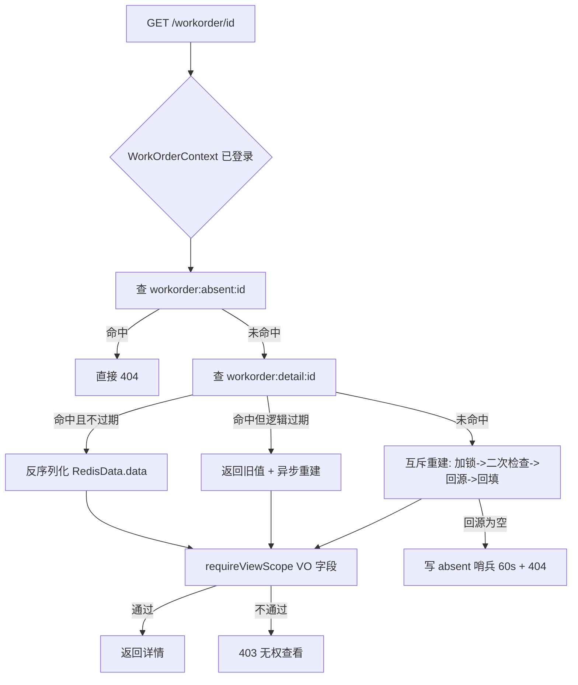

# 模块四（缓存与分布式锁）技术设计方案

> 本文档给出「智能工单系统」**模块四：缓存与分布式锁** 的完整技术设计方案。
> 写作目的：作为实现前的设计依据 + 作者本人复习/面试讲解材料，因此既写「怎么做」，也写**「为什么这么设计」与「我们没选什么」**。
> 文中所有类名、方法名、表名、字段、状态码、Key 命名均与当前代码一致（`src/main/java/com/rj/` 与 `src/main/resources/db/`），可对照源码阅读。
> **本文只做设计，不含实现代码。** 落地顺序与验证方式见第九、十节。
>
> 前置阅读：`设计理念/权限解析.md`（板块一：认证鉴权 + RBAC）、`设计理念/工单核心业务.md`（板块二：工单状态机）、`阶段计划书/模块二.md`、`阶段计划书/模块三.md`（模块三 §11.3 已把「分布式锁对本 Job 只是性能优化，不是补漏」的结论留给模块四）。
>
> **已确认的两条范围决策**（本计划据此展开，后续不再反复）：
> 1. **「并发资源申请」不加库存表**：锁用于「同部门 + 同资源类别 + 同资源名称」的并发申请互斥，锁内校验「不存在进行中的同类资源申请工单」，复用现有 `work_order` / `work_order_resource` 两张表，不引入新的业务表。
> 2. **缓存击穿采用「互斥重建 + 逻辑过期」双方案**：一般热点详情走互斥重建，超热键走逻辑过期（值内带 `expireAt`，过期后异步重建、立即返回旧值）。

---

## 一、文档定位

### 1.1 范围

本模块解决两件事：**给读多写少的热点数据加缓存**，以及**给并发临界区加分布式锁**。具体交付：

1. **工单详情缓存**（`WorkOrderDetailVO`）：读穿 + 写失效 + 击穿防护（互斥重建 / 逻辑过期）+ 穿透防护（空值缓存）。
2. **权限相关缓存**：权限树字典 `permission:tree`（TTL 兜底）+ 角色已分配权限列表 `role:perms:{roleId}`（TTL + 写失效）。
3. **工单编号生成的分布式锁**：编号格式由「毫秒时间戳 + 3 位随机」改为「日期 + 日内自增序号」，序号由 Redis `INCR` 提供，Redisson 锁守护「自增 + 首次设过期」这段临界区。
4. **并发资源申请互斥**：`orderType=2 资源申请` 提交时，按「部门 + 资源类别 + 资源名称」加 Redisson 锁，锁内校验不存在进行中的同类申请，防止并发重复申请。
5. 一套可复用的基础设施：`CacheClient`（读穿 + 互斥重建 + 逻辑过期 + 空值缓存）与 `RedisLockHelper`（Redisson 锁封装）。

### 1.2 边界（不在本文范围）

| 不做 | 原因 |
|---|---|
| 工单**列表** / **统计**接口缓存 | 列表带「按角色动态收敛的数据范围」与多条件过滤，Key 维度爆炸（角色 × 部门 × 用户 × status × type × keyword），缓存收益远低于维护成本。**只缓存 `detail`——它是按主键取、维度单一、且天然是热点。** |
| 站内信未读数缓存 `notify:unread:{userId}` | 模块三已自带（写失效 + TTL 300s），**模块四不重做、不动它**（模块三 §2.1 已把这条边界划清）。 |
| 鉴权快照缓存 `login:user:auth:{userId}` | 板块一已自带（`AuthService.getOrLoad`）。模块四**复用其「缓存优先 + 未命中回源 + 写失效」的思路**，但不改其实现。 |
| 给 `MqCompensationJob` 加分布式锁 | 模块三 §11.3 已论证：该 Job 的多实例正确性由 **CAS 认领**保证，锁只是「省掉无效扫描」的优化，**不是补漏**。模块四**明确不做**，避免把正确性寄托在锁上。 |
| 限流、幂等键、接口级防重放 | 属模块五（全局能力）与模块三（消费幂等）。 |
| 引入 Flyway/Liquibase 等迁移框架 | 仓库既有约定是「脚本手工执行」，模块四**不新增任何表**，无须迁移。 |

### 1.3 一句话总览

> **缓存用「cache-aside（读穿 + 写失效）」打底，用「互斥重建」防击穿、用「逻辑过期」防超热键阻塞、用「空值缓存」防穿透；锁只用在两个真正需要串行化的临界区——工单编号生成与同资源并发申请。**

一条纪律贯穿全文：**锁的作用是「把并发变成串行」，不是「把不正确变成正确」。** 模块二已经用「状态机 + 乐观锁 `@Version` + 唯一键 `uk_order_no`」把工单的并发正确性做在了数据库层；模块四的锁**叠加在这之上**，好处是「让业务校验（如资源占用检查）在并发下依然成立」，而不是「替数据库兜底」。

---

## 二、职责边界与模块关联

### 2.1 与其它模块的关系

| 模块 | 关联方向 | 具体依赖 | 关键约束 |
|---|---|---|---|
| **模块一：认证鉴权 RBAC** | 模块四**复用其缓存范式** | `AuthService.getOrLoad` 已是「缓存优先 + 回源重建 + `evict` 写失效」，本模块的 `CacheClient` 沿用同一套语义；`RedisConfig` 提供的 `RedisTemplate<String,Object>`（Jackson3 序列化）直接复用 | ⚠️ **不改 `login:user:*` 的任何 Key 与 TTL。** 用户的权限码已随鉴权快照缓存，模块四**不再为「用户权限」另建缓存**（避免两处缓存、两套失效）|
| **模块二：工单核心业务** | 模块四**寄生其上** | 在 `WorkOrderService` 的 `create()` / `transition()` / `closeTimeout()` / `detail()` 四处**接线**；编号生成改写 `generateOrderNo()`；资源申请互斥读 `WorkOrderCreateDTO.resources` | **不改状态机、不改接口签名、不改表结构。** 唯一的行为增量：`orderType=2` 且资源重复时可能返回 409（见 6.3，需你确认）|
| **模块三：异步通知** | **正交** | 通知链路（outbox / 投递 / 消费）**完全不受影响**；工单详情缓存失效与 MQ 投递互不依赖 | 通知消费端**不做任何缓存**（它按库当前状态解析收件人，缓存反而会引入陈旧收件人）|
| **模块五：全局能力** | 模块四**复用** | `Result` / `BusinessException` / `ResultCode` / `GlobalExceptionHandler` | 遵守「HTTP 恒 200，业务态在 body `code`」；**不新增 `ResultCode` 枚举值**——冲突复用 409，锁等待超时复用 409 或 500（见 6.5）|

### 2.2 与现有 Redis 使用的关系

当前 Redis（`application.yaml`：`localhost:6379`，`database: 4`）已被三处占用，模块四新增的 Key 与它们**同库不同前缀，互不干扰**：

| 现有 Key 前缀 | 归属 | 存储方式 | 模块四的关系 |
|---|---|---|---|
| `login:user:token:` | 模块一 | `StringRedisTemplate` | 不动 |
| `login:user:auth:` | 模块一 | `RedisTemplate<String,Object>` | **范式复用**，不改 |
| `notify:unread:` | 模块三 | `StringRedisTemplate` | 不动 |

模块四新增前缀统一登记在 `common/RedisConstants.java`（与既有约定一致）：`workorder:detail:`、`workorder:no:`、`permission:tree`、`role:perms:`，锁名前缀见 `common/LockConstants.java`。

### 2.3 Redis 已是硬依赖 —— 与模块三 RabbitMQ「可选降级」的关键区别

模块三把 RabbitMQ 设计成**可选降级**（`mq.notify.enabled=false` 时应用照样启动、工单照样流转），因为「能不能发通知」与「该不该记工单」是两件事。

**模块四不做这种降级，且这是刻意的：**

> 从**模块一**开始，登录 token 就存在 Redis（`LoginInterceptor` 每次请求 `GET login:user:token:{userId}` + `GET login:user:auth:{userId}`）。**Redis 一旦不可用，整个系统的登录与鉴权已经失效**，应用此时本就不可用。

因此：
- `RedissonClient` **可以无条件启用**，不需要 `redis.lock.enabled=false` 这类开关；
- 锁获取失败（Redis 抖动）**不应吞异常降级**为「无锁执行」——那等于在 Redis 抖动时静默放弃互斥，比直接报错更危险。**失败就快速失败（500），交给上游重试。**
- 唯一需要「吞异常」的地方是**缓存失效（`DEL`）**：与模块三 `evictUnreadCache` 一致，`DEL` 失败记 warn 由 TTL 自愈，**不让缓存抖动反向搞挂业务写**。

---

## 三、设计目标与原则

### 3.1 设计目标

1. **降低热点读的数据库压力**：工单详情与权限字典是读多写少，缓存后详情页首屏不再打 DB。
2. **缓存必须「可失效、可自愈」**：任何写路径都能让相关缓存立即失效；`DEL` 失败有 TTL 兜底。
3. **并发临界区串行化**：编号生成不重号、同资源申请不重复。
4. **不引入正确性依赖**：锁是「让业务校验成立」的手段，**不是**并发正确性的唯一来源——DB 唯一键、乐观锁、CAS 依旧在。

### 3.2 五条设计原则

| 原则 | 含义 | 反面（我们没有这么做） |
|---|---|---|
| 读穿 + 写失效 | 读：未命中回源并回填；写：先改库，再删缓存 | 不用「写时更新缓存」（并发写会互相覆盖，且空值没法「更新」）；不用「先删缓存再改库」（会造出更长的不一致窗口）|
| 缓存 Key 逐层登记 | 所有前缀 + TTL 常量集中在 `RedisConstants` | 不在业务代码里散落魔法字符串 |
| 锁只护临界区，不护整个方法 | 锁的粒度 = 需要串行化的那一段，尽可能短 | 不把「查工单 + 改状态 + 写日志 + 发通知」整段塞进一把大锁——那会把并发吞吐压成串行 |
| 锁的租约显式化 | `tryLock(waitTime, leaseTime)` 显式给 lease，避免 Watchdog 依赖 | 不用 `lock()` 无参阻塞 + 依赖看门狗续约——长事务下续约行为不透明，排查困难 |
| 缓存不承载鉴权 | 命中缓存**仍要**跑一次数据范围校验 | 不因为「命中缓存」就跳过 `requireViewScope`——**缓存只省 DB，不省鉴权** |

---

## 四、技术选型

### 4.1 Redis / Spring Data Redis（现状，不改）

| 项 | 现状 |
|---|---|
| 依赖 | `spring-boot-starter-data-redis`（`pom.xml:33-36`）|
| 连接 | `spring.data.redis.*`，`database: 4`，`timeout: 10000` |
| Bean | `RedisConfig` 提供 `RedisTemplate<String,Object>`（Key 用 `StringRedisSerializer`，Value 用 **Jackson3 版** `GenericJacksonJsonRedisSerializer`，开了 default typing 写 `@class`）；`StringRedisTemplate` 由 Boot 自动配置 |
| 序列化注意 | Value 走 JSON 带 `@class`，取回能还原实体；**这也是「列表/详情 VO 能直接缓存」的前提** |

模块四**继续用这套 `RedisTemplate` 做缓存读写**，不引入新的序列化器（避免与既有 `login:user:auth:` 的快照格式分家）。

### 4.2 Redisson：集成方式与版本风险（本模块唯一的「外部新增依赖」）

> ⚠️ **本项目是 Spring Boot 4.1.1 / Java 17 / Jackson 3**（`pom.xml:8`）——这是一个非常新的栈。经验：**绝大多数网上的 Redisson 集成说明都是 Boot 3 时代的**，直接照抄大概率踩坑（与 `spring-boot-4-stack-gotchas` 记录的 AMQP starter 改名、Jackson 3 转换器是同一类问题）。因此集成方式的首要出发点是**「与 Spring Data Redis 的版本解耦」**。

| 方案 | 说明 | 结论 |
|---|---|---|
| **A. `redisson-spring-boot-starter`** | 自动配置 `RedissonClient`，并**接管/替换** `spring-data-redis` 的 `RedisTemplate`。它内部依赖一个 `redisson-spring-data-XX` 适配模块，**该模块必须与 `spring-data-redis` 的大版本对齐** | ❌ **不采用（主推避坑）**：Boot 4 用的是 `spring-data-redis 4.x`，Redisson 未必已发布对应的 `redisson-spring-data-4x` 适配器，存在「依赖解析不到」或「适配层与 4.x 不兼容」的风险；而且它会**抢走现有 `RedisTemplate` 的装配**，与模块一/三已定型的序列化格式冲突 |
| **B. `org.redisson:redisson`（核心）+ 手写 `RedissonClient` Bean** ✅ | 只引入 Redisson 核心，**不引入任何 spring-data 适配层**。在 `config/RedissonConfig.java` 里读 `spring.data.redis.*` 手工构造单机 `Config`，注册一个 `RedissonClient` Bean | ✅ **采用**：① 与 `spring-data-redis` 版本完全解耦，不受 Boot 4 适配进度影响；② 不碰现有 `RedisTemplate`，序列化格式零影响；③ 我们**本来就不需要** Redisson 的分布式集合/缓存功能（缓存仍走 `RedisTemplate`），只需要锁 + 布隆过滤器，核心包足够 |

**版本**：`org.redisson:redisson` 的具体版本号**以实施第一步实测能解析的版本为准**（先不写死；在 `pom.xml` 加依赖后 `mvn dependency:resolve` 验证），而不是照抄某篇博客的版本。**这一条明确写进实施第 0 步。**

### 4.3 Redisson 只负责「锁」与「布隆过滤器」，缓存读写仍走 `RedisTemplate`

这是本方案一个**刻意的边界**：

| 能力 | 由谁提供 | 理由 |
|---|---|---|
| 缓存读写（详情 / 权限树 / 角色权限） | **现有 `RedisTemplate`** | 与 `login:user:auth:` 同序列化格式，`WorkOrderDetailVO` 直接存 JSON 即可 |
| 分布式锁 | **Redisson** | 手写 `SETNX + Lua 释放 + 看门狗续约` 容易写错；Redisson 屏蔽了锁的可重入、续约、释放语义 |
| 布隆过滤器（穿透扩展，可选） | **Redisson `RBloomFilter`** | 现成实现，避免自造 |

**为什么强调这一点？** 因为 Redisson 自带一套编解码器（如 `JsonJacksonCodec`），其内部用的是 **Jackson 2**（`com.fasterxml.jackson`），而本项目是 **Jackson 3**（`tools.jackson`）。若让 Redisson 也承担缓存序列化，就会在同一份数据上出现两套 Jackson，一旦哪个类被两边同时序列化就会炸。**让锁只走 `StringCodec`（锁的 value 是线程标识字符串，和 Jackson 无关），缓存只走 `RedisTemplate`，两套序列化永不相遇。**

---

## 五、缓存设计

### 5.1 缓存对象与 Key 设计

命名沿用既有 `domain:entity:qualifier:` 冒号分段风格（对齐 `login:user:auth:{userId}`、`notify:unread:{userId}`）：

| # | 缓存对象 | Key 模板 | Value | 载体 | 失效方式 |
|---|---|---|---|---|---|
| 1 | 工单详情 | `workorder:detail:{id}` | `RedisData<WorkOrderDetailVO>`（逻辑过期包装，见 5.4）| `RedisTemplate` | **写失效**（`transition` / `closeTimeout` / 资源替换后 `DEL`）+ **逻辑过期**兜底 |
| 2 | 工单不存在哨兵 | `workorder:absent:{id}` | `"1"`（占位） | `StringRedisTemplate` | TTL 到期（短 TTL）|
| 3 | 权限树字典 | `permission:tree` | `List<PermissionVO>` | `RedisTemplate` | TTL 兜底（当前**无**写入入口，见 5.2 注）|
| 4 | 角色已分配权限ID | `role:perms:{roleId}` | `List<Long>` | `RedisTemplate` | **写失效**（`assignPermissions` 后 `DEL`）+ TTL 兜底 |
| — | 编号日内序号 | `workorder:no:seq:{yyyyMMdd}` | 整数（`INCR`） | `StringRedisTemplate` | 首次写入时设过期（2 天）|
| — | 编号生成锁 | `lock:workorder:no` | Redisson 锁 | Redisson | 见 6.4 |
| — | 详情重建锁 | `lock:cache:workorder:detail:{id}` | Redisson 锁 | Redisson | 见 5.4 |
| — | 资源申请锁 | `lock:resource:apply:{departmentId}:{resourceType}:{resourceName}` | Redisson MultiLock | Redisson | 见 6.3 |

> **命名纪律**：缓存键一律 `domain:entity:...`，锁键一律 `lock:...`。**两类键语义不同（一个是数据、一个是状态），前缀先分开**，运维扫库或排查时一眼可分。

### 5.2 TTL 策略

| 缓存 | 逻辑 TTL（业务过期）| 物理 TTL（Redis 过期）| 为什么 |
|---|---|---|---|
| 工单详情 | **5 分钟**（`expireAt`）| **30 分钟** | 逻辑 TTL 是「多久没更新就考虑重建」，物理 TTL 是「最坏情况下的兜底清场」。物理 > 逻辑，是因为逻辑过期靠**主动重建**刷新，物理过期只是防止「边缘键」永远驻留 |
| 不存在哨兵 | — | **60 秒** | 穿透防护的哨兵要**短**：一旦该 id 后来被创建（如工单刚建好），长 TTL 会让「查不到」多存活很久。60s 是与「写失效」的权衡（见 5.5）|
| 权限树字典 | — | **30 分钟** | 权限是**几乎不变的字典**。当前系统**没有**「新增/删除权限」的接口（权限在 `data.sql` 里种一次），所以**TTL-only 失效是安全的**——这一点必须写明，避免日后有人以为「改权限不生效」是 bug |
| 角色已分配权限 | — | **10 分钟** | 该列表**会变**（`PUT /role/{roleId}/permissions`），所以主失效手段是**写失效**；10 分钟物理 TTL 只兜「`DEL` 失败」的情况。**注意：角色权限变更在模块一已经会驱逐该角色下所有用户的 `login:user:auth:` 快照**，本缓存与之同属「权限变更的连锁失效」，但两者 Key 不同、互不替代 |

**为什么不用「永不过期」？** 见 5.4：逻辑过期的键**逻辑上会过期**，但物理上可以长期驻留。给一个「物理 TTL」是为了让**没有任何访问、也没被任何写路径碰到的边缘键**最终被清掉，而不是为了让活跃键更新。**活跃键的更新永远由「写失效 + 逻辑过期重建」负责，物理 TTL 是清场，不是刷新。**

### 5.3 读穿（cache-aside）与写失效

**读路径（以 `detail` 为例）**：



**写路径（顺序不可反）**：

```
① UPDATE/INSERT 数据库（在 @Transactional 内）
② 事务提交后（或事务方法末尾）DELETE workorder:detail:{id}
```

**为什么「先改库、再删缓存」？**

| 顺序 | 并发问题 |
|---|---|
| **先删缓存 → 再改库** ❌ | 删完后、改完前，另一个读请求回源读到**旧值**并回填，此后库里是新值、缓存是旧值，**长期不一致** |
| **先改库 → 再删缓存** ✅ | 最坏是「删缓存前，读请求回填了一次旧值」，但紧接着缓存被删，**下次读即恢复**；窗口极小 |

> **注意**：`DEL` 放在**事务内还是提交后**是有讲究的。本方案选择**事务提交之后**做失效（通过 `TransactionSynchronizationManager` 或 `@TransactionalEventListener(AFTER_COMMIT)`，与模块三投递侧同一套机制）。理由：若在事务内 `DEL` 而事务随后回滚，缓存已被删但数据没变——虽不致命（下次读回源即可），但会把「无谓的重建」放大。**提交后失效是更干净的做法。** 具体接入点复用模块三已有的 `@TransactionalEventListener` 范式，不必新造轮子。

**失效点必须枚举全**（对齐模块三 §9.1「触点必须列全」）：

| # | 失效点 | 位置 | 覆盖 |
|---|---|---|---|
| 1 | `transition(...)` 末尾 | `WorkOrderService.java:423-459` | 7 个入口（resubmit/review/dispatch/transfer/process/accept/withdraw）|
| 2 | `closeTimeout()` 循环内（每条成功关闭后）| `WorkOrderService.java:352-395` | 超时关闭 |
| 3 | `resubmit()` 的资源覆盖替换之后 | `WorkOrderService.java:176-189` | 明细替换（发生在 `transition` 之后，需**再删一次**，否则删缓存时明细已是新值、回填的却是旧明细）|
| 4 | `create()` | — | **无需失效**：新 id 此前不在缓存里；但需确保**没有残留的 `workorder:absent:{id}` 哨兵**——若 id 曾被查询过（几乎不可能，自增 id 不重复），哨兵会误报 404。**MVP 依赖「自增 id 不复用」+ 哨兵 60s 短 TTL**，不额外删除 |

> ⚠️ 第 3 条是本模块最容易漏的一处：`resubmit` 先 `transition`（触发一次失效）、再替换明细。若只在 `transition` 里失效，**回填发生在「明细已替换、但缓存尚未再次删除」的窗口**。因此**在明细替换后再删一次**，或统一把失效收敛到每个写方法的最末尾。

### 5.4 缓存击穿：互斥重建 + 逻辑过期

**击穿**的定义：某个热点 Key 恰好失效的瞬间，大量并发请求同时扑向数据库重建。

本方案对**两类键**用**两种手段**（已确认决策）：

#### (a) 互斥重建（mutex rebuild）—— 一般热点，默认路径

未命中 → 尝试 `Redisson.tryLock("lock:cache:workorder:detail:{id}", wait 1s, lease 5s)`：

```
getCache -> miss -> tryLock
   ├─ 抢到锁：二次检查缓存（可能别人已重建好）→ 仍未命中则回源 DB → 回填 → 释放锁
   ├─ 没抢到锁（wait 超时）：不阻塞等待，回源 DB 一次（+ 短随机退避）或直接返回「稍后重试」
   └─ 二次检查命中：直接用别人的结果，不碰 DB
```

要点：
- **锁内必须二次检查**（double-check）——否则「抢到锁的线程」会重复回源，锁就白加了。
- **锁的 lease 要短**（5s）：重建是「一次主键查询 + 列表查询 + 一次 `SET`」，毫秒级；5s 足够。锁的 wait 也要短（1s）：**抢不到锁不能长等**，否则热点 key 失效瞬间会把请求线程池堆满——这正好是击穿想避免的事。**抢不到锁时退化为「直接回源一次」**，用「多打几次 DB」换「不阻塞」。
- 重建的是**同一把锁**，与资源/编号的锁互不干扰（不同 Key）。

#### (b) 逻辑过期（logical expiration）—— 超热键，不阻塞路径

值里带 `expireAt`，**物理 TTL 长（30min）**：

```
读缓存 -> 反序列化 RedisData{data, expireAt}
   ├─ now < expireAt：直接返回 data
   ├─ now >= expireAt：立即返回 data（旧值）+ 提交异步重建任务
   │                      异步任务：tryLock -> 二次检查 -> 回源 -> 回填（刷新 expireAt）
   └─ 未命中：走 5.4(a) 互斥重建
```

要点：
- **逻辑过期永不阻塞读请求**——这是它与互斥重建的本质区别。代价是**返回的那一次可能是旧值**（陈旧窗口 = 异步重建耗时，通常毫秒级）。
- **异步重建必须单飞**：用同一把重建锁，保证「逻辑过期瞬间的 N 个请求」只触发 **1 次** DB 重建，而不是 N 次。**逻辑过期不等于放弃单飞**，两者是叠加的。
- 异步重建需要线程池：新增 `cacheRebuildExecutor`（`ThreadPoolTaskExecutor`，核心 2 / 最大 4 / 有界队列 / **拒绝策略 = `DiscardPolicy` + `log.warn`**）。理由：重建是**可丢弃的优化**——这次丢了，下次读还会触发；**不能因为重建任务堆积把请求线程拖下水**。

**两种手段的分工**：

| 场景 | 手段 | 理由 |
|---|---|---|
| 一般热点详情（低并发击穿风险） | 互斥重建 | 简单、读请求拿到的一定是新值 |
| 超热键（如系统首页/看板反复刷新的那几条工单） | 逻辑过期 | 宁可给一次旧值，也不让任意请求阻塞 |
| 命中但逻辑未过期 | 直接返回 | 零额外开销 |

> **MVP 的落地建议**：**详情缓存统一用「逻辑过期 + 互斥重建兜未命中」**（即上面的组合流程），因为两者共享同一把重建锁，实现上是**一套 `CacheClient` 的两个分支**，不是两套代码。API 上暴露 `get(key, ttl, logicalTtl, loader)` 即可，具体哪些键用逻辑过期，由 `logicalTtl` 是否为 0 决定。**避免「给每个键手写一段缓存逻辑」的散装实现。**

### 5.5 缓存穿透：空值缓存 + 参数校验（+ 布隆过滤器扩展）

**穿透**的定义：查询一个**数据库里也不存在**的 id（如 `GET /workorder/999999999`），缓存永远不命中，每次都打 DB——被恶意枚举 id 时会打穿。

| 手段 | 采用 | 说明 |
|---|---|---|
| **参数校验** | ✅ | `id <= 0` 直接 400，**在查缓存之前**就拦截，连 Redis 都不进。最便宜的穿透防护 |
| **空值缓存（哨兵）** | ✅ | `requireOrder` 查不到时，写 `workorder:absent:{id}` = `"1"`，TTL **60s**；下次同 id 直接 404，不打 DB |
| **布隆过滤器（RBloomFilter）** | ⏳ 扩展 | **MVP 不做**，列为扩展（见十三）。理由：工单 id 是**自增且持续新增**的，布隆过滤器需要在**每次 `insert work_order` 时同步 `add(id)`**；一旦有「先查后建」的时序或删除逻辑，过滤器与真实集合的偏差会**误判不存在→误报 404**（布隆的假阳性会把「存在的」判成「不存在」是无法接受的错误方向）。**空值缓存 + 短 TTL 的收益/风险比在此规模下明显更优。** |

> **诚实说明**：`detail` 的穿透其实是「主键查询打 DB」——单次是索引定位、亚毫秒，**危害远小于「复杂聚合查询被打穿」**。空值缓存的真实价值更多是「抗恶意枚举」。因此本项定位为**简单防护**（正合需求措辞），不做重型方案。

**空值哨兵与「先写库、后删缓存」的一致性**：哨兵 TTL 只有 60s，且「新建工单」与「查询不存在的 id」在时间上几乎不可能相交（自增 id 不复用）。**MVP 不去主动删哨兵**，把这个极小概率交给 60s TTL 自愈；若未来 id 会复用，再在 `create()` 里补一次 `DEL workorder:absent:{id}`。

### 5.6 缓存与数据范围：安全交叉点（必须强调）

`WorkOrderService.detail()` 目前先 `requireOrder(id)`，再 `requireViewScope(order)`。接入缓存后：

- **缓存的是「不含调用者身份」的 `WorkOrderDetailVO`**（它只描述工单本身）；
- **`requireViewScope` 必须在每次读时照跑**，只是**不再查 DB，而是用 VO 上的 `userId` / `departmentId` / `handlerId` 判断**（这三个字段 `WorkOrderDetailVO` 都有，见 `WorkOrderDetailVO.java:27-33`）。

> ⚠️ **最危险的反模式**：「因为命中缓存所以跳过鉴权」。缓存只省 DB，**不省鉴权**。任何「把鉴权结果缓存起来」「把可见性判断挪到写缓存时」的做法，都会在「角色/部门变更」后出现越权窗口（而模块一的快照缓存是为了让变更**立即生效**，两者目的相反）。**判权永远走当前请求的 `UserContext`，缓存只提供被判断的数据。**

---

## 六、分布式锁设计

### 6.1 锁的粒度与 Key

| 场景 | 锁 Key | 粒度 | 类型 |
|---|---|---|---|
| 工单编号生成 | `lock:workorder:no` | **全局单锁**（同一天内所有编号生成串行）| 普通 Redisson 锁 |
| 详情缓存重建 | `lock:cache:workorder:detail:{id}` | **每工单一把** | 普通 Redisson 锁 |
| 并发资源申请 | `lock:resource:apply:{deptId}:{type}:{name}` | **每「部门+资源」一把** | Redisson **MultiLock**（一单多资源时）|

**粒度原则**：**锁的 Key 要能唯一定位「被争抢的那一份资源」。** 编号生成争的是「同一个日内序号」，所以是全局单锁；资源申请争的是「同一个部门对同一种资源」，所以 Key 里带上 `deptId + type + name`；不同部门的同种资源申请**不该互斥**（把它们串起来是过度加锁，会无谓降低吞吐）。

### 6.2 工单编号生成（编号生成场景）

**现状**（`WorkOrderService.java:606-610`）：

```java
// 现状：WO + yyyyMMddHHmmssSSS + 3 位随机数，唯一性靠 uk_order_no
return "WO" + LocalDateTime.now().format(ORDER_NO_FORMATTER)
        + String.format("%03d", ThreadLocalRandom.current().nextInt(1000));
```

**问题**：毫秒内并发 > 1000 时会撞（3 位随机只提供 1000 个槽位），把正确性全押在 `uk_order_no` 的**冲突重试**上——而现在**没有重试**，撞了就 `DuplicateKeyException` → 500。

**新方案**：`order_no = "WO" + yyyyMMdd + 6 位日内自增序号`，序号由 Redis `INCR` 提供：

```
tryLock("lock:workorder:no", waitTime=2s, leaseTime=5s)
  ├─ 抢到：
  │      key  = "workorder:no:seq:" + yyyyMMdd
  │      seq  = INCR key
  │      if (seq == 1) EXPIRE key 2 天      // 首次写入补过期，防键泄漏
  │      orderNo = "WO" + yyyyMMdd + String.format("%06d", seq)
  └─ 没抢到：抛 409「编号生成繁忙，请重试」（或最多退避重试 N 次）
```

**为什么还要锁？（诚实说明）** `INCR` 本身**原子且唯一**，光靠 `INCR` 就能保证序号不重复——所以严格说，**「防重号」并不需要锁**。锁在此的**真实价值**是：

1. 让「`INCR` + 首次 `EXPIRE`」两步成为**不可分割的临界区**——否则并发首日第 1 次请求里，`INCR` 与 `EXPIRE` 之间存在一个「key 已存在但没有过期时间」的窗口，若此时进程崩溃，该键将**永不过期**（`RedisConstants` 里其他键都带 TTL，这个键成为例外）。
2. 需求明确要求「编号生成用 Redisson 锁」，把它**落在真正有意义的临界区**上，而不是「为了用锁而用锁」地包住整个 `create()`。
3. 为**扩展留位**：若将来编号需要「按部门前缀 + 各自独立序号」，锁 Key 换成 `lock:workorder:no:{deptId}` 即可，临界区结构不变。

> **锁与 `uk_order_no` 的关系**：锁**不替代**唯一键，唯一键**也不依赖**锁。两者是「双保险」——锁降低冲突概率、唯一键兜住所有漏网（如 Redis 被清库、跨天重置后的重放）。**保留 `uk_order_no`，并建议给 `insert` 补一层「冲突则重试一次」的包装**，作为最后一道防线（这本属模块二的健壮化，模块四可顺带一提，但**不强制**）。

**编号格式的兼容性**：旧编号（`WO` + 20 位）与新增编号（`WO` + 14 位）**都是合法字符串**，`order_no` 列是 `VARCHAR(32)`，新格式更短，**存量数据无需迁移**。前端若有「按编号长度/格式解析」的假设需检查（本模块不涉及）。

### 6.3 并发资源申请互斥（并发资源申请场景）

**触发条件**：`create()` 时 `orderType == 2（资源申请）` 且 `dto.resources` 非空。

**语义**（已确认）：**同一部门**对**同一资源（`resource_type` + `resource_name`）**不允许有**多个「进行中」**的申请工单。锁的作用是把「检查 + 插入」这段**读改写**变成串行，否则两个并发请求会同时通过检查、各插一单。

```
// 1. 收集本次申请涉及的 (type, name) 去重集合
Set<(type,name)> targets = distinct(dto.resources.map(r -> (r.type, r.name)))

// 2. 按 (type,name) 排序后构造 MultiLock（排序防死锁：两个请求若涉及 {A,B} 与 {B,A}，
//    不排序会互相等锁而死锁）
RLock multi = redisson.getMultiLock(targets.sorted().map(t -> getLock("lock:resource:apply:"
                 + deptId + ":" + t.type + ":" + t.name)));

// 3. tryLock(wait=3s, lease=10s)
//    锁内：对每个 (type,name) 校验「同部门不存在进行中的同类申请」
//          exists = countActiveResourceApplications(deptId, type, name) > 0
//    若存在 -> 抛 409「该资源已有进行中的申请，请勿重复提交」
//    4. 校验全通过 -> 走原有的 create() 落库逻辑（主表 + 明细，同事务）
//    5. finally: multi.unlock()
```

**「进行中」的定义**：`work_order.status` 属于**非终态** `{0 待审核, 1 待派单, 2 处理中, 3 待验收, 5 已驳回}`（4 已完成 / 6 已取消 / 7 已超时是终态，可再次申请）。校验 SQL 需 `work_order` 与 `work_order_resource` JOIN：

```sql
-- 新增 WorkOrderMapper 自定义方法（示意）
SELECT COUNT(*) FROM work_order w
JOIN work_order_resource r ON r.order_id = w.id
WHERE w.department_id = #{deptId}
  AND w.order_type = 2
  AND w.status IN (0,1,2,3,5)
  AND w.deleted = 0
  AND r.resource_type = #{type}
  AND r.resource_name = #{name}
```

> **这是模块四的「行为增量」，需要你确认**：它会让 `create()` 在「同部门重复申请同资源」时返回 **409**。若你希望保持「申请随意提、由审核环节人为去重」的宽松语义，则应把它改为**告警日志**而非拒绝。**默认按「拒绝（409）」设计**，因为这是「并发资源申请」这类需求通常想要的语义，也才让锁有意义。

**锁粒度与死锁**：
- **粒度**：`deptId + type + name`——不同部门、不同资源**不互斥**。
- **死锁**：一单多资源 → 多把锁，**必须按 `(type,name)` 排序后依次获取**（Redisson `getMultiLock` 内部按序加锁，但仍需保证**所有调用方用同一排序**）。**不排序的 MultiLock 是经典死锁源**，写进验证清单。
- **`lease` 取 10s**：锁内有一次 JOIN 查询 + 一次事务写入，比编号生成重；10s 有充足余量，又远小于「业务超时」量级。
- **锁在事务外还是内？** **在事务外包裹**（`tryLock` → 事务方法 → `unlock`）。理由：若把锁放在 `@Transactional` **内部**，锁在事务**提交前**就已释放（方法返回即释放），而提交可能尚未完成——另一个请求会在**前一个事务未提交**时通过校验，锁形同虚设。**必须让锁的生命周期 ≥ 事务的生命周期。** 实现上把「加锁 + 校验 + 调事务方法」放在一个**非事务**的外层方法里。

### 6.4 锁的获取 / 释放 / 续约

| 项 | 选择 | 理由 |
|---|---|---|
| 获取 | `tryLock(waitTime, leaseTime, TimeUnit)` | **不用无参 `lock()`**。无参会无限阻塞，且触发 Watchdog 自动续约，行为不透明 |
| 续约 | **不用 Watchdog**（因显式给了 `leaseTime`）| 显式 `lease` 让「锁最多持有多久」是一个可读的常量；配上「临界区必须远快于 lease」的纪律，比依赖看门狗更可控 |
| 释放 | `fillally { if (lock.isHeldByCurrentThread()) lock.unlock(); }` | Redisson 可重入，只有**持有者**能释放；`isHeldByCurrentThread()` 防止「未持有却解锁」异常 |
| 释放时机 | **临界区结束立即释放**（含异常路径）| 锁不跨越「用户网络往返」、不跨越「异步任务」 |
| 获取失败 | 编号生成 → 409；资源申请 → 409；缓存重建 → **退化为直接回源**（不报错）| 前两者是**用户发起的写**，失败应可见；后者是**读路径优化**，失败不应影响可用性 |
| 跨实例 | Redisson 锁天然跨实例 | 本机单实例开发**无法**验证跨实例互斥，见十（需文档说明该验证缺口）|

### 6.5 锁与「Redis 不可用」的关系

如 2.3 所述，Redis 已是硬依赖：
- **锁获取阶段** Redis 抖动 → 抛 `RedisConnectionException` → 不吞、交给 `GlobalExceptionHandler` 兜成 **500**；
- **绝不做**「拿不到锁就无锁执行」的降级——那会把「互斥」静默降级为「无互斥」，是**最危险**的降级方向；
- 唯一吞异常的是缓存 `DEL`（见 5.3），与模块三 `evictUnreadCache` 同款处理。

---

## 七、类与接口改动清单

### 7.1 新增

| 类 | 包 | 单一职责 |
|---|---|---|
| `RedisData<T>` | `com.rj.cache` | **逻辑过期包装**：`{ T data; long expireAtEpochMilli; }`（`data` 为 null 表示「不存在」的扩展位）|
| `CacheClient` | `com.rj.cache` | **缓存统一入口**：读穿 + 互斥重建 + 逻辑过期 + 异步重建 + 空值写入。业务层只调它，不直接碰 `RedisTemplate` 做缓存读写 |
| `RedisLockHelper` | `com.rj.lock` | Redisson 锁封装：`tryLock`/`executeWithLock`/`MultiLock`，统一 wait/lease 常量与异常语义 |
| `LockConstants` | `com.rj.common` | 锁名前缀常量（`lock:workorder:no`、`lock:cache:workorder:detail:`、`lock:resource:apply:`）|
| `RedissonConfig` | `com.rj.config` | 读 `spring.data.redis.*` 手工构造 `RedissonClient`（单机 `Config`，`database=4`）|
| `CacheConfig` | `com.rj.config` | `cacheRebuildExecutor` 线程池（逻辑过期异步重建用）|
| 新增 Mapper 方法 | `com.rj.mapper.WorkOrderMapper` | `countActiveResourceApplications(deptId, type, name)`（自定义 JOIN SQL）|

### 7.2 修改

| 文件 | 改动 |
|---|---|
| `pom.xml` | 新增 `org.redisson:redisson`（核心包，**非** starter；版本实测确定）|
| `common/RedisConstants.java` | 追加缓存 Key 前缀与 TTL 常量：`WORKORDER_DETAIL_KEY`、`WORKORDER_ABSENT_KEY`、`WORKORDER_NO_SEQ_KEY`、`PERMISSION_TREE_KEY`、`ROLE_PERMS_KEY` 及各 TTL |
| `service/impl/WorkOrderService.java` | ① `detail()` 改为读穿缓存（**保留 `requireViewScope`，改用 VO 字段判断**）；② `generateOrderNo()` 改为「锁 + `INCR`」；③ `create()` 对 `orderType=2` 加资源申请 MultiLock 与校验；④ `transition()` / `closeTimeout()` / `resubmit()` 加详情缓存失效（`DEL`，提交后）|
| `service/impl/PermissionService.java` | `tree()` 改为缓存读取（`permission:tree`，TTL-only）|
| `service/impl/RoleService.java` | ① `listPermissionIds()` 改为缓存读取（`role:perms:{roleId}`）；② `assignPermissions()` 末尾失效该 Key |
| `config/RedisConfig.java` | **不改**（缓存继续走既有 `RedisTemplate`）|

> **不新增 `RedisConfig` 改动、不新增 `RedisTemplate` Bean**：这是 4.3 的边界——**Redisson 只出锁，缓存仍是既有 `RedisTemplate`**。刻意强调，避免实现时顺手把 Redisson 的 `RedissonConnectionFactory` 接进 `RedisTemplate` 而改变序列化。

### 7.3 复用的既有资产（不重造）

`Result` / `PageResult` / `BusinessException` / `ResultCode` / `GlobalExceptionHandler` / `UserContext` / `@TransactionalEventListener`（模块三范式）/ `RedisTemplate<String,Object>`（模块一）。

---

## 八、配置变更

### 8.1 `pom.xml`

```xml
<!-- 分布式锁:只用核心包,不引 spring-data 适配层(避免与 Boot 4 的 spring-data-redis 4.x 版本耦合) -->
<dependency>
    <groupId>org.redisson</groupId>
    <artifactId>redisson</artifactId>
    <version>${redisson.version}</version>  <!-- 实施第一步实测定版 -->
</dependency>
```

### 8.2 `application.yaml`

Redisson **复用**现有 `spring.data.redis.*`（`RedissonConfig` 直接读取），**无需新增连接配置**。仅新增锁与缓存的行为参数：

```yaml
redis:
  lock:
    # 编号生成:临界区极短(INCR + EXPIRE)
    order-no-wait-seconds: 2
    order-no-lease-seconds: 5
    # 资源申请:锁内有 JOIN 查询 + 事务写
    resource-wait-seconds: 3
    resource-lease-seconds: 10
    # 缓存重建:抢不到锁不阻塞,退化为直接回源
    cache-rebuild-wait-seconds: 1
    cache-rebuild-lease-seconds: 5
cache:
  workorder-detail:
    logical-ttl-seconds: 300     # 逻辑过期 5 分钟
    physical-ttl-seconds: 1800   # 物理 TTL 30 分钟
  absent-ttl-seconds: 60         # 穿透哨兵 60 秒
  permission-tree-ttl-seconds: 1800
  role-perms-ttl-seconds: 600
  rebuild-executor:
    core-size: 2
    max-size: 4
    queue-capacity: 256          # 满则丢弃 + warn(重建是可丢弃的优化)
```

> 配置项抽出来的意义：**TTL 与 lease 是「策略」不是「代码」**——调参不该改代码。这与模块三把 `mq.notify.*` 全量外置是同一条思路。

---

## 九、分阶段实施步骤（MVP）

> **顺序原则**：先让「基础设施」可编译可注入，再逐个接入，「每接一个就能单独验证」。

| 步 | 内容 | 完成标志 |
|---|---|---|
| **0** | **验证 Redisson 版本能解析**：加 `redisson` 核心依赖，`mvn -B -DskipTests compile` 通过（本机 Maven/JDK 路径见 memory；Bash 需 `> log` 后 `Read`）| `BUILD SUCCESS` |
| 1 | `RedisData` + `CacheClient`（先只做「读穿 + 互斥重建 + 空值」，逻辑过期随后）| 单测/手工：二次读命中缓存 |
| 2 | `CacheConfig` 的 `cacheRebuildExecutor` + `CacheClient` 补「逻辑过期 + 异步重建」| 手工改 `expireAt` 验证 |
| 3 | `RedisLockHelper` + `LockConstants` + `RedissonConfig`；写一个最简 demo（如加锁自增）验证注入与释放 | 启动无报错、锁可用 |
| 4 | `RedisConstants` 追加 Key 常量；`WorkOrderService.detail()` 接入缓存 + 三个写点加失效 | 改状态后立即读详情为新值 |
| 5 | `generateOrderNo()` 改为「锁 + `INCR`」；编号格式切换 | 并发创建无重号 |
| 6 | `PermissionService.tree()` / `RoleService.listPermissionIds()` 接入缓存 + `assignPermissions` 失效 | 改角色权限后回显为新值 |
| 7 | `create()` 的资源申请 MultiLock + `countActiveResourceApplications` 校验（**需你确认 409 语义**）| 并发同资源申请仅一个成功 |
| 8 | 补验证脚本、补文档、清理（不留 `sysout`/调试开关）| 见第十节全绿 |

> **步 7 是唯一含「行为增量」的一步**，建议单独一个提交，便于回滚。

---

## 十、测试与验证要点

> **环境事实**（据 memory）：本机 **MySQL 3306 + Redis 6379 可用**，故本模块**可以端到端实测**（不像模块三受「无 RabbitMQ」限制）。跨**实例**的锁行为**无法**在本机单实例验证——这是必须写进文档的验证缺口。

### 10.1 编译与启动

1. `mvn -B -DskipTests compile` → `BUILD SUCCESS`（步 0 与每次改完）。
2. 应用能启动，`RedissonClient` Bean 注入成功（启动日志无 Redisson 连接异常）。

### 10.2 缓存功能

| # | 用例 | 期望 |
|---|---|---|
| 1 | 连续两次 `GET /workorder/{id}` | 第二次命中缓存（DB 无第二次查询；可通过日志/耗时/`monitor` 观察）|
| 2 | 对同一 id 并发 N 个「首次读」 | **只发生 1 次 DB 回源**（互斥重建生效）|
| 3 | 手动把 Redis 中 `expireAt` 改为过去 | 仍立即返回（旧值），且异步任务把它重建为新值 |
| 4 | `GET /workorder/不存在id` 两次 | 第二次命中 `workorder:absent:{id}`，**不打 DB** |
| 5 | `GET /workorder/0` 或负数 | 400，**未进缓存/DB** |
| 6 | 修改工单状态（review/dispatch/…）后立即 `GET /workorder/{id}` | 返回**新状态**（写失效生效）|
| 7 | `resubmit` 换明细后立即读详情 | 明细为**新明细**（验证 5.3 第 3 条「二次删除」）|
| 8 | 超时关闭（`closeTimeout`）后读详情 | 状态为 7、日志含 `operate_type=10` |
| 9 | 权限：改角色权限后读 `role:perms:{roleId}` | 回显**新值**（写失效生效）|
| 10 | 数据范围回归：A 部门用户读 B 部门工单详情 | 403（**命中缓存也要判权**，5.6）|

### 10.3 分布式锁

| # | 用例 | 期望 |
|---|---|---|
| 11 | 并发（如 50 线程 / 200 次）创建工单 | `order_no` **全部唯一**、格式为 `WO+yyyyMMdd+6位`；序号**连续无洞**（除 `INCR` 浪费）|
| 12 | 跨天：把序号 Key 的日期改成前一天再创建 | 当日序号从 1 重新开始，且 Key 带过期 |
| 13 | 同部门并发提交**同一资源**的资源申请 | **仅一个成功**，其余 409「已有进行中的申请」|
| 14 | 同部门提交**不同资源** / 不同部门提交**同一资源** | 均成功（验证粒度：不该被串行）|
| 15 | 一单含**多个**资源且与另一单资源集合**顺序相反**（{A,B} vs {B,A}）| 无死锁，两单按序判权（验证 MultiLock 排序）|
| 16 | 关闭 Redis 后发起编号生成/资源申请 | 返回 500（**快速失败，不无锁执行**）|
| 17 | 关闭 Redis 后读已缓存的详情 | 读缓存失败 → 回源 DB → 正常返回（`DEL`/读缓存异常不应 5xx 到用户，需确认 `CacheClient` 的读异常处理策略）|

> 用例 11/13 的并发脚本：环境里 Bash 工具不便直接压测，建议用**本地 PowerShell `Invoke-RestMethod` + `ForEach-Object -Parallel`**，或写一个 `CountDownLatch` + 线程池的 JUnit 测试（`spring-boot-starter-webmvc-test` 已在 `pom.xml`）。

### 10.4 必须写进文档的验证缺口

- **跨实例互斥**未验证（本机单实例）：只能证明单实例下锁语义正确，**多实例 Redisson 锁的正确性依据是 Redisson 的公开语义 + 代码审查**，不是本机实测。
- **逻辑过期的陈旧窗口**：只能验证「返回旧值 + 异步重建」，**具体的陈旧毫秒数**依赖机器负载，不做硬性断言。

---

## 十一、潜在风险与注意事项

| # | 风险 | 影响 | 应对 |
|---|---|---|---|
| 1 | **Redisson 与 Boot 4.1 的兼容性** | 依赖解析不到 / 适配层不兼容 | 4.2 方案 B（核心包 + 手写 Bean）已规避 spring-data 适配；**实施第 0 步先实测定版** |
| 2 | **两套 Jackson**（Redisson 内部 Jackson2 vs 项目 Jackson3）| 同一类被两边序列化会炸 | 4.3：Redisson 只用 `StringCodec` 出锁，**缓存全部走既有 `RedisTemplate`**；两者不交叉 |
| 3 | **锁被放在 `@Transactional` 内部** | 锁在事务提交前释放 → 互斥失效 | 6.3：锁必须在**事务外层**的非事务方法里包裹；写进 code review 检查项 |
| 4 | **MultiLock 未排序** | 死锁 | 6.3：按 `(type,name)` 排序后构造；用例 15 专测 |
| 5 | **`resubmit` 二次失效遗漏** | 明细缓存陈旧 | 5.3 第 3 条 + 用例 7 |
| 6 | **`DEL` 失败导致陈旧** | 最坏逻辑 TTL 内的陈旧 | 5.2：物理 TTL 兜底；`DEL` 吞异常记 warn（与模块三同款）|
| 7 | **逻辑过期返回旧值** | 详情短暂陈旧 | 写失效是主手段；逻辑过期只覆盖「写失效未触及」的窗口；业务可接受（详情页非强一致场景）|
| 8 | **资源申请 409 语义改变 `create()` 行为** | 前端可能收到未预期的 409 | **需你确认**（6.3）；单独提交便于回滚；前端需处理该错误码 |
| 9 | **编号格式变更** | 若有按格式解析编号的逻辑 | 格式更短、兼容存量；检查前端是否有相关假设 |
| 10 | **缓存 Key 维度失控** | 内存/维护成本上升 | 1.2 明确**只缓存 detail**，列表/统计不缓存；Key 集中于 `RedisConstants` |
| 11 | **`INCR` 序号被浪费**（抢锁失败/事务回滚但仍 `INCR` 过）| 编号出现「空洞」| **可接受**：编号只需唯一、不需连续。**不要为「连续」额外设计**（那是给自己造 bug）|
| 12 | **`RedisData` 里的 `@class` 与泛型** | 反序列化类型还原 | 既有 `RedisConfig` 已开 default typing 写 `@class`，`WorkOrderDetailVO`（含 `List<WorkOrderResource>`/`List<WorkOrderOperateLog>`）需**实测反序列化**（用例 1 顺带覆盖）|

---

## 十二、方案对比与取舍（面试点）

### Q1：编号生成，`INCR` 已经原子，为什么还要 Redisson 锁？是不是为了「用锁而用锁」？

不是。**`INCR` 保证的是「序号不重复」，锁保证的是「`INCR` + `EXPIRE` 两步的原子性」**——首日第一次生成时，若在两步之间进程崩溃，会留下一个**永不过期**的序号键。锁把这个窗口关掉。同时，锁让「跨天重置 + 编号拼接」成为一个可审计的临界区，并为「按部门独立序号」留了扩展位。**我们承认「防重号」主要靠 `INCR` + `uk_order_no`，锁在这里是更小的那一半价值，且我们把这个事实写清楚了**，而不是含糊地说「用锁来防重复」。

### Q2：为什么不给详情缓存直接用 Spring 的 `@Cacheable`？

`@Cacheable` 默认的过期与 Key 生成**表达不出**本模块要的三件事：① **逻辑过期**（值内带 `expireAt`，物理不过期）；② **互斥重建**（未命中时加锁 + 二次检查）；③ **空值缓存的独立短 TTL**。套 `@Cacheable` 要么自己写 `Cache` 实现（等于把 `CacheClient` 塞进 Spring 的接口里，更绕），要么退化成「只解决最普通的那一种缓存」。**本模块的缓存不是「最普通的那一种」，所以显式写 `CacheClient` 更诚实也更可控。** 代价是失去注解式的简洁——在只有 3 个缓存点的规模下，这个代价可接受。

### Q3：为什么不用 `redisson-spring-boot-starter`？

两点：① **版本耦合**——starter 带一个 `redisson-spring-data-XX` 适配模块，必须与 Boot 4 的 `spring-data-redis 4.x` 对齐，而 Boot 4 足够新，适配可能未就绪（与 `spring-boot-4-stack-gotchas` 记录的同类坑）；② **它会抢 `RedisTemplate` 的装配**——本项目的 `RedisTemplate` 已由模块一定型（Jackson3 + default typing），被替换会**改变所有既有缓存的序列化格式**。**我们只需要锁，不需要 Redisson 的 Spring 集成**，所以只引核心包。

### Q4：既然是「先改库、后删缓存」，为什么不做「延迟双删」？

延迟双删（删缓存 → 改库 → 睡一小会儿 → 再删缓存）是为了堵「回填旧值」的窗口，代价是**引入一次 `sleep`**（阻塞线程）或一次延迟任务，收益在「读并发极高且写很少」时才明显。本模块已用 **「提交后再删」+ 逻辑过期 + TTL 兜底** 覆盖了绝大多数窗口，**MVL 不做延迟双删**，把它列为扩展（若线上出现「写完立刻读仍是旧值」的稳定复现再加）。

### Q5：资源申请为什么不用数据库唯一约束，而用分布式锁？

因为「不允许存在**多个进行中**的同类申请」**不是一个能用唯一键表达的约束**：唯一键能表达「同一时刻只能有一行」，而这里的规则是「进行中状态的**子集**里只能有一行」——状态会流转（终态后要允许再次申请），唯一键无法跟随状态变化。**能用锁表达的动态约束，不该硬塞进静态唯一键。**

### Q6：为什么不加「资源库存表」来做超卖防护？

因为「并发资源申请」在本项目里**没有库存这个实体**——`work_order_resource` 只是申请明细，没有「总量/余量」的语义。硬加一张库存表会把模块四的边界扩张成一个**新的业务子系统**（库存从哪来、谁维护、工单回退时怎么回补），远超「缓存与分布式锁」的命题。**我们选择在现有两张表上表达「互斥申请」这一条规则**（已确认决策），而不是为演示锁而虚构一个业务实体。

### Q7：锁的 `leaseTime` 为什么要显式给，不用看门狗自动续约？

看门狗（`leaseTime = -1` 时启用）会**周期性自动续约直到显式解锁**——它的好处是「临界区耗时不确定时不会提前过期」，坏处是**「锁一直没被释放」这个 bug 会被掩盖成「锁永远续约」**，且续约行为依赖 Redisson 客户端线程存活。本模块的临界区都是**毫秒级**，显式 `lease`（5s / 10s）足够且更可控：**临界区若真的跑到超过 lease，那不是「该续约」，而是「这里有 bug」**——让它暴露成一次锁过期 + 重复执行，比让它静默续约更早发现问题。

### Q8：缓存失效放在事务提交后，和模块三「提交后发送」是同一个道理吗？

**机制相同，动机不同**。两者都用「事务提交后」这个时机，`@TransactionalEventListener(AFTER_COMMIT)` 就够了。但：模块三是怕「事务回滚但消息已发」，缓存失效是怕「事务回滚但缓存已删，造成无谓重建」。**结论一致，原因各自成立。**

---

## 十三、扩展方向

1. **布隆过滤器（穿透）**：Redisson `RBloomFilter`。触发条件：出现**恶意枚举 id** 的稳定迹象，或详情回源中「查不到」的占比显著上升。落地时必须解决「新增工单同步 `add(id)`」与「不误判存在项」两个问题（5.5 已记录为何 MVP 不做）。
2. **延迟双删（一致性）**：触发条件：线上稳定复现「写完立刻读仍是旧值」。
3. **缓存预热**：应用启动或定时任务，把「近期活跃工单」批量灌入缓存，避免冷启动瞬间的穿透。
4. **热点探测**：统计各 id 的访问频次（如 Redis `ZINCRBY` 或本地滑动窗口），只对「真热」的键启用逻辑过期，冷键用普通 TTL。触发条件：缓存内存压力上升。
5. **Redis 持久化/主从**：当前单机 Redis。生产需考虑锁与缓存的高可用（Redisson 支持哨兵/集群；**注意锁在 `RedLock` 与主从切换下的语义差异**，那是一个独立的深水区，不在本期）。
6. **配置外置化**：把 `redis.lock.*` / `cache.*` 的常量进一步收敛（当前已在 `application.yaml`，已是良好形态）。
